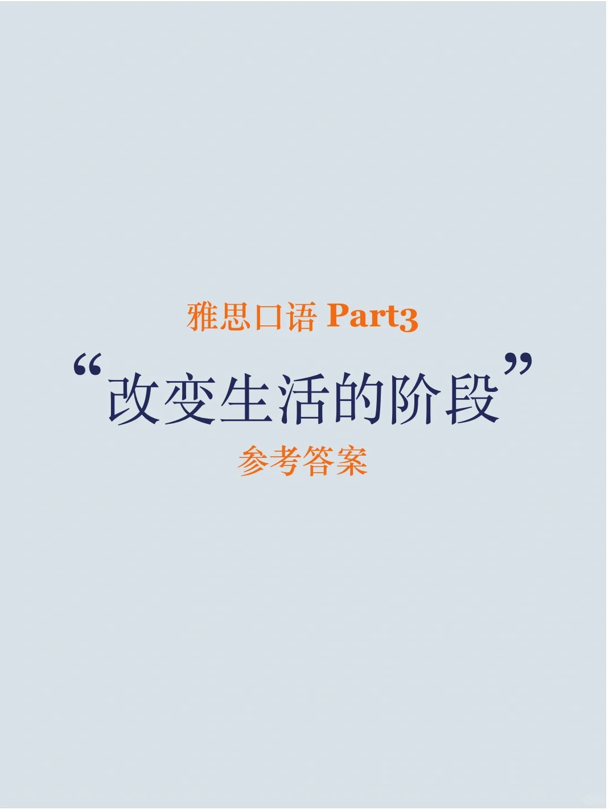
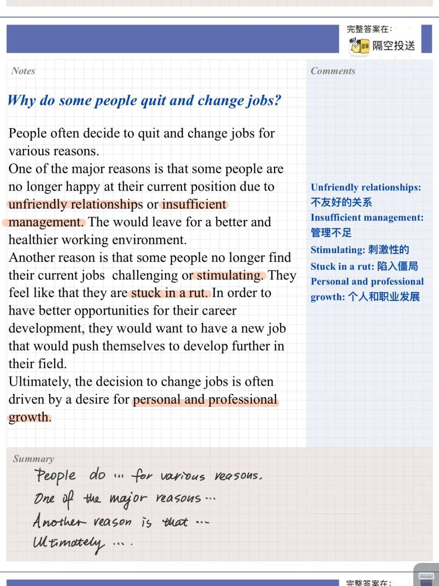
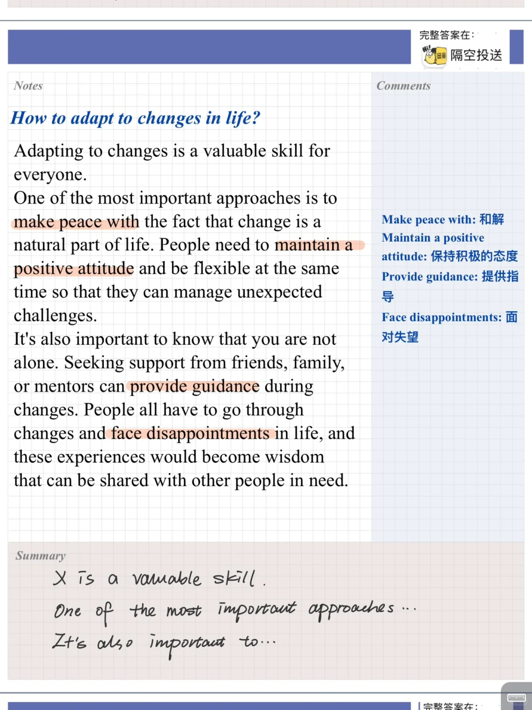
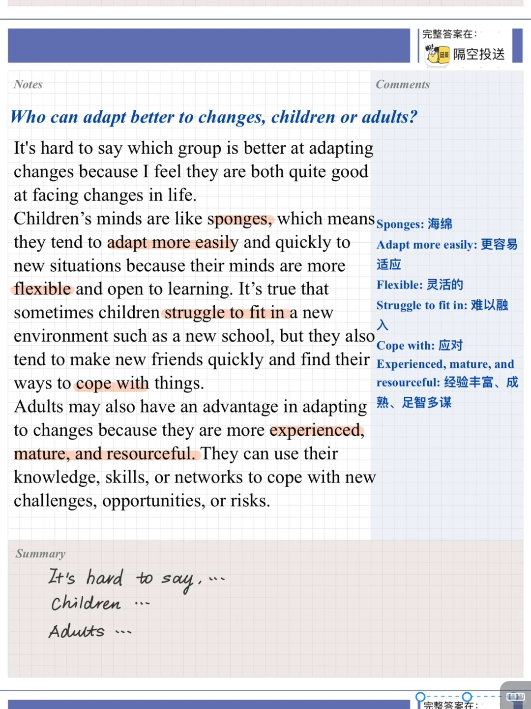
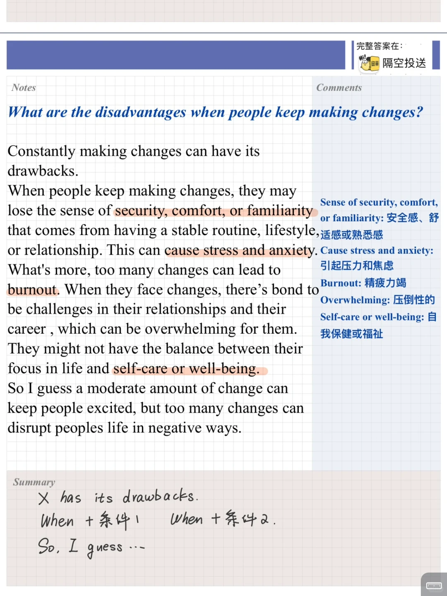

# 雅思口语part3高分答案｜改变生活的阶段

今天的相关part2:
Describe a period of time that changed your life in good ways 改变生活的阶段
When it was
Who you were with What happened
And explain why it changed your life
	
part3 则主要关注人生变化的形式，如何应对等
快积累起来吧～
新题库口语训练营开放啦，需要的同学快快加入吧
#雅思 #雅思口语 #雅思攻略 #雅思备考 #雅思口语part3 #雅思口语高分

## 图片
| 图1 | 图2 | 图3 | 图4 |
| --- | --- | --- | --- |
|  |  |  |  |
|  |  |   |   |

生成时间：2025-11-15 00:34:43