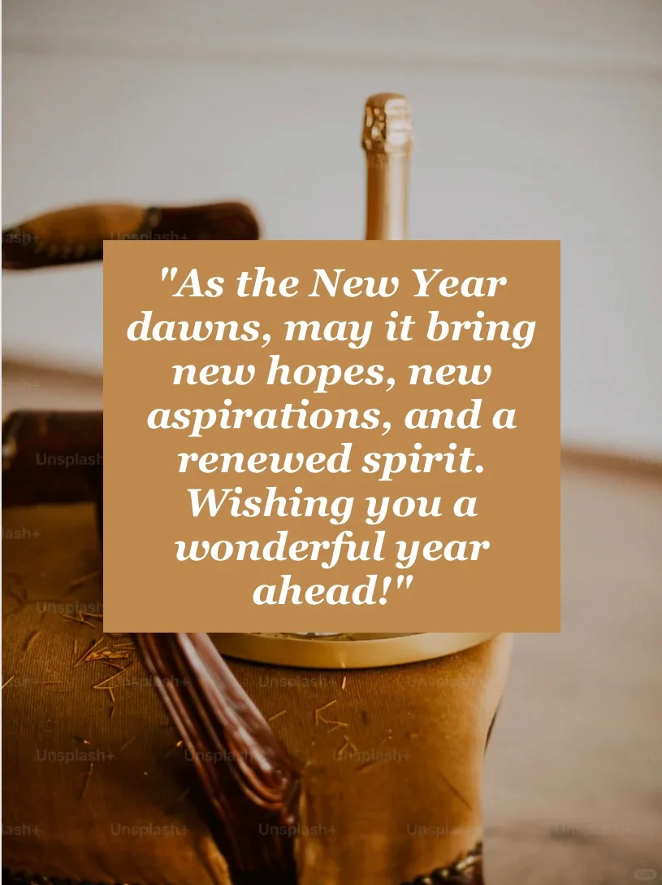

# 新年英文祝酒词 贺卡寄语

新年快乐 Happy New Year！
🎆“May the New Year bring you new grace, new gladness, and new glory.”
"Here's to a year filled with laughter, love, and prosperity. May your dreams take flight and your spirit soar high. Happy New Year!"
"To new adventures, new experiences, and new memories waiting to be made. Happy New Year! Let's make it extraordinary!"
"Cheers to a year filled with happiness, good health, and the fulfillment of your dreams. Happy New Year!"**
"As the New Year dawns, may it bring new hopes, new aspirations, and a renewed spirit. Wishing you a wonderful year ahead!"
	
#英语口语 #英语祝福语 #英语贺词 #新年快乐 #新年英语贺卡 #英语 #雅思口语 #雅思备考

## 图片
| 图1 | 图2 | 图3 | 图4 |
| --- | --- | --- | --- |
|  |  |  |  |
|  |  |   |   |

生成时间：2025-11-15 00:33:36