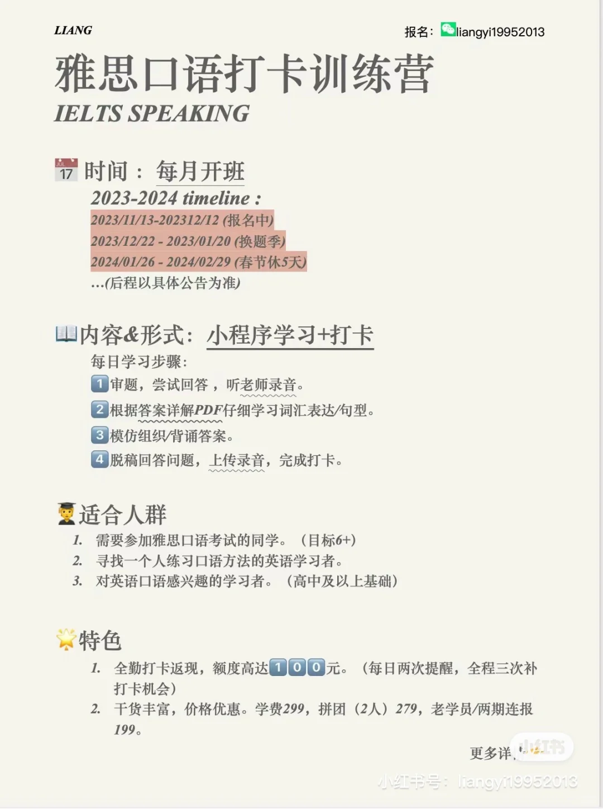
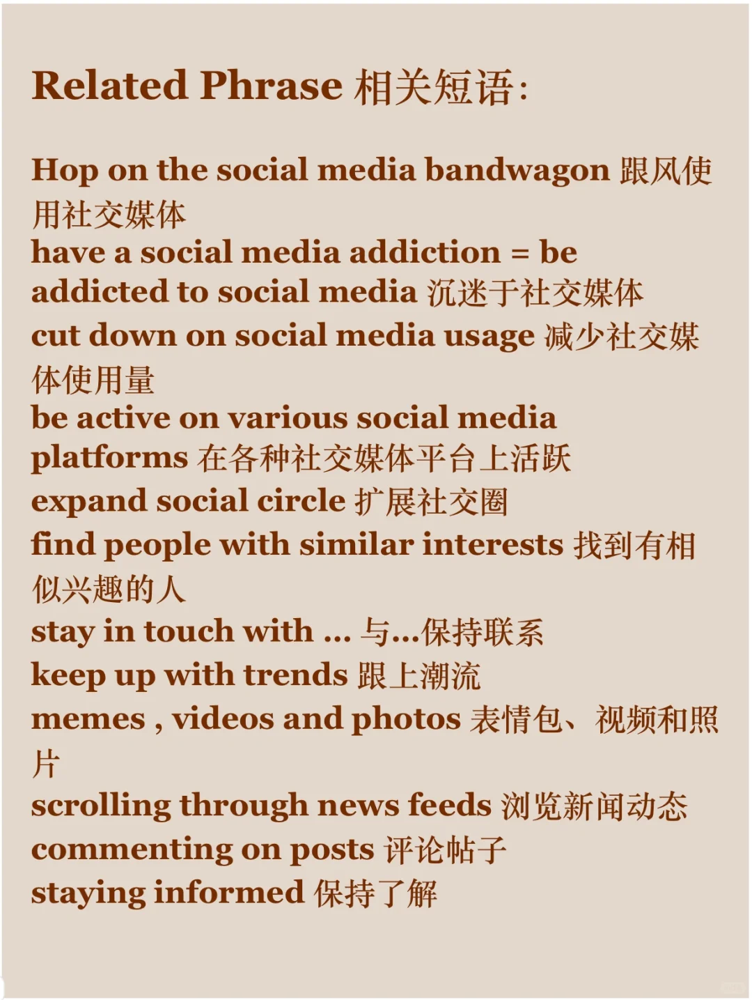
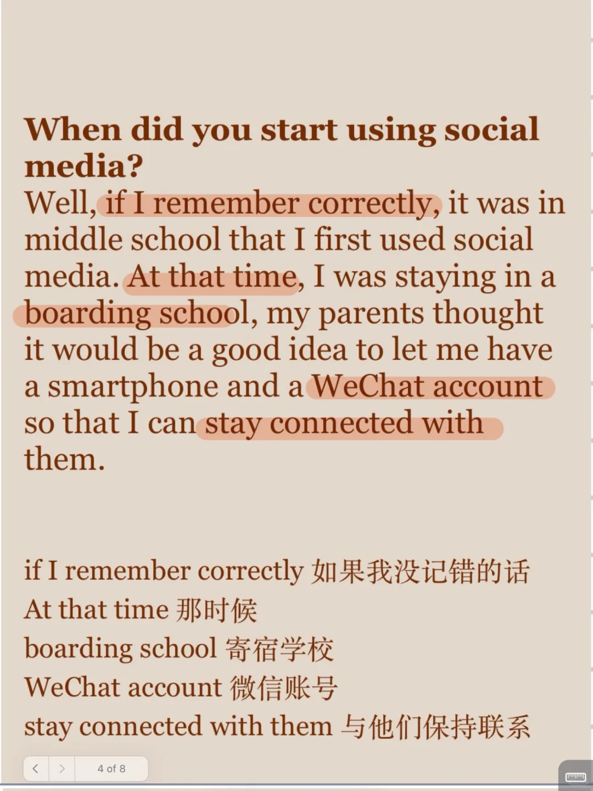
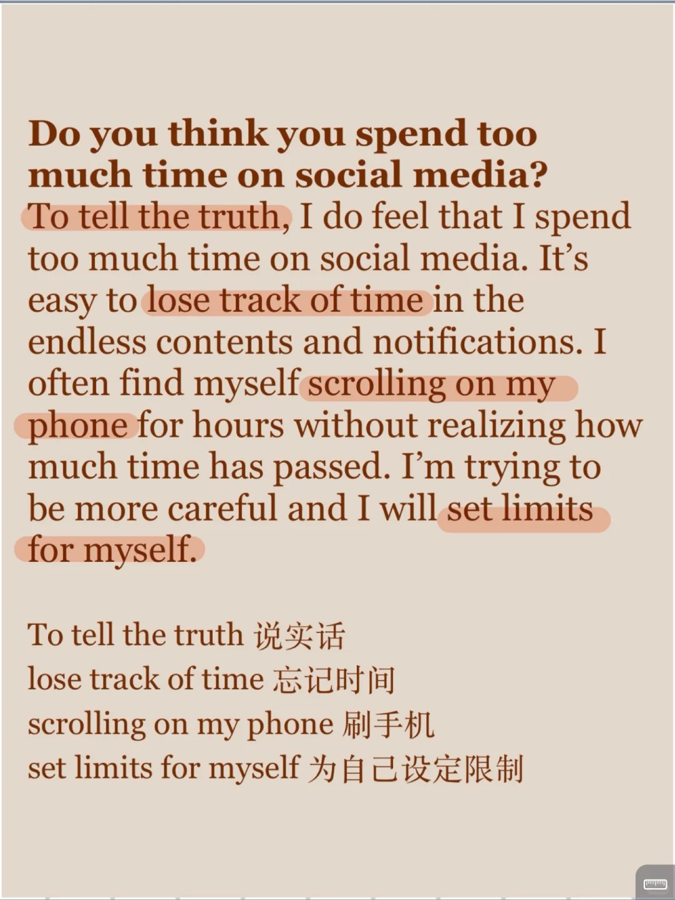
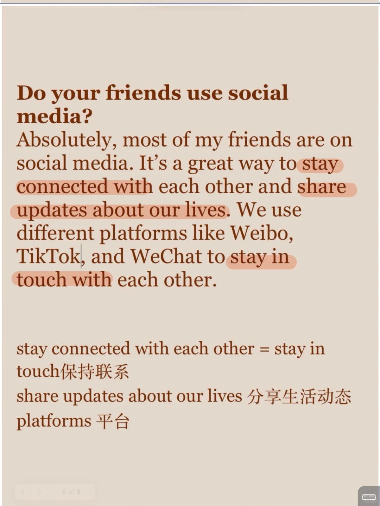
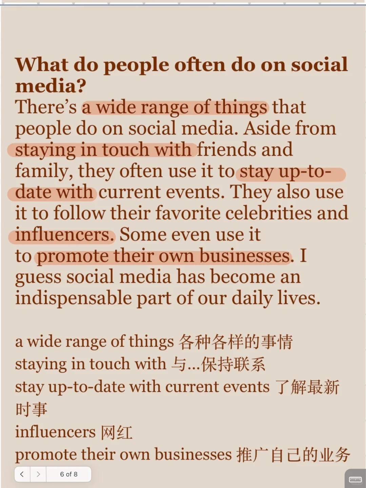

# 雅思口语24新题答案 | P1 Social Media

Social media
When did you start using social media?
Do you think you spend too much time on social media?
Do your friends use social media?
What do people often do on social media?
	
新题更新中~ 新一期训练营也正式开始
加入雅思口语训练营，一个月练完题库💪
#雅思 #雅思攻略 #雅思口语 #分手吧雅思 #雅思口语part1新题答案

## 图片
| 图1 | 图2 | 图3 | 图4 |
| --- | --- | --- | --- |
|  |  |  |  |
|  |  |  |   |

生成时间：2025-11-15 00:32:31