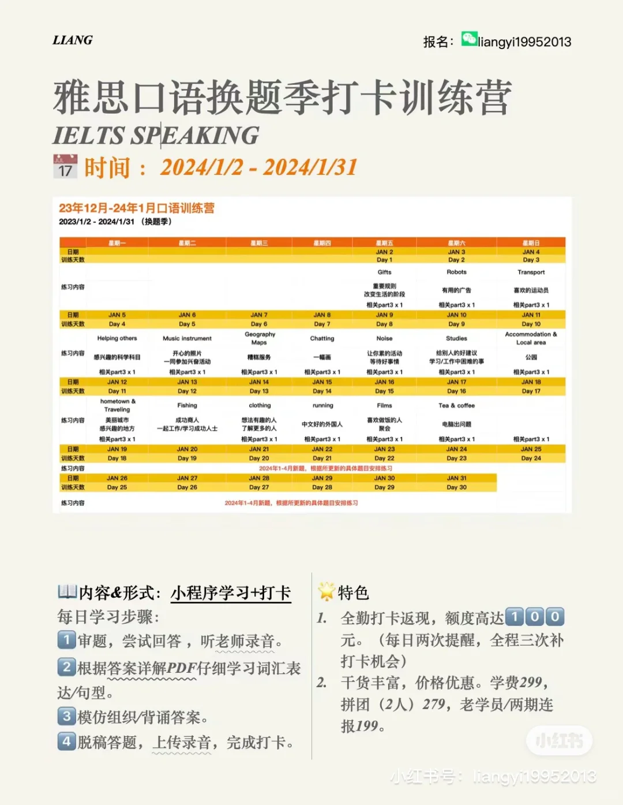
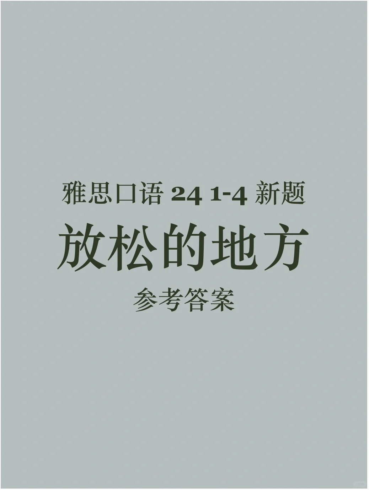
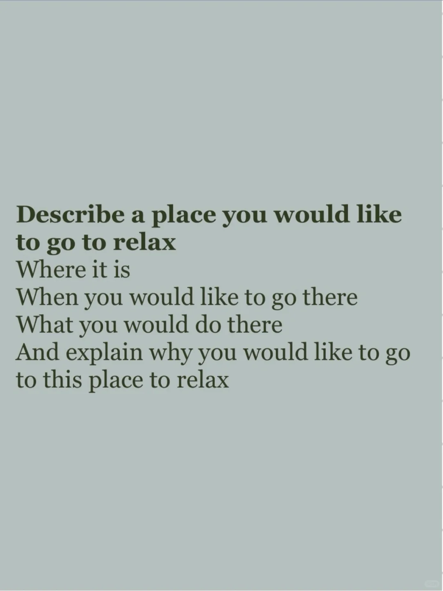
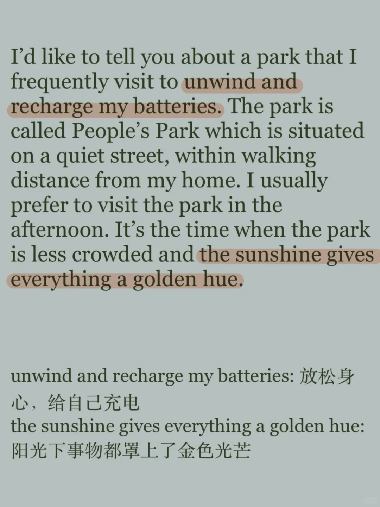
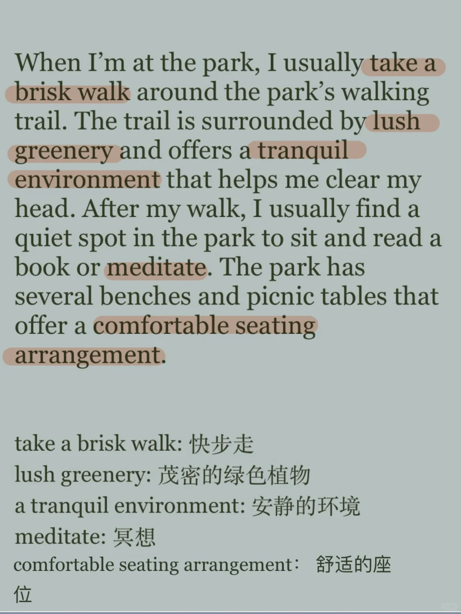
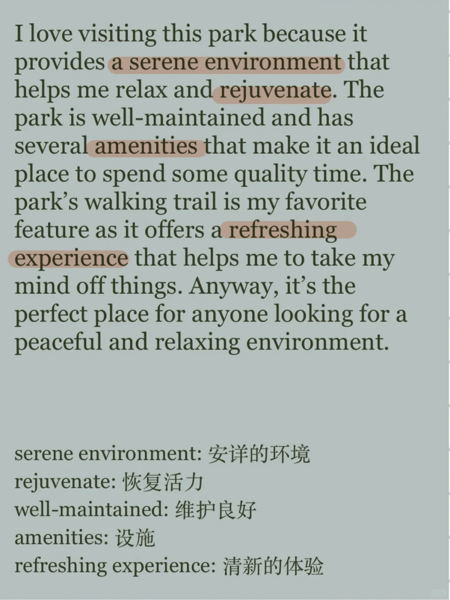

# 24雅思口语新题｜ P2 放松的地方

这个题目可以考虑和旧题库中的“公园”串题
重点描述此地的环境，令人放松的原因
	
新题库训练营进行中，欢迎加入哦👏
#雅思 #雅思口语 #雅思备考 #雅思攻略 #雅思口语换题 #雅思口语part2新题答案

## 图片
| 图1 | 图2 | 图3 | 图4 |
| --- | --- | --- | --- |
|  |  |  |  |
|  |  |   |   |

生成时间：2025-11-15 00:31:24