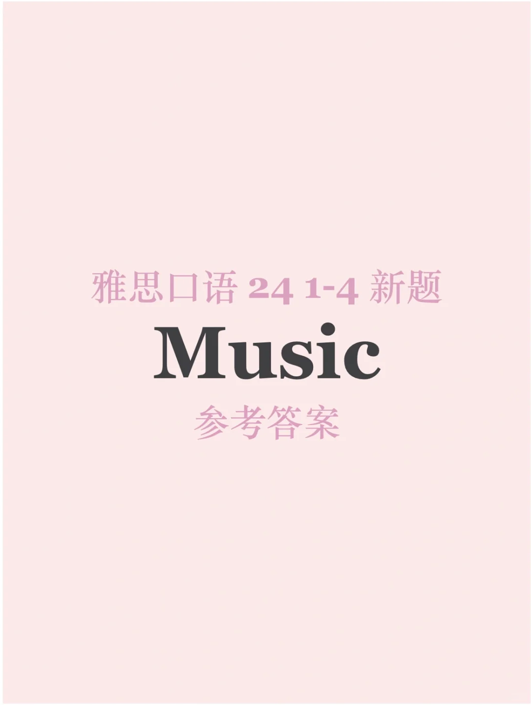
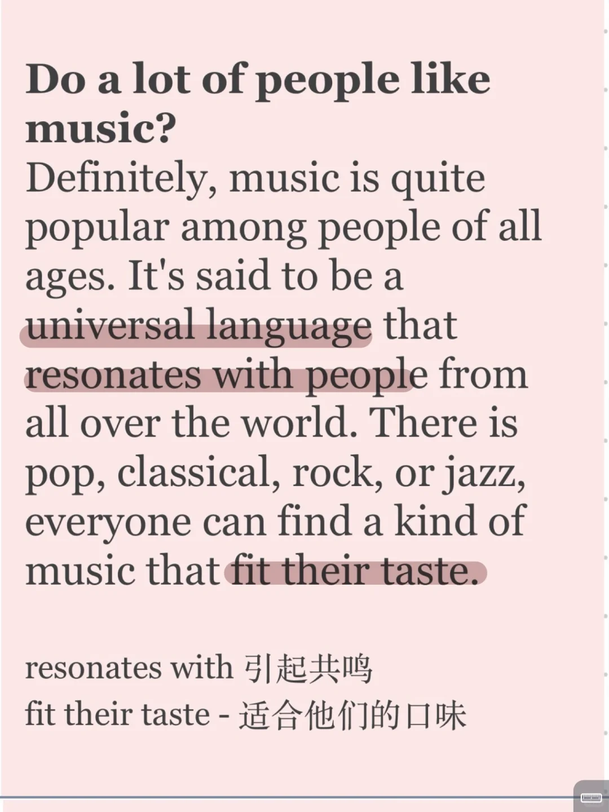
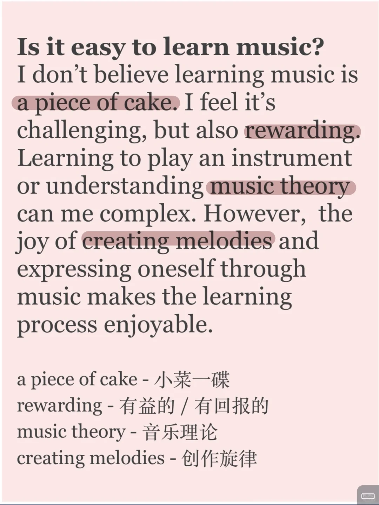
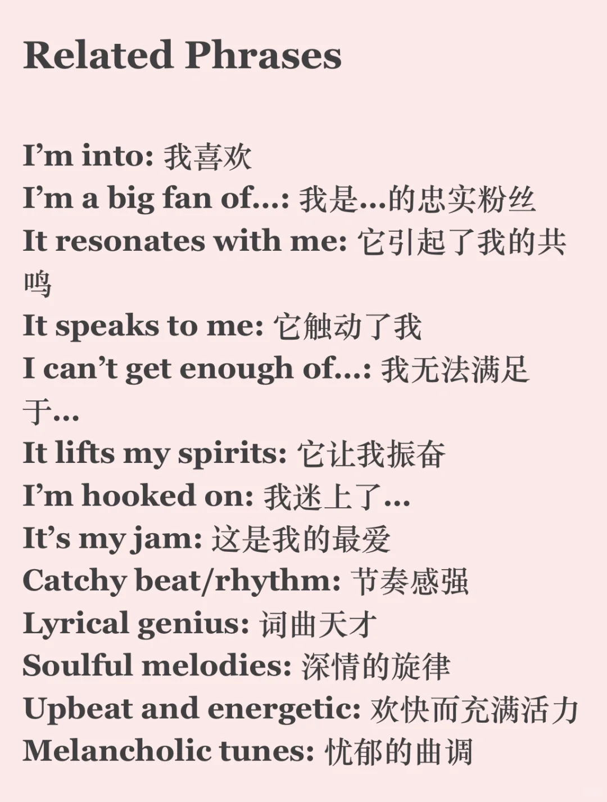

# 24雅思口语新题参考答案｜P1 music

经典话题音乐又又又返场了
音乐类型、对音乐的感受是经典的提问方向
现在又多出了关于音乐教育的话题，一起来练习吧💪新题库训练营进行中 欢迎加入
	
#雅思 #雅思口语换题 #雅思攻略 #雅思备考 #分手吧雅思 #雅思口语Part1

## 图片
| 图1 | 图2 | 图3 | 图4 |
| --- | --- | --- | --- |
|  |  |  |  |
|  |  |  |   |

生成时间：2025-11-15 00:30:18