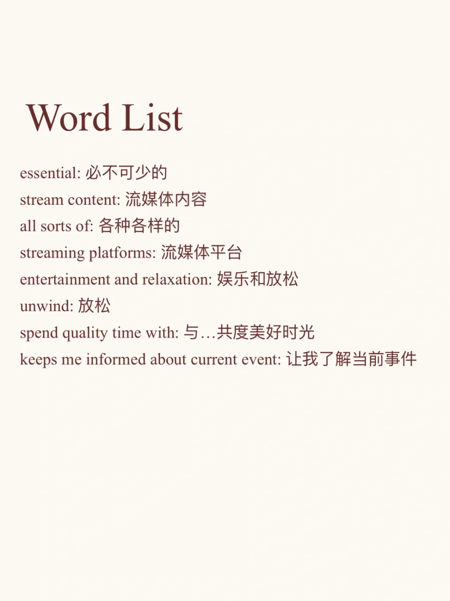
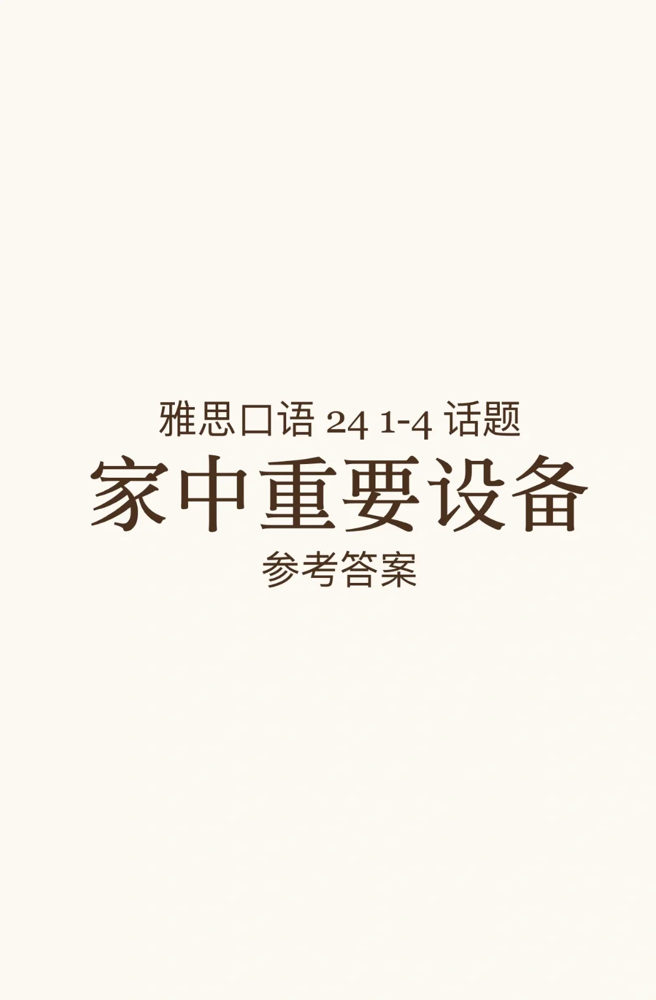
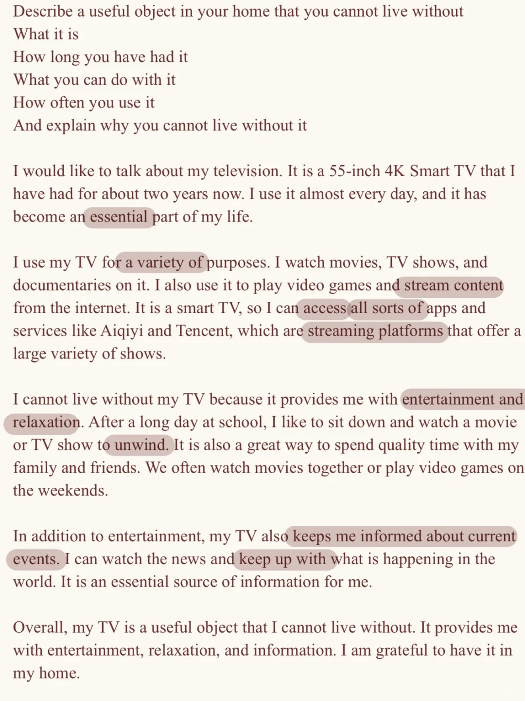

# 雅思口语新题答案｜P2 家中重要物品

#雅思攻略 #雅思备考 #雅思口语 #雅思口语换题 #雅思口语题库 #雅思 #雅思口语part2新题答案
	
题库中一直有关于电子设备、科技产品等相关的话题，多储备表达可以很好的应变串题💪

## 图片
| 图1 | 图2 | 图3 | 图4 |
| --- | --- | --- | --- |
|  |  |  |   |

生成时间：2025-11-15 00:20:26