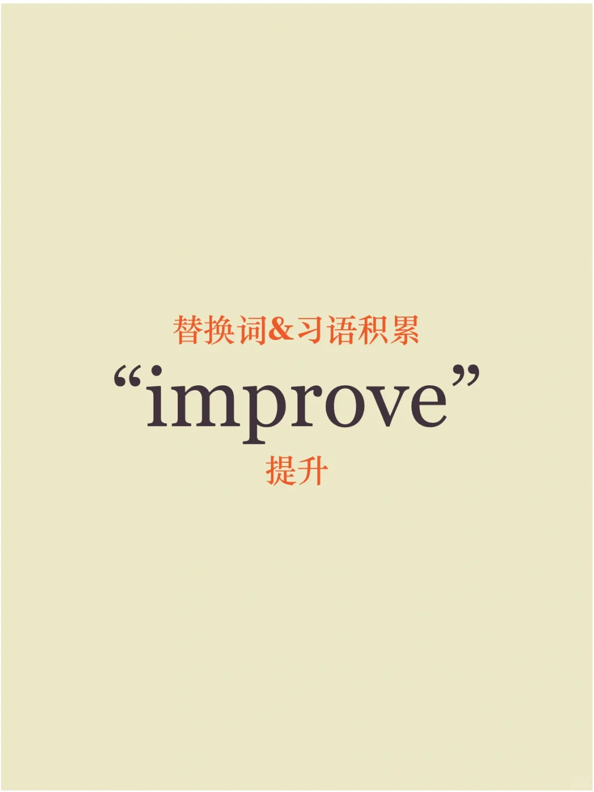
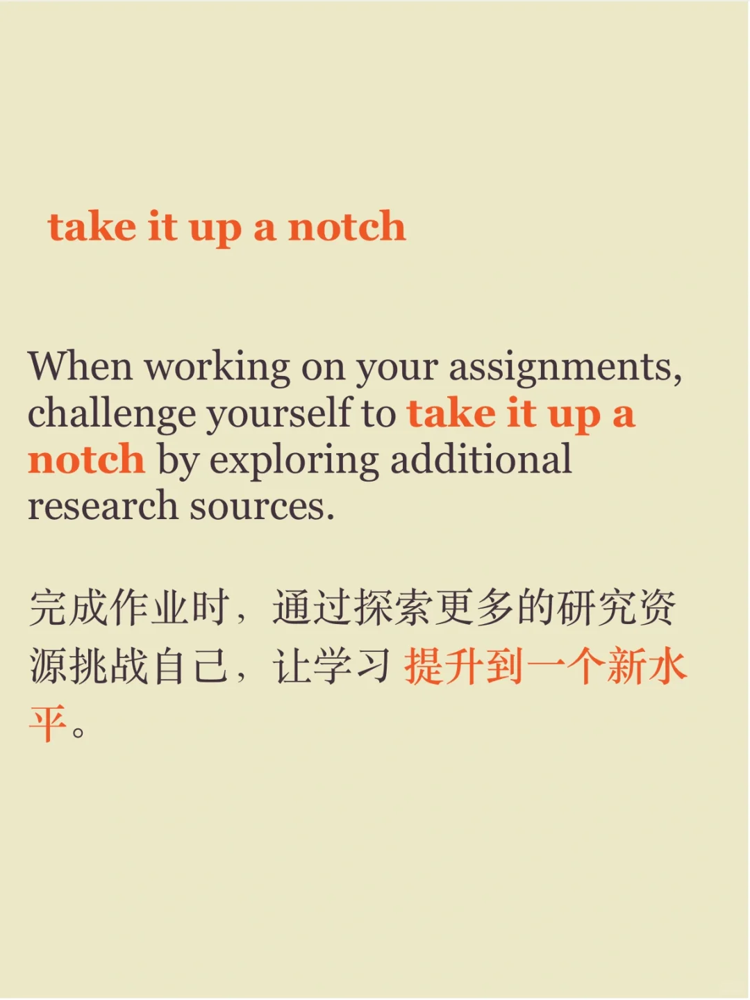
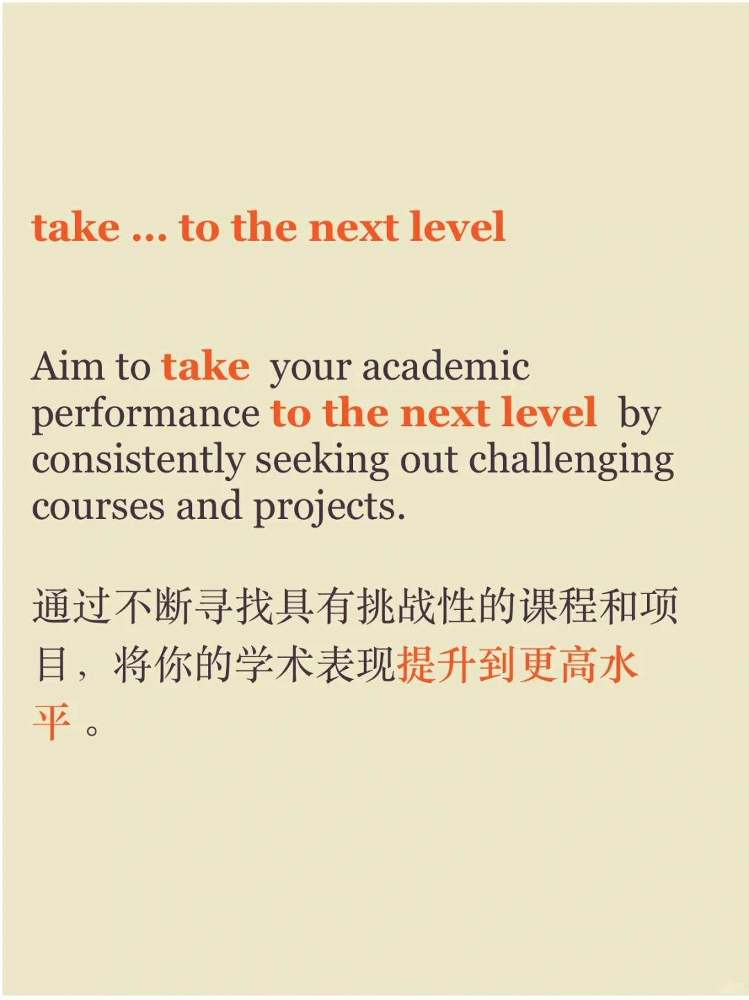

# 提升“improve”的口语灵活替换

你肯定还会其他表达，评论区讨论分享吧～
#雅思攻略 #雅思备考 #雅思口语 #英语口语 #英语口语攻略 #每日英语口语学习 #英语学习 #英语地道表达 #英语口语地道表达

## 图片
| 图1 | 图2 | 图3 | 图4 |
| --- | --- | --- | --- |
|  |  |  |  |
|  |  |   |   |

生成时间：2025-11-15 00:18:16