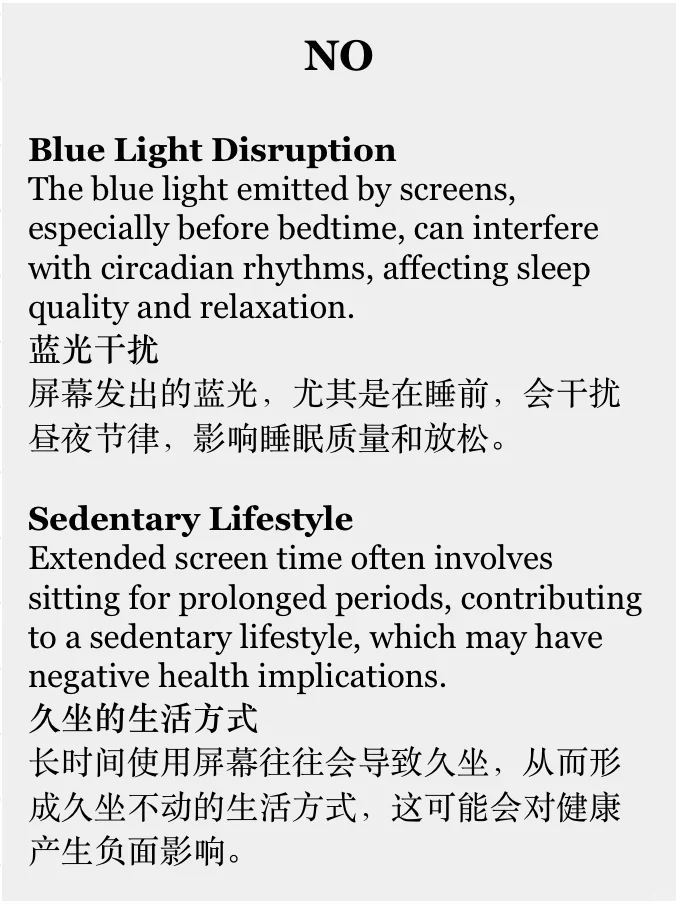
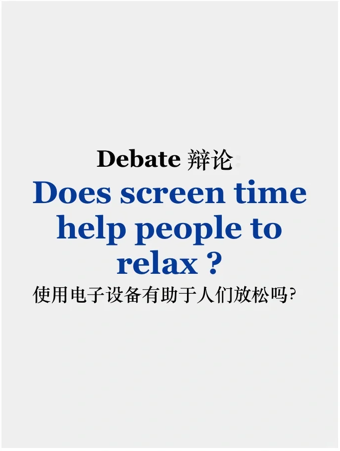
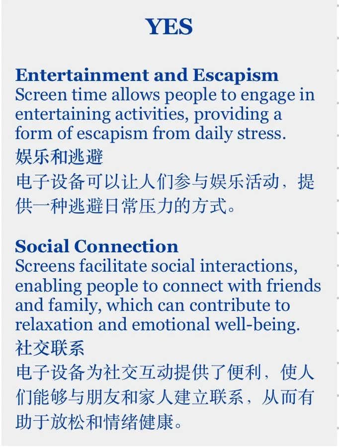
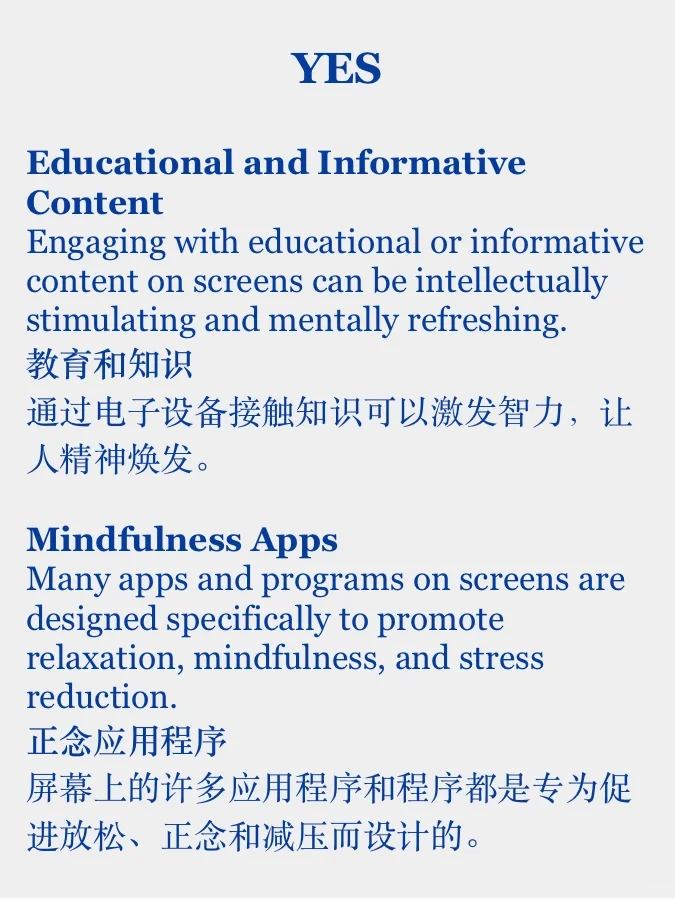
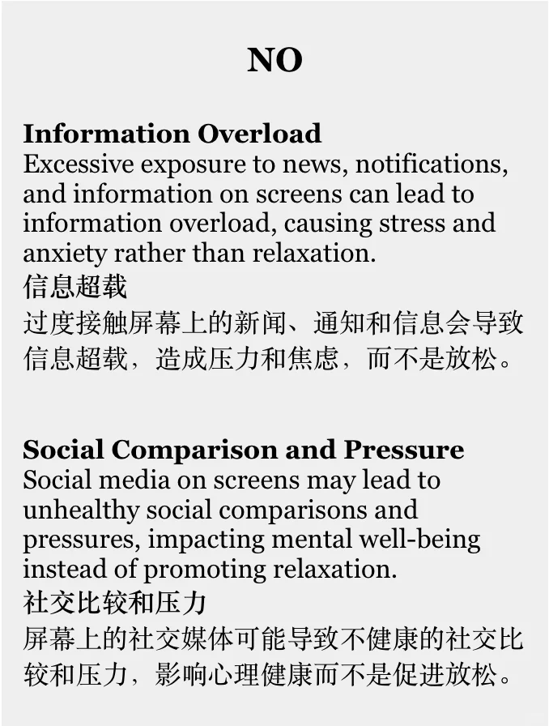

# 素材积累｜电子设备有利于放松吗？

话题来自于本季度雅思口语题库的part3问题:
does spending time in front of screens help people to relax?
	
尝试辩证地来回答这个问题吧～
#雅思备考 #雅思攻略 #雅思口语 #雅思口语素材 #英语 #英语口语 #雅思高分素材 #英语辩论 #英语写作素材

## 图片
| 图1 | 图2 | 图3 | 图4 |
| --- | --- | --- | --- |
|  |  |  |  |
|  |   |   |   |

生成时间：2025-11-15 00:11:41