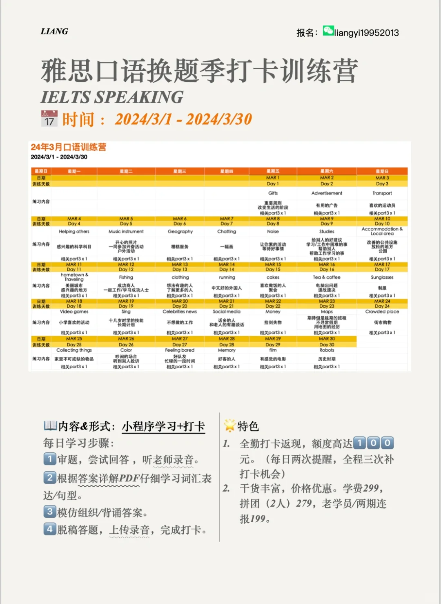
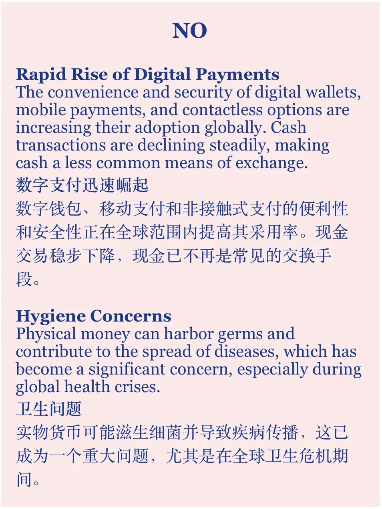
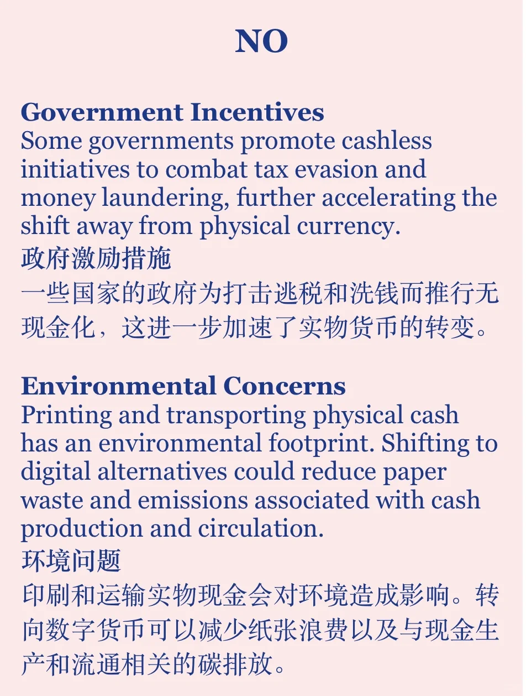
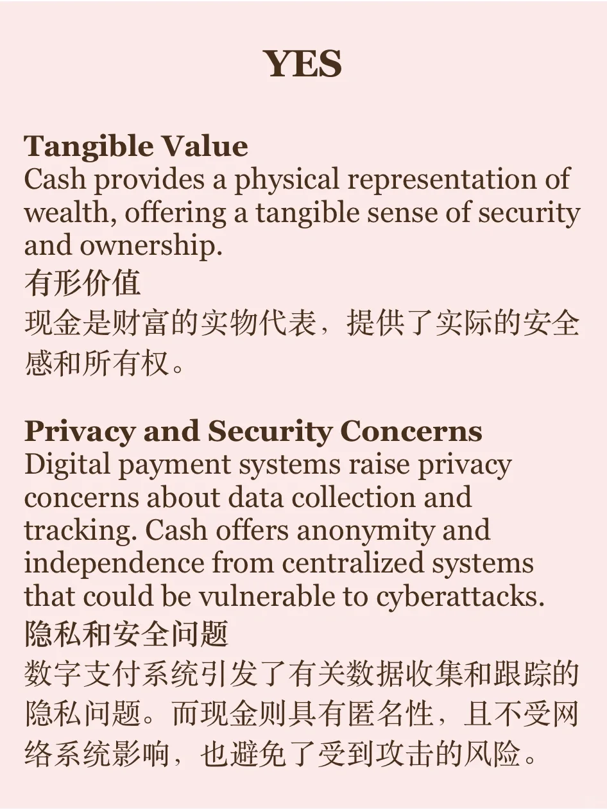

# 素材积累｜现金还会受欢迎吗？

话题来自当季雅思题库part1: money
电子支付在很多地区已经成为主流
接下来现金还会受欢迎吗？会被完全取代吗？
#雅思备考 #雅思口语 #雅思攻略 #作文素材积累 #素材 #素材分享 #英语口语 #英语写作 #英语地道表达

## 图片
| 图1 | 图2 | 图3 | 图4 |
| --- | --- | --- | --- |
|  |  |  |  |
|  |  |   |   |

生成时间：2025-11-15 00:10:36