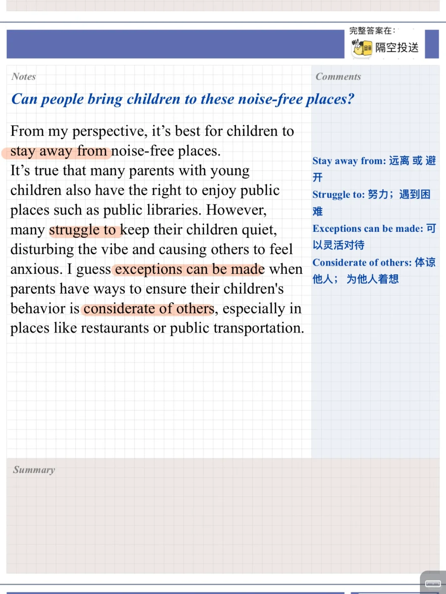
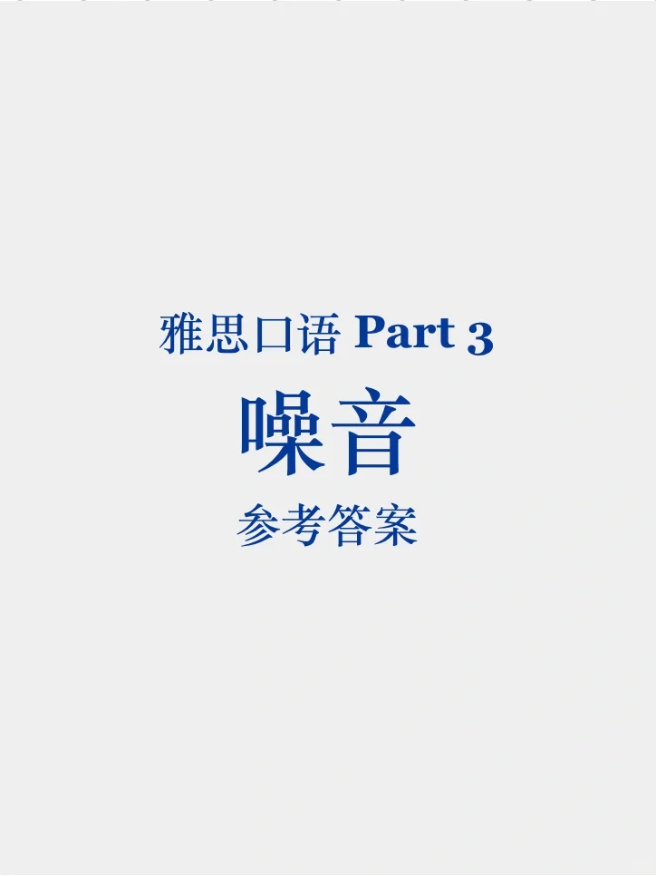
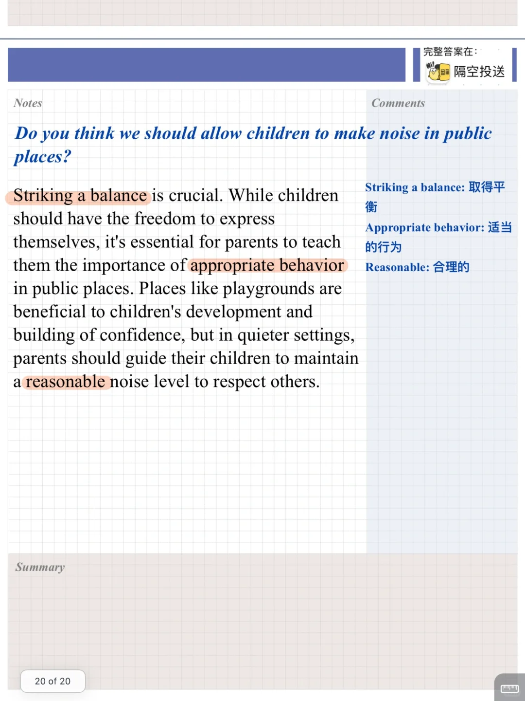
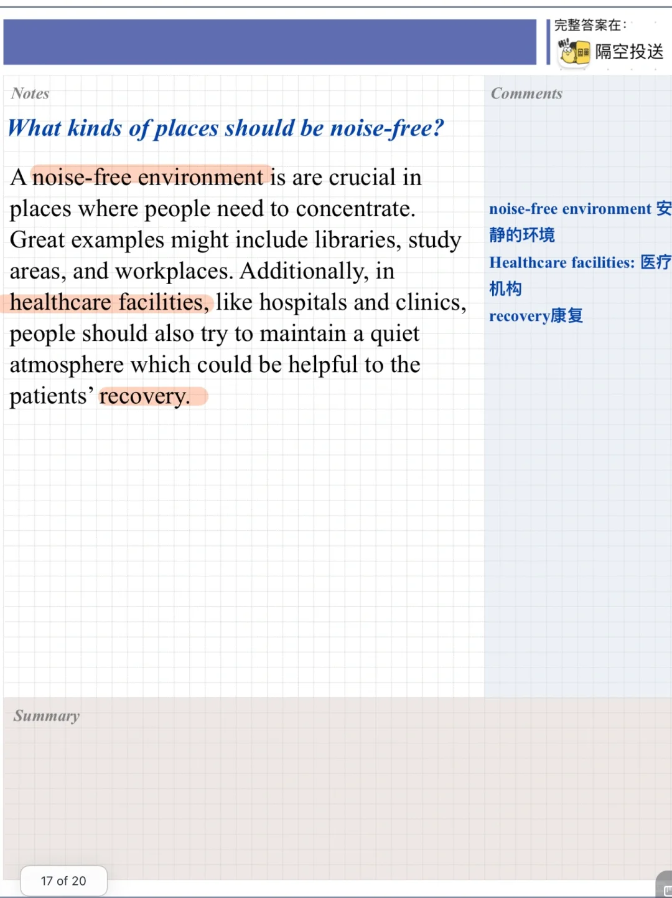
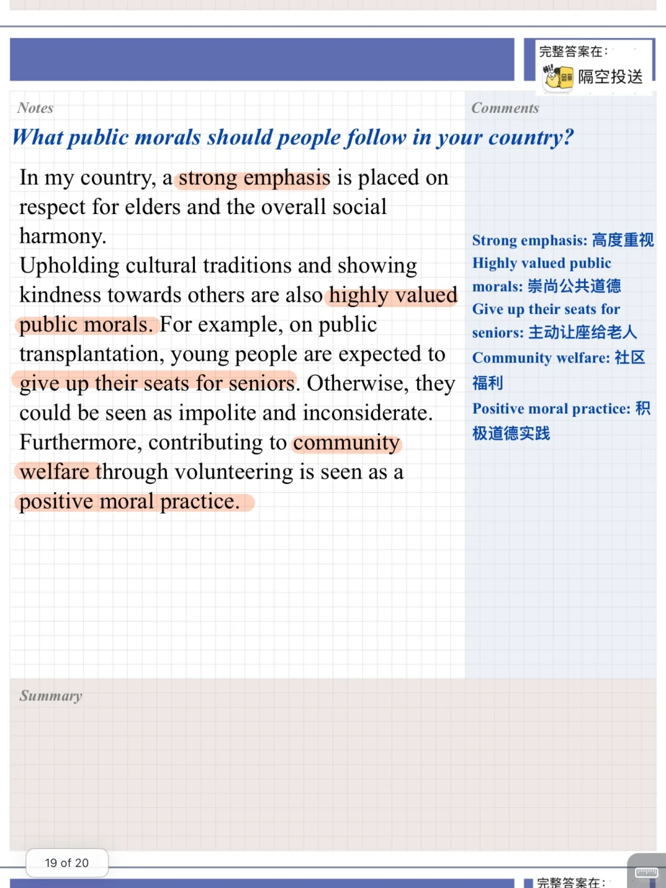

# 雅思口语参考答案｜P3 噪音的场合

#雅思备考 #雅思口语 #雅思攻略 #雅思口语素材 #雅思口语题库 #雅思 #雅思考试 #雅思口语答案 #雅思口语高分示范

## 图片
| 图1 | 图2 | 图3 | 图4 |
| --- | --- | --- | --- |
|  |  |  |  |
|  |   |   |   |

生成时间：2025-11-15 00:09:30