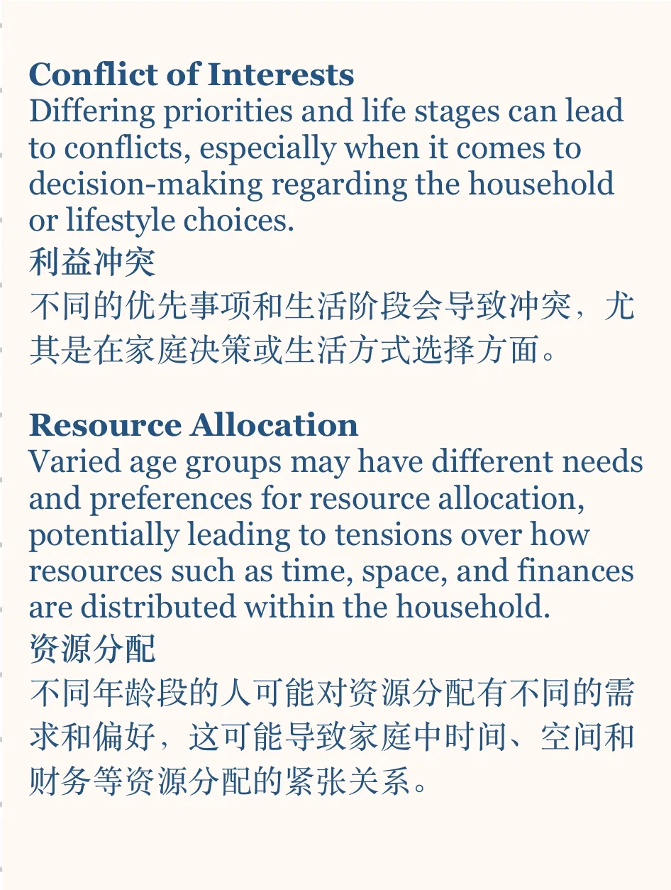
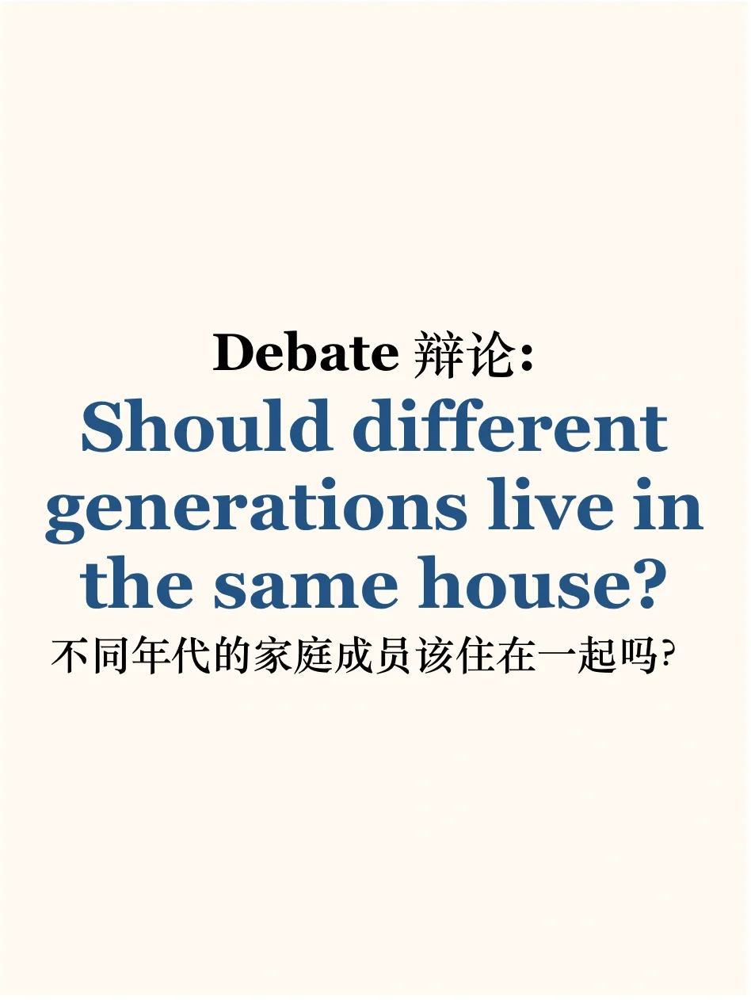
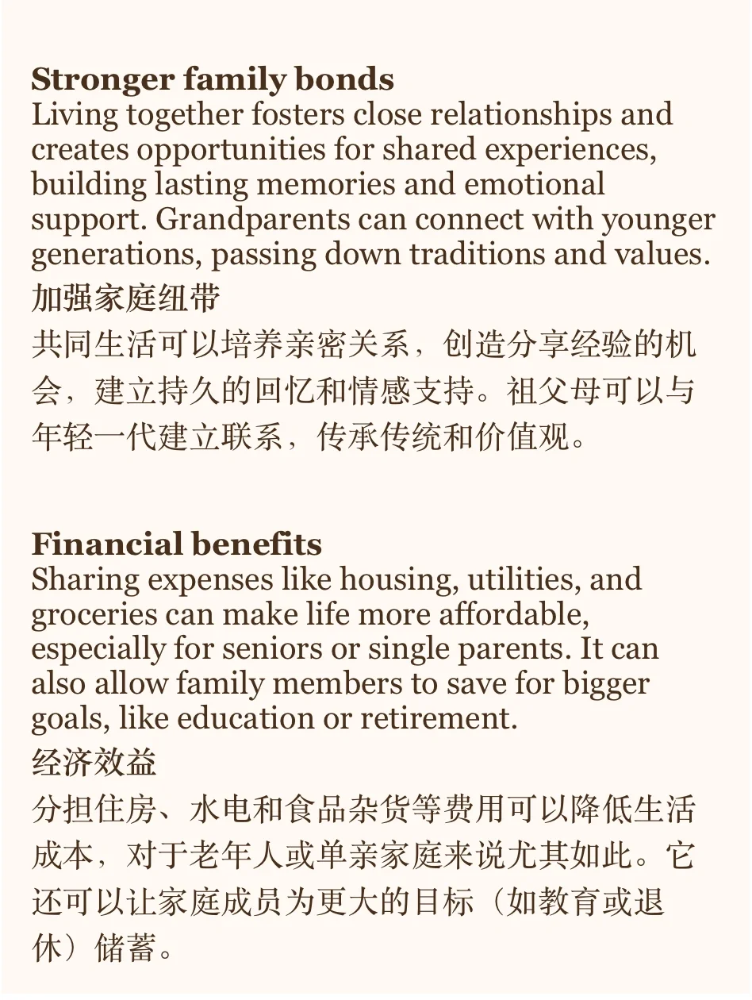
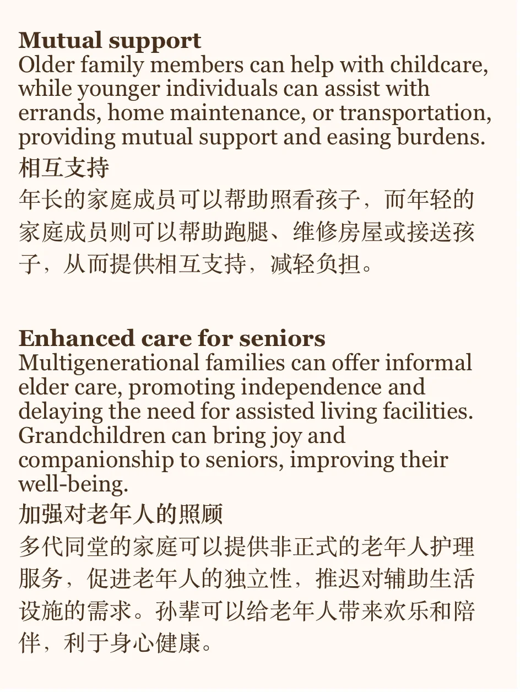
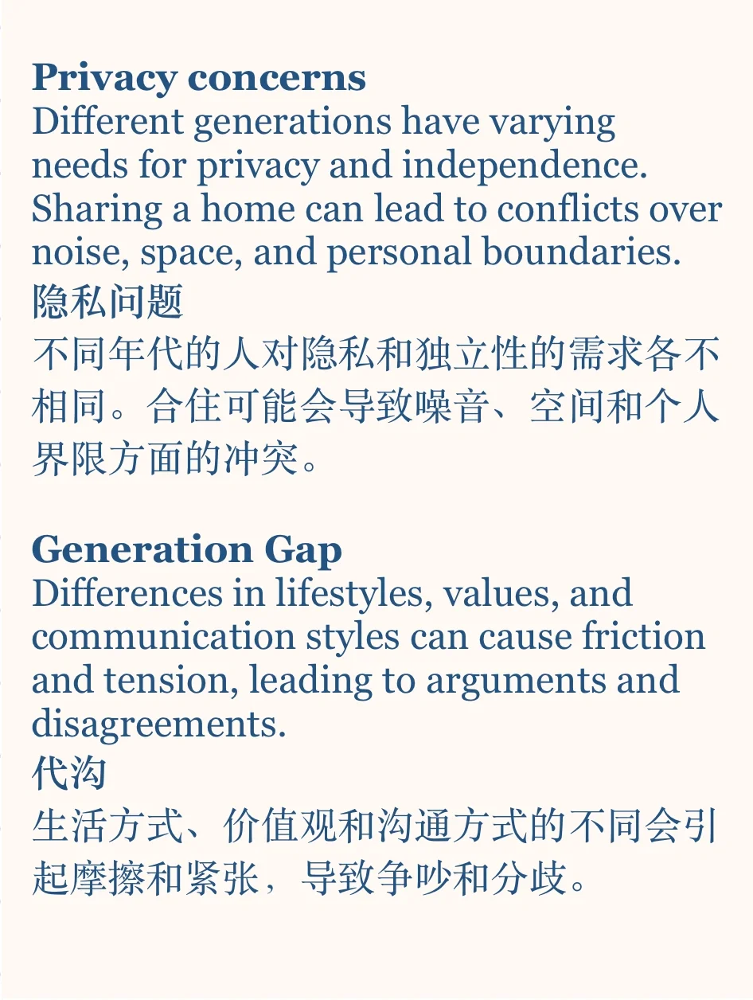

# 素材积累｜多代同堂是好是坏？

今天的话题来自当季雅思题库part3: what are the advantages of people of different ages living together?
你怎么看？
#雅思口语 #英语口语 #英语素材#写作素材#雅思攻略 #雅思口语part3

## 图片
| 图1 | 图2 | 图3 | 图4 |
| --- | --- | --- | --- |
|  |  |  |  |
|  |   |   |   |

生成时间：2025-11-15 00:08:24