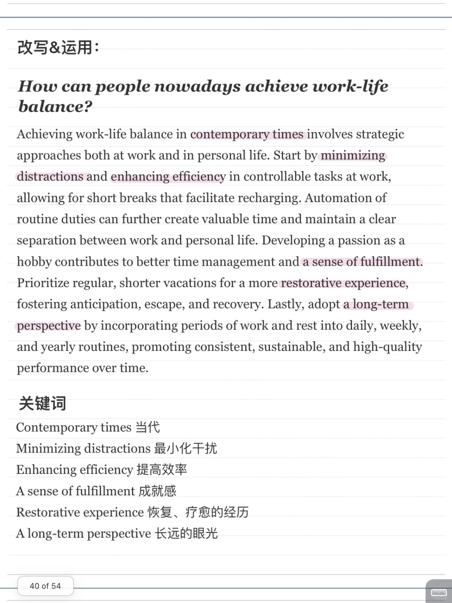
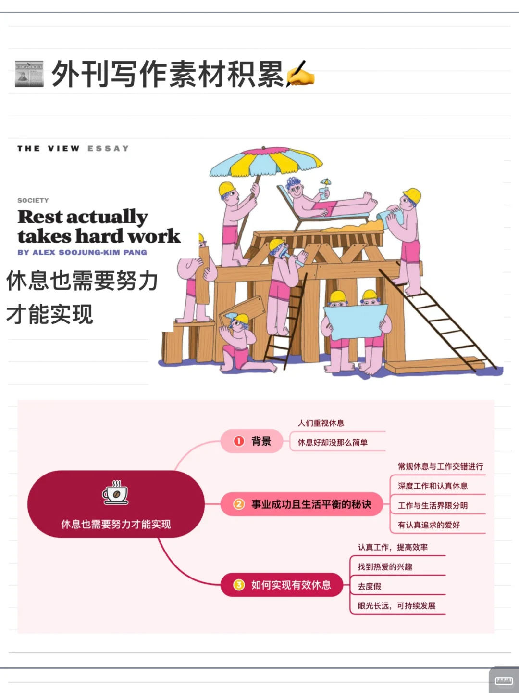
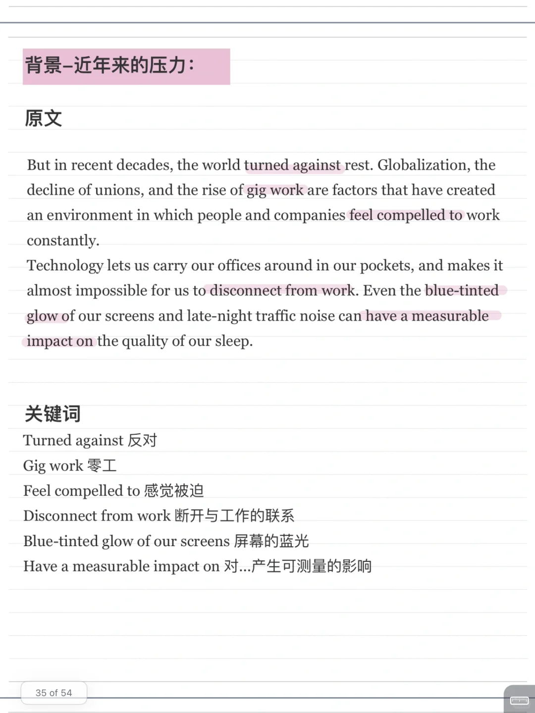
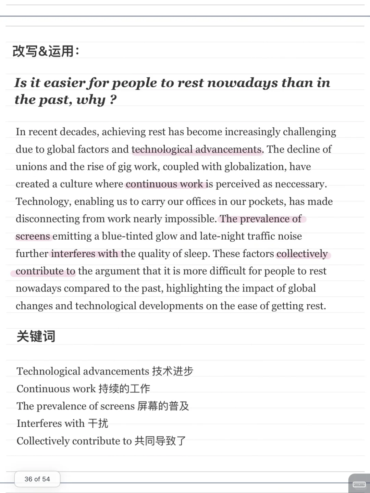
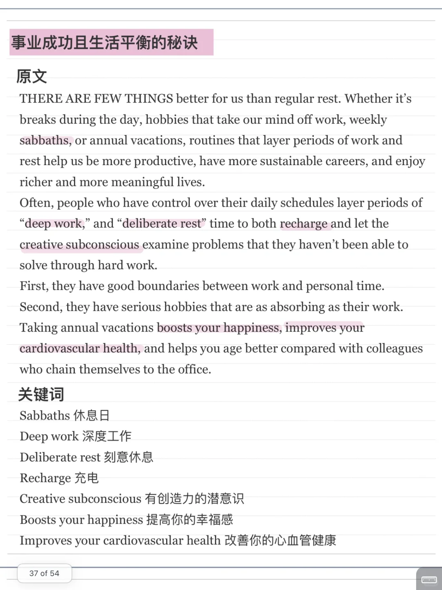
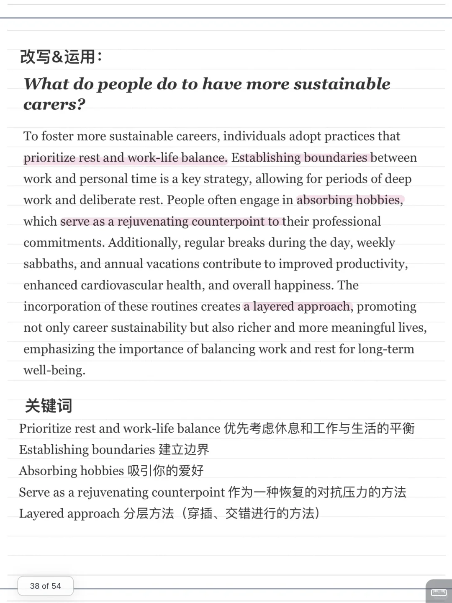
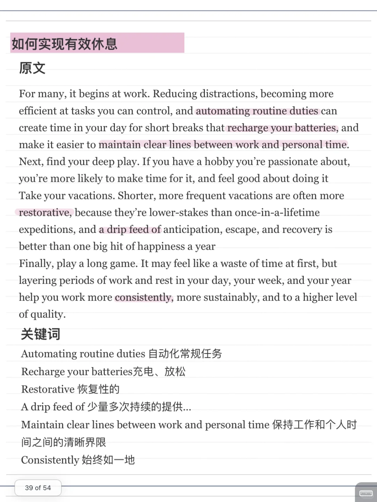

# 读外刊积累写作素材｜学会放松

文章来自The Times 杂志
主要讨论快节奏生活、工作至上的社会背景下，如何学会“刻意休息”，实现工作和生活的可持续发展。
针对以下几个角度改写了素材：
🌟如今人们为何难以放松？
🌟事业生活平衡的人是怎么做到的？
🌟如何休息，实现事业可持续发展？
	
杂志原文可以进group chat获得
#外刊 #外刊阅读 #外刊写作素材 #写作素材 #雅思 #雅思口语 #雅思攻略 #作文素材积累

## 图片
| 图1 | 图2 | 图3 | 图4 |
| --- | --- | --- | --- |
|  |  |  |  |
|  |  |  |   |

生成时间：2025-11-15 00:07:19