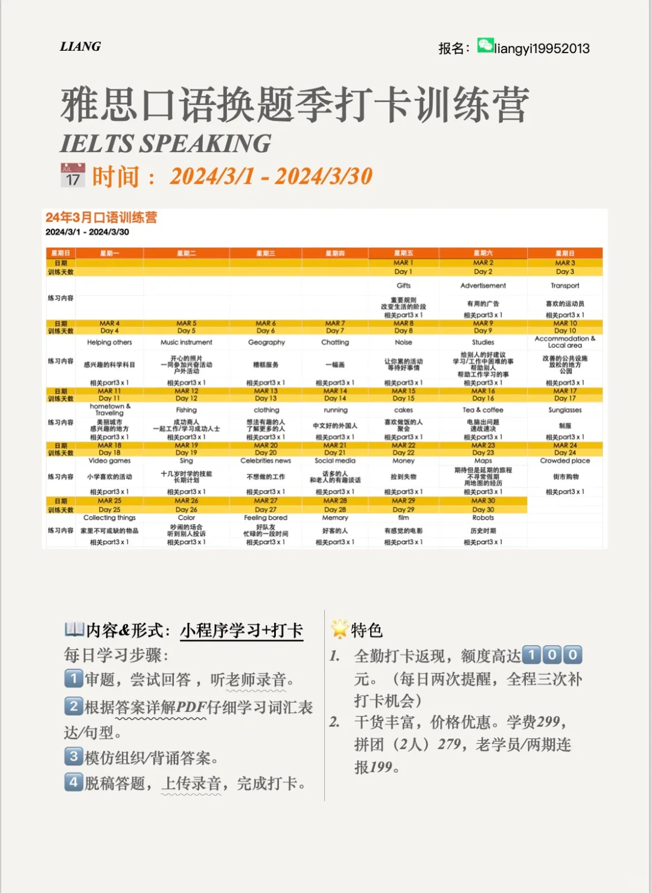
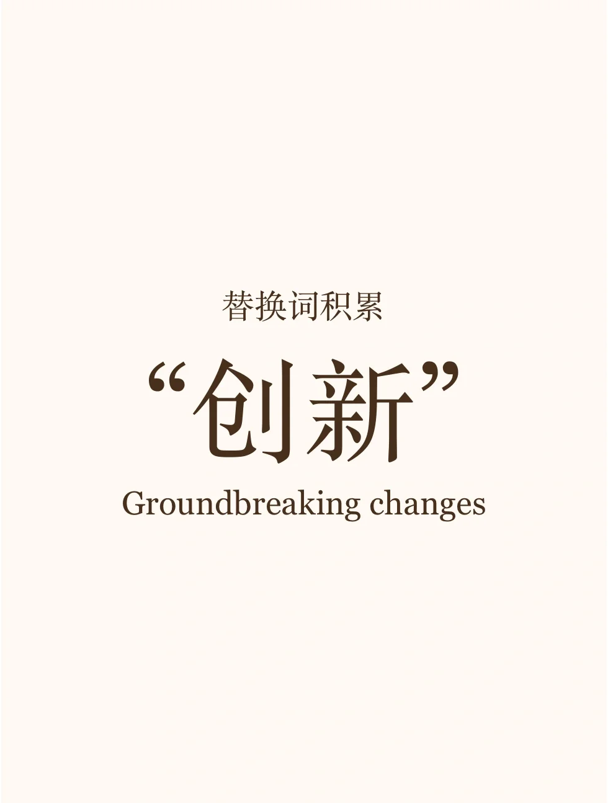
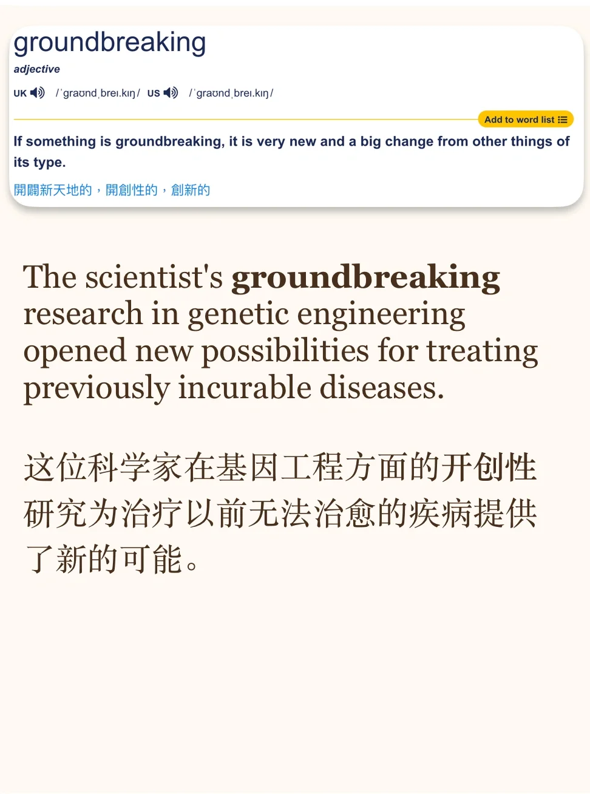
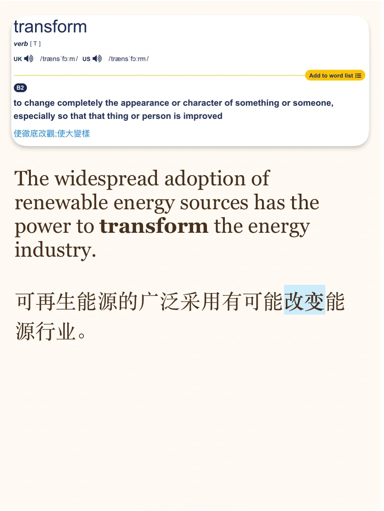
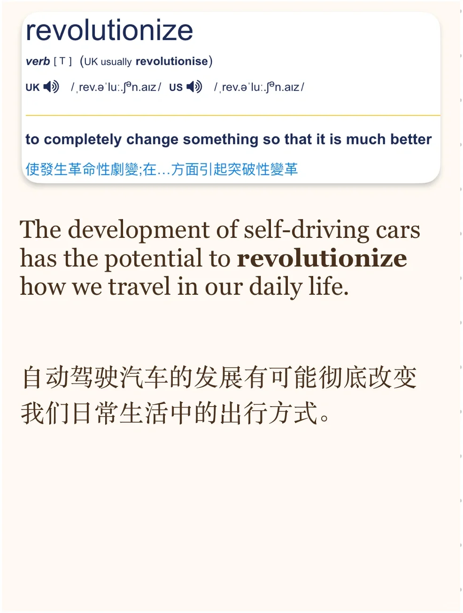
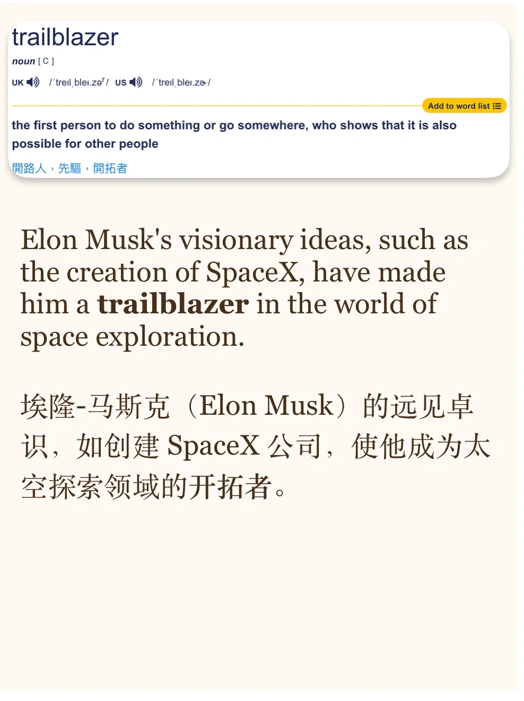

# 词汇积累｜聊创新、变化、引领改革

今天积累创新主题相关的词汇，积累新词注意看例句，理解语境～
#英语单词 #背单词打卡 #雅思备考 #雅思攻略 #英语写作 #词汇积累 #英语口语 #雅思口语打卡训练营

## 图片
| 图1 | 图2 | 图3 | 图4 |
| --- | --- | --- | --- |
|  |  |  |  |
|  |  |  |  |

生成时间：2025-11-15 00:05:06