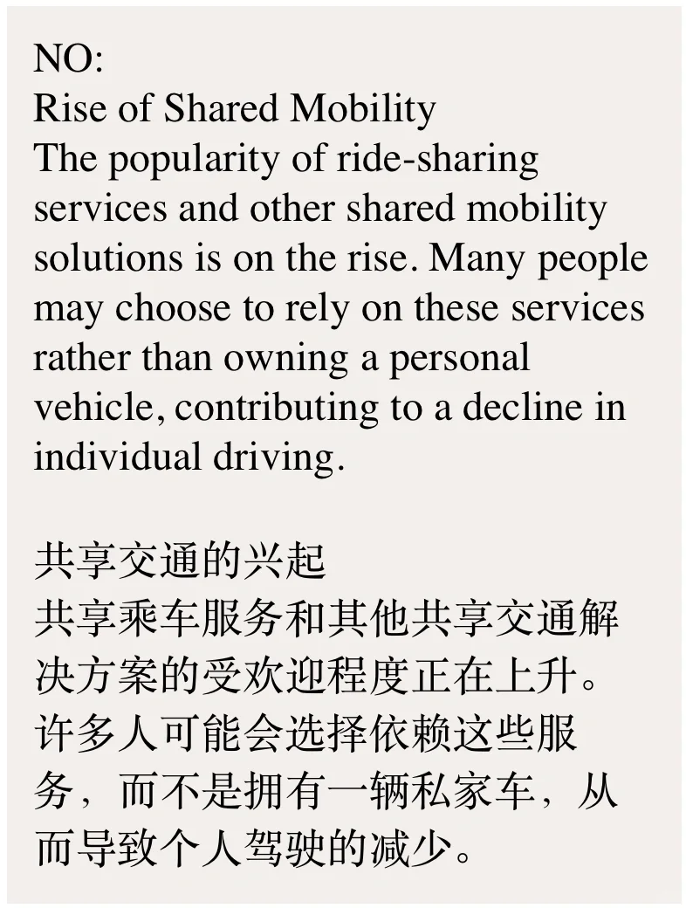
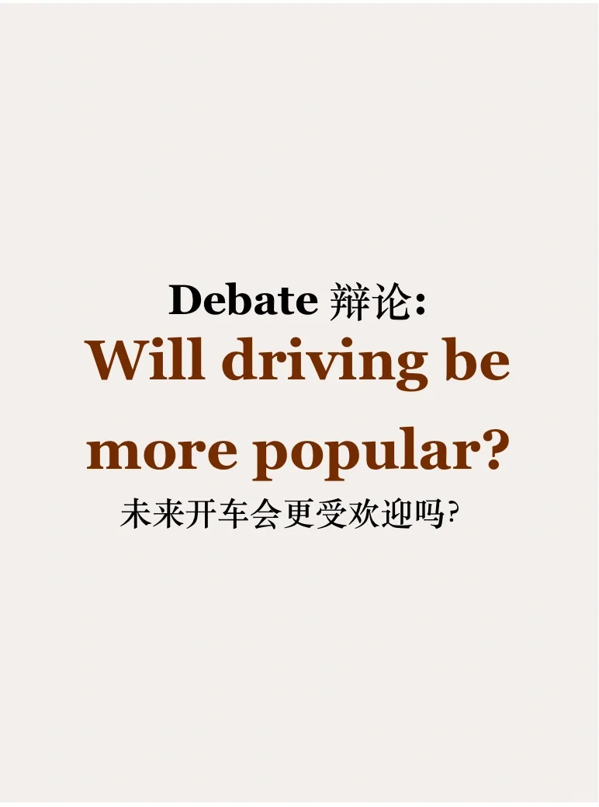
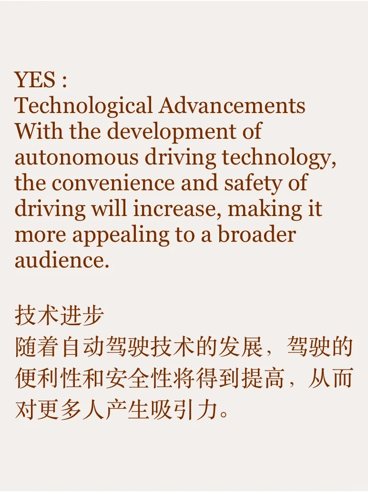
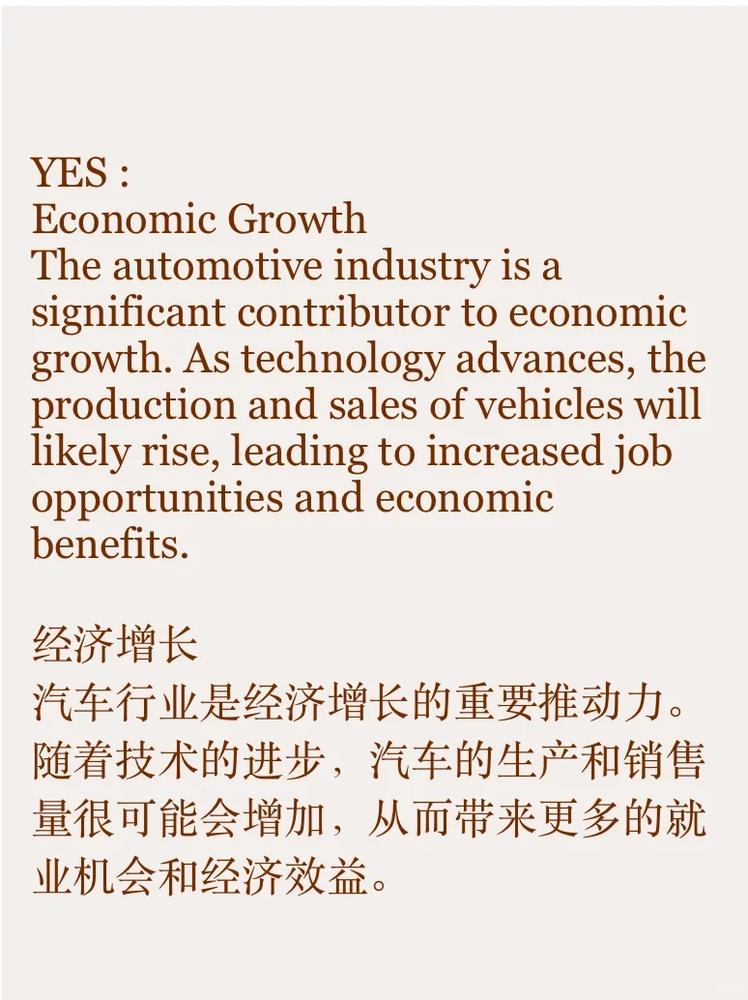
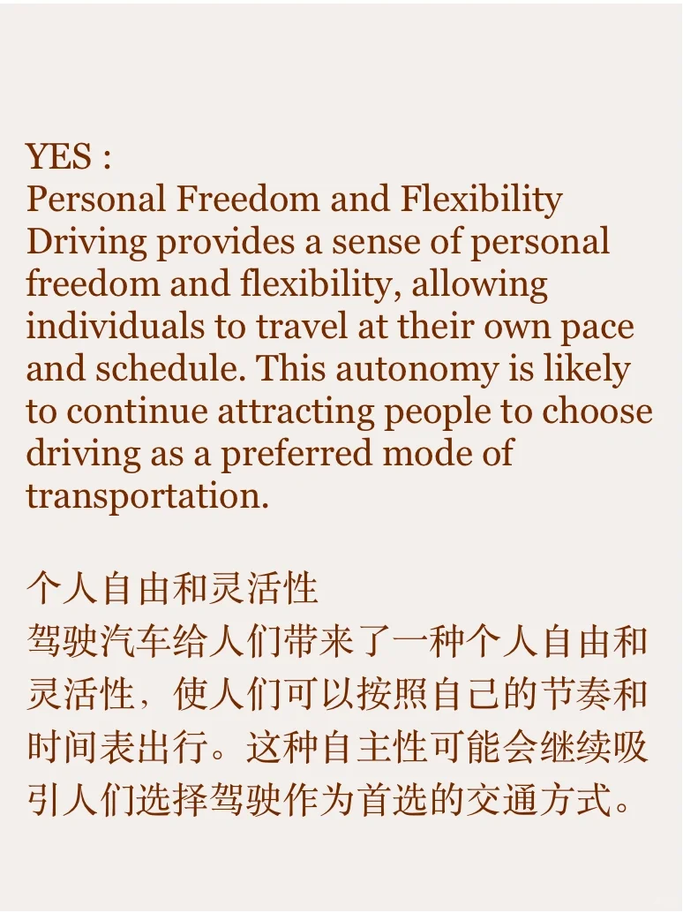
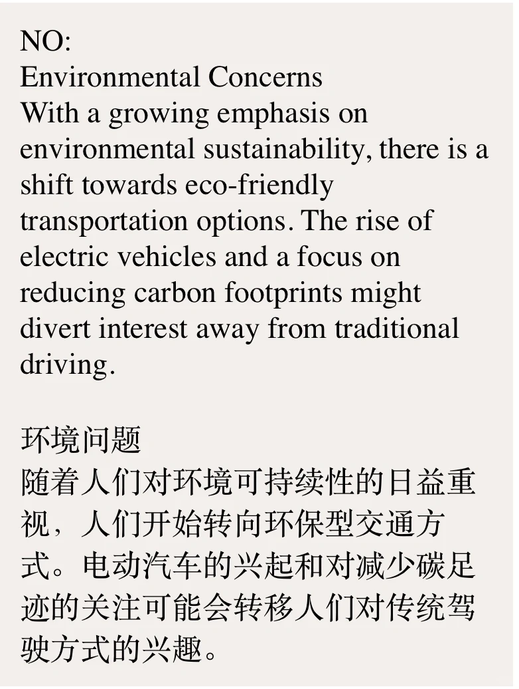
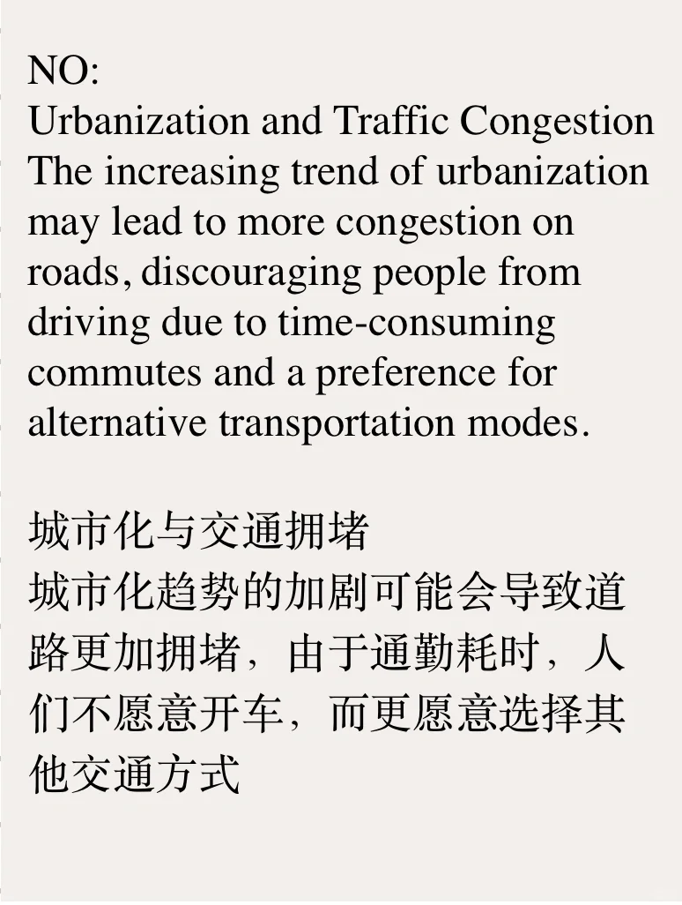

# 雅思素材积累｜私家车未来还会受欢迎吗？

今天的话题来自题库part1 题目
Do you think driving will be more popular in the future?
从私家车本身的隐私性、舒适性优势和社会经济科技进步来看，开车可能会继续受欢迎。
但随着环境和堵车问题加重、交通方式多样性提升，私家车或许会不再是人们的第一选择。
你怎么看？
#雅思备考 #雅思口语 #雅思攻略 #雅思口语素材 #英语口语 #英语口语攻略 #英语写作素材

## 图片
| 图1 | 图2 | 图3 | 图4 |
| --- | --- | --- | --- |
|  |  |  |  |
|  |  |  |   |

生成时间：2025-11-15 00:04:00