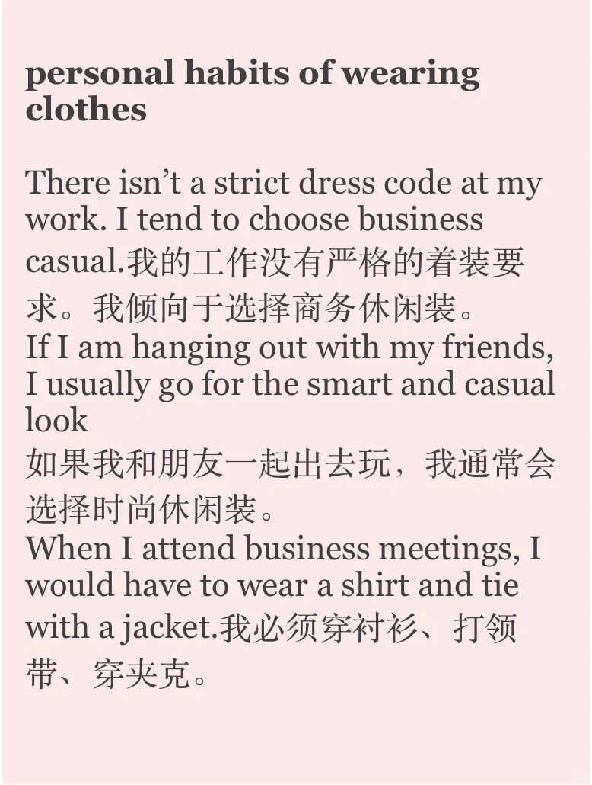
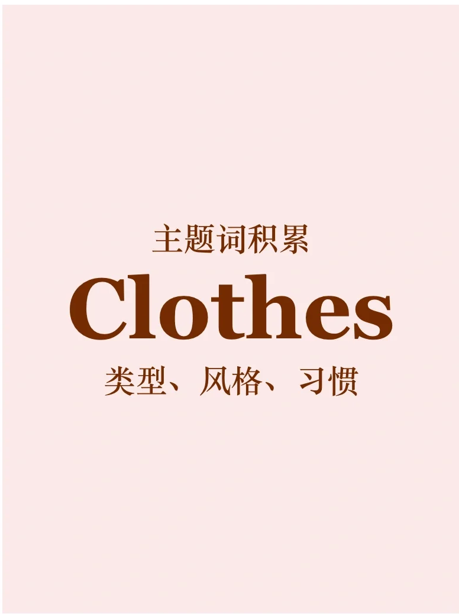
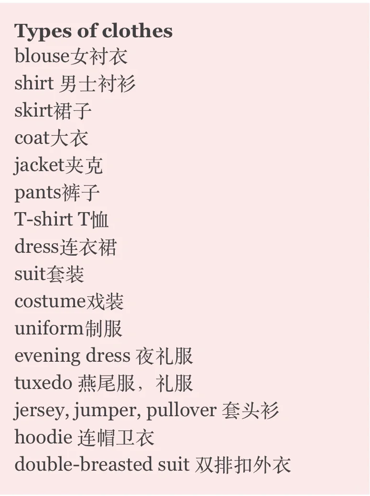
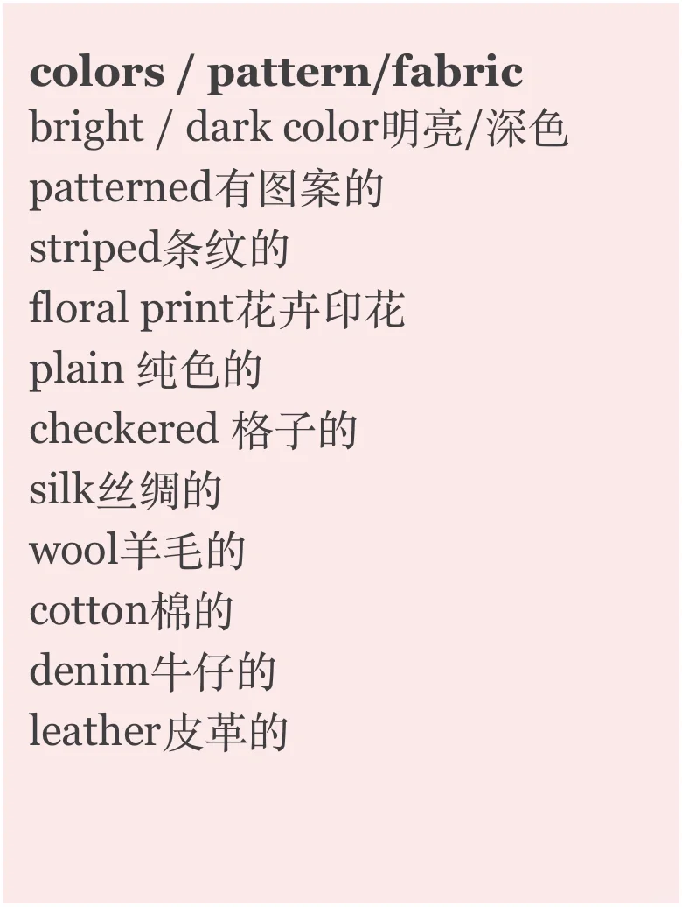
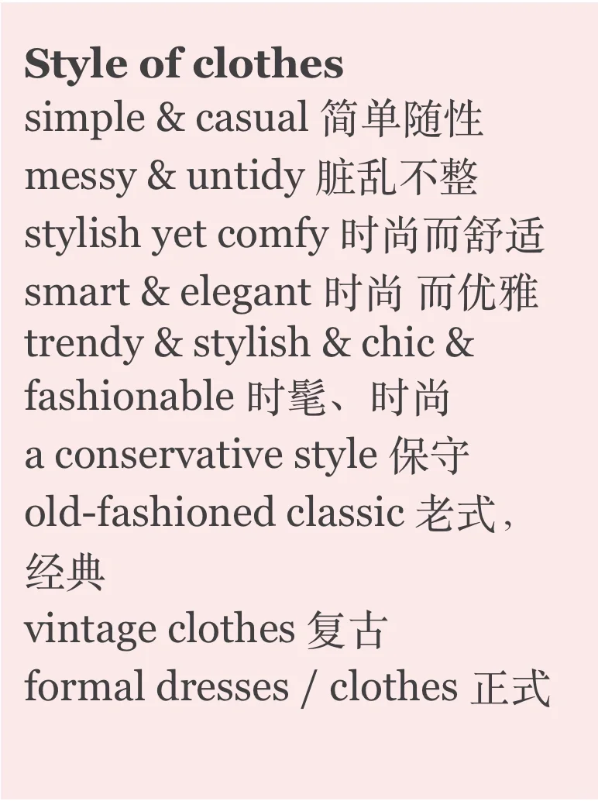
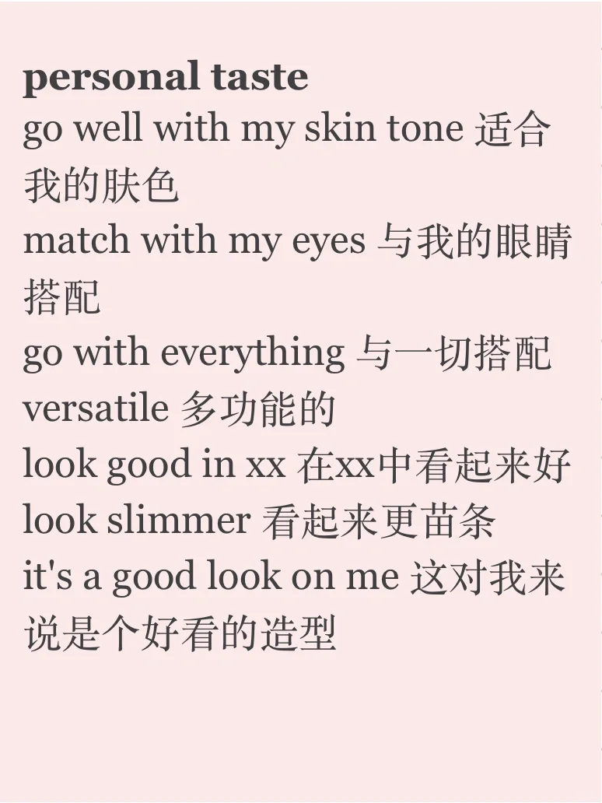
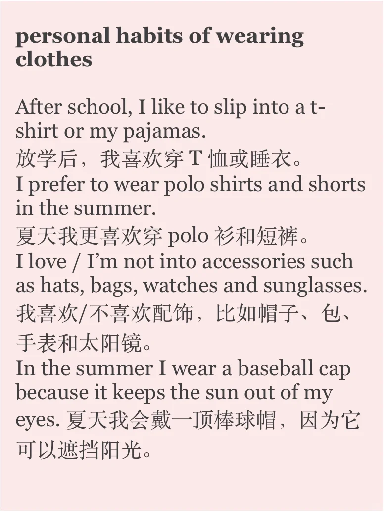

# 主题词积累｜如何用英语聊衣服？

clothes 是长期在题库中存在的日常生活话题
今天补充类型、风格、习惯等角度的描述素材
一起积累吧💪
#雅思 #雅思口语 #雅思备考 #英语学习打卡 #雅思攻略 #英语教育分享 #衣服 #英语口语 #日常口语

## 图片
| 图1 | 图2 | 图3 | 图4 |
| --- | --- | --- | --- |
|  |  |  |  |
|  |  |  |   |

生成时间：2025-11-15 00:02:52