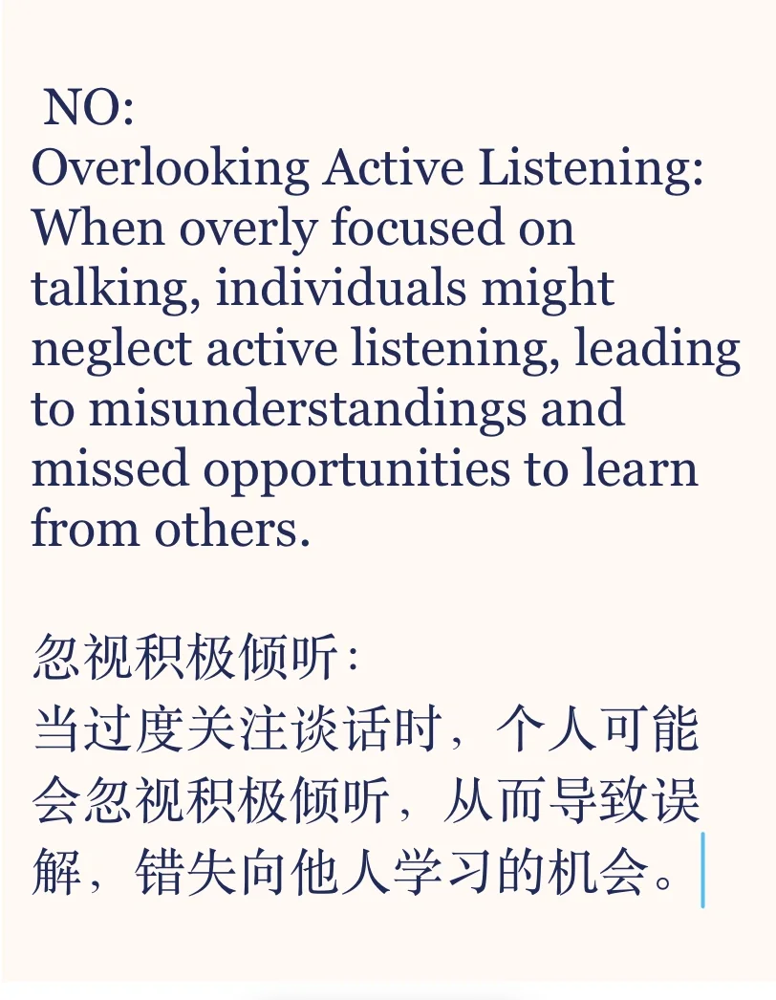
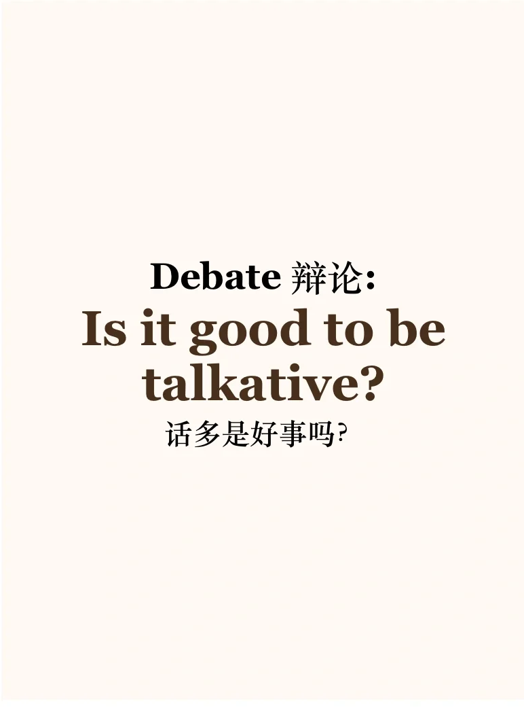
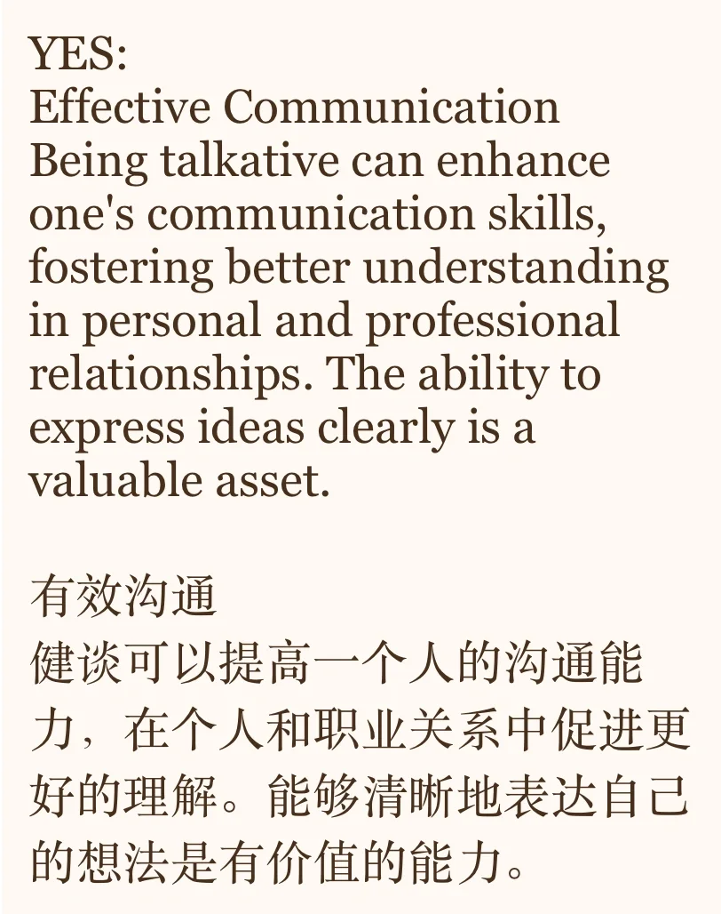
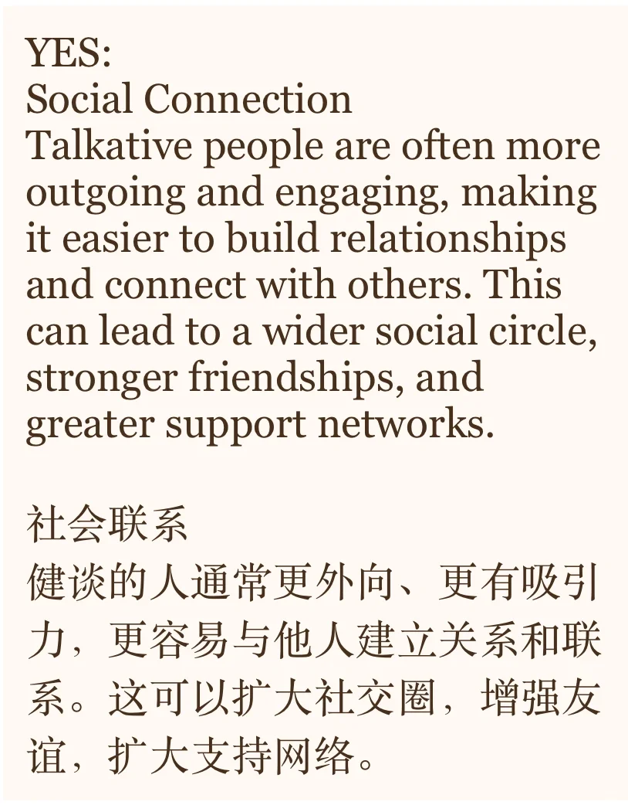
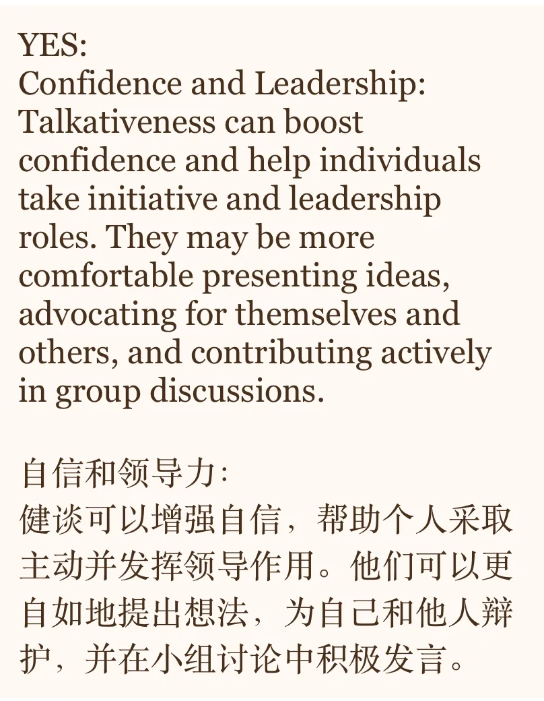
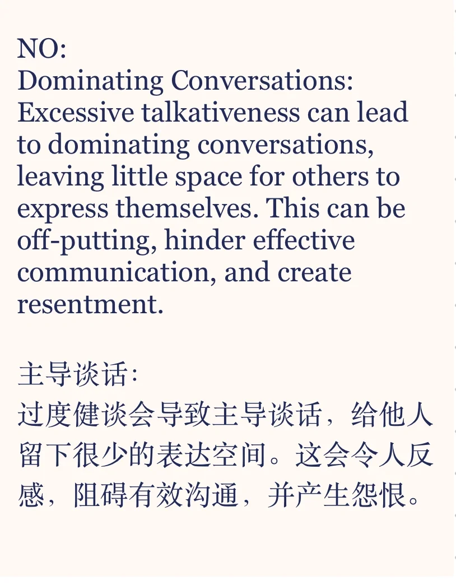
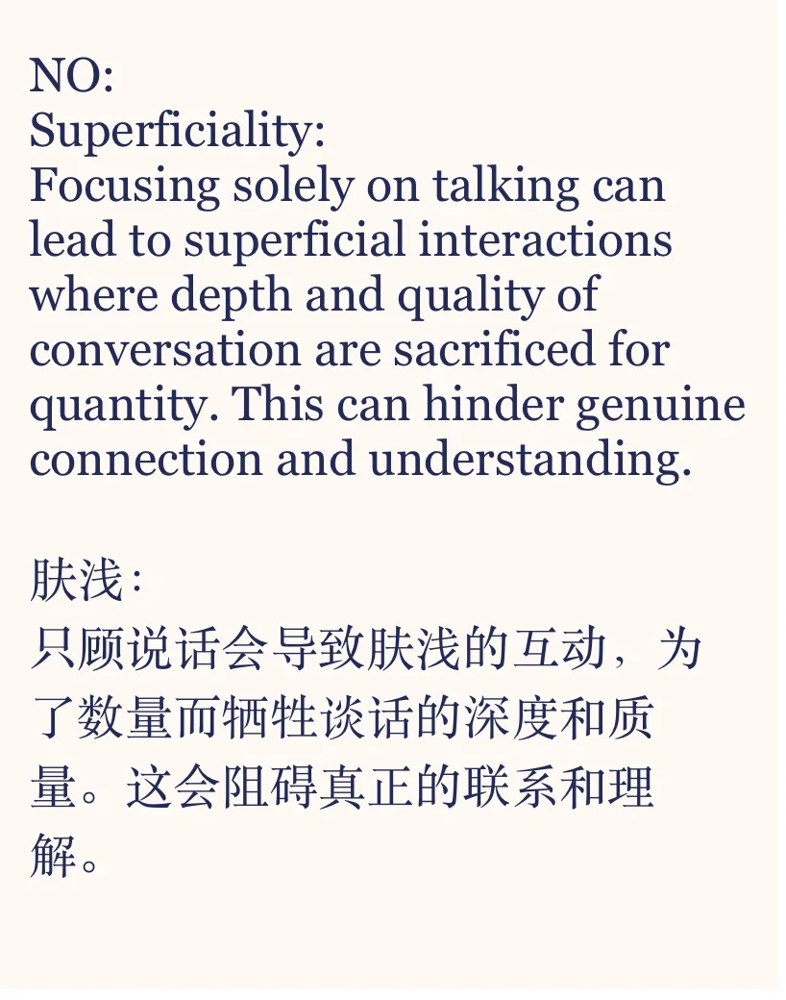

# 素材积累｜话多是好是坏？

话题来自雅思口语题库part3
Is it good to be talkative?
正反方都列举了三个角度，你是否同意呢？
你是健谈的人吗？ 你觉得是好是坏？
#雅思备考 #雅思口语 #雅思攻略 #作文素材积累 #素材 #英语口语 #英语口语攻略

## 图片
| 图1 | 图2 | 图3 | 图4 |
| --- | --- | --- | --- |
|  |  |  |  |
|  |  |  |   |

生成时间：2025-11-15 00:01:46