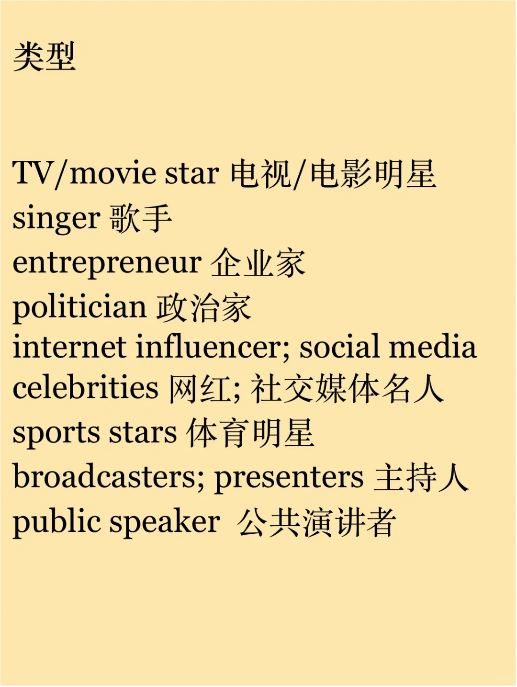

# 口语话题词积累｜名人Celebrities

生活中有哪些类型的名人？
他们做什么事出名？有什么特点？
为什么人们会喜欢他们？
#雅思备考 #雅思口语 #雅思攻略 #雅思词汇 #英语口语攻略 #英语词汇

## 图片
| 图1 | 图2 | 图3 | 图4 |
| --- | --- | --- | --- |
|  |  |  |  |
|  |   |   |   |

生成时间：2025-11-14 23:59:33