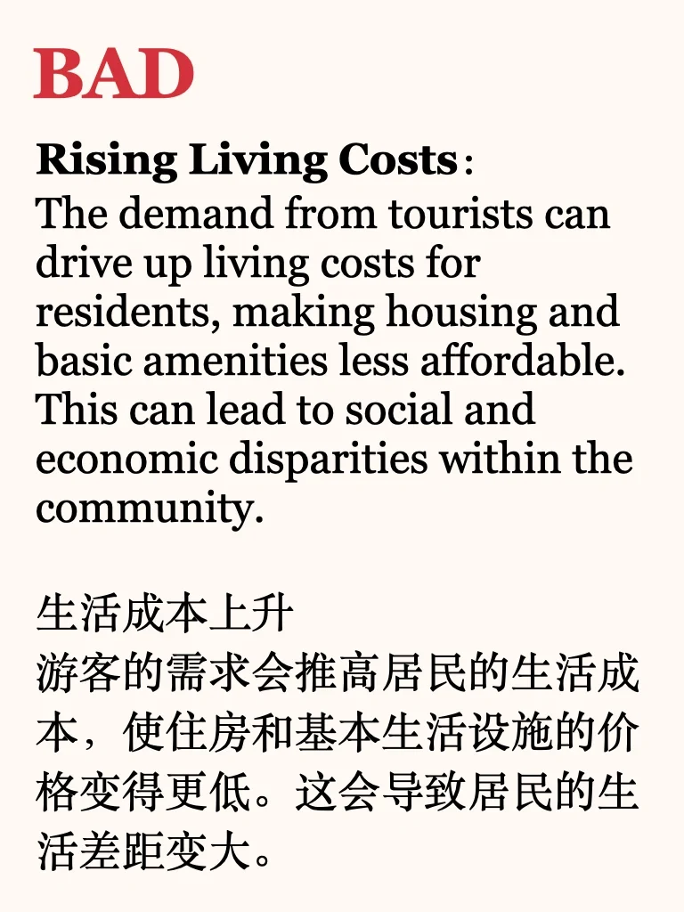
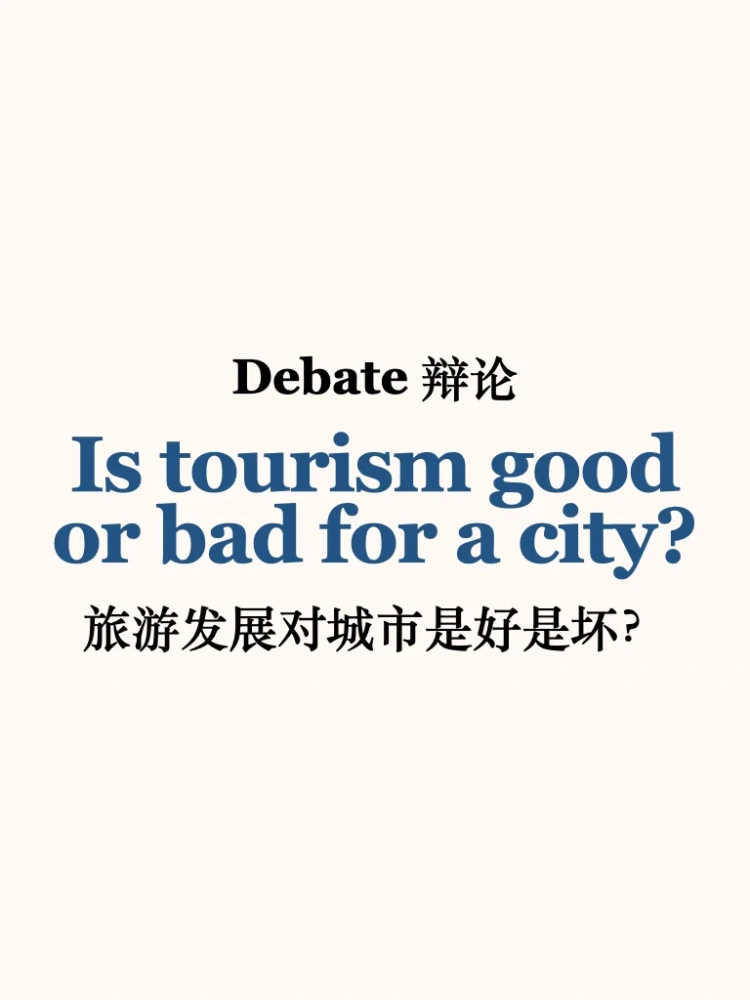
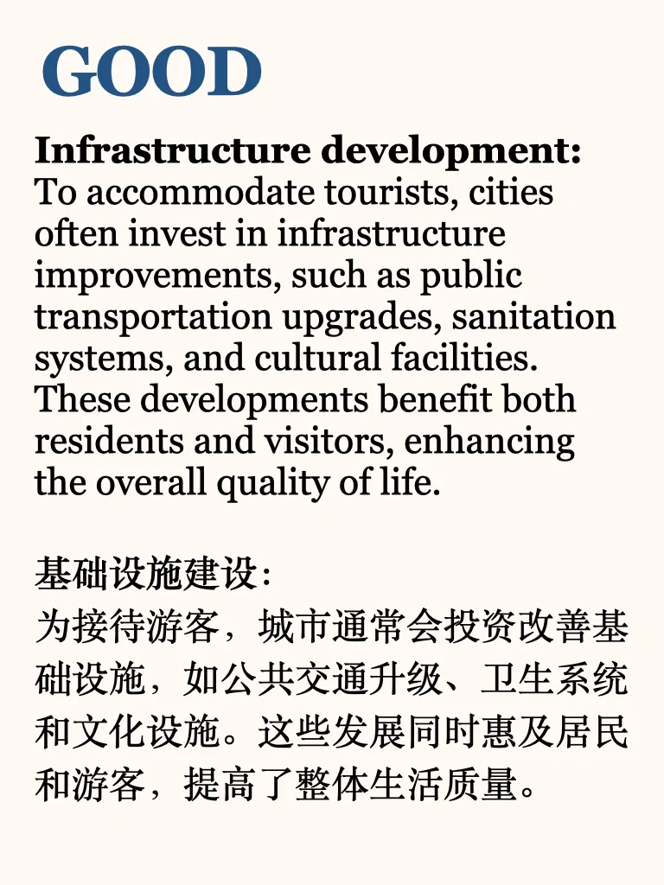
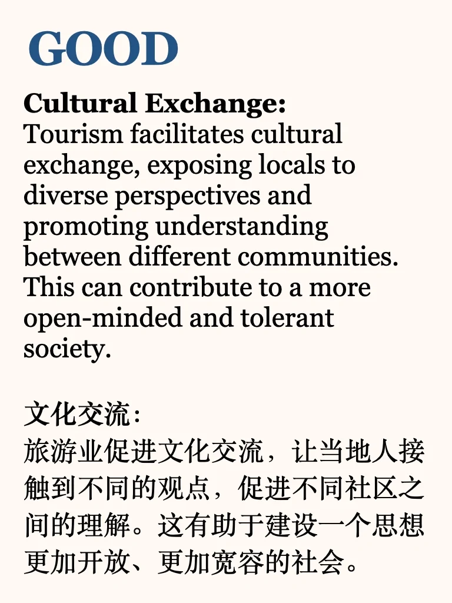
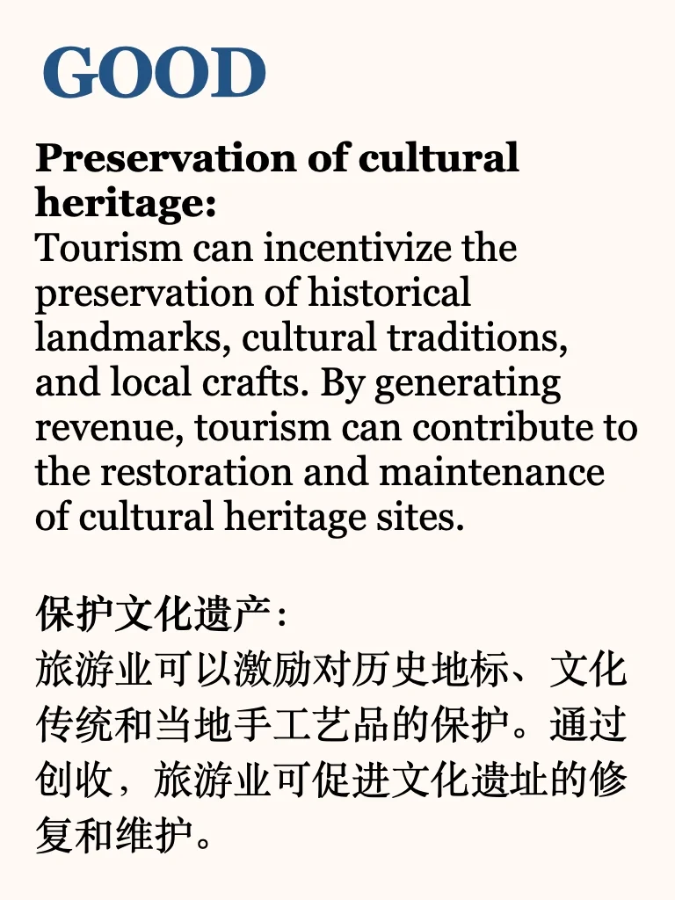
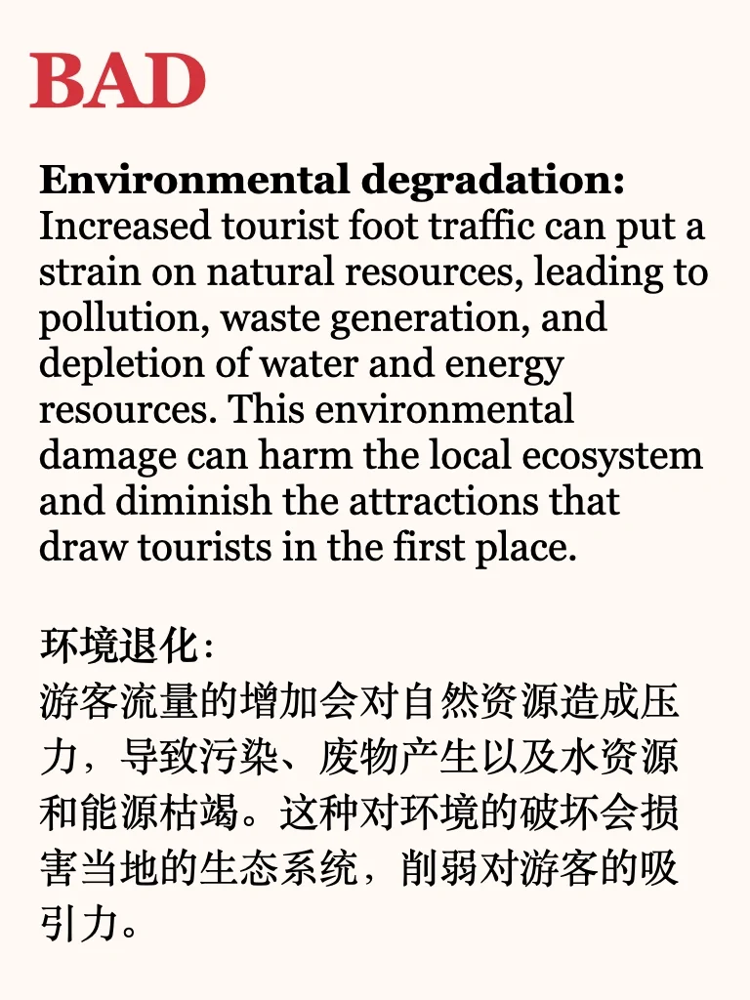
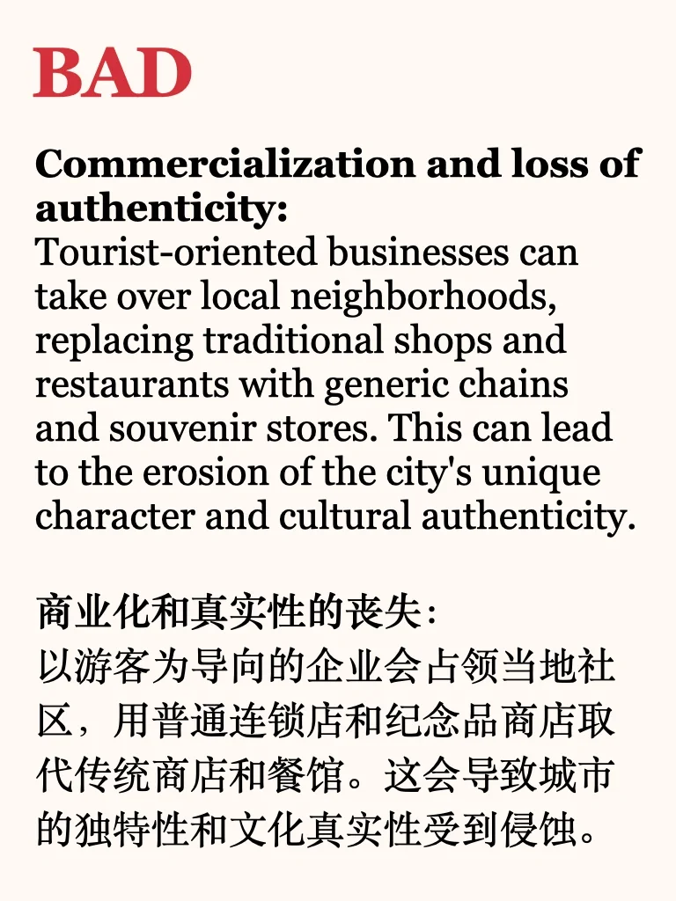
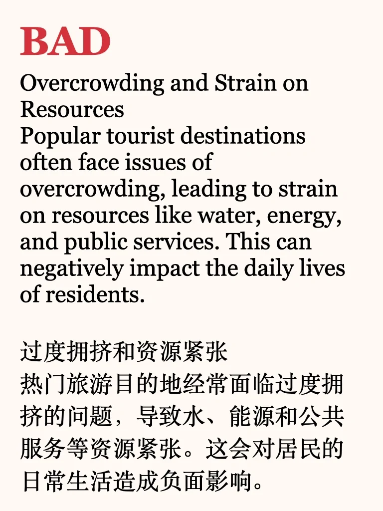

# 辩证素材积累｜旅游业对城市的好坏

#雅思备考 #雅思口语 #雅思攻略 #作文素材积累 #素材 #作文素材 #英语口语 #英语写作

## 图片
| 图1 | 图2 | 图3 | 图4 |
| --- | --- | --- | --- |
|  |  |  |  |
|  |  |  |  |
|  |   |   |   |

生成时间：2025-11-14 23:57:22