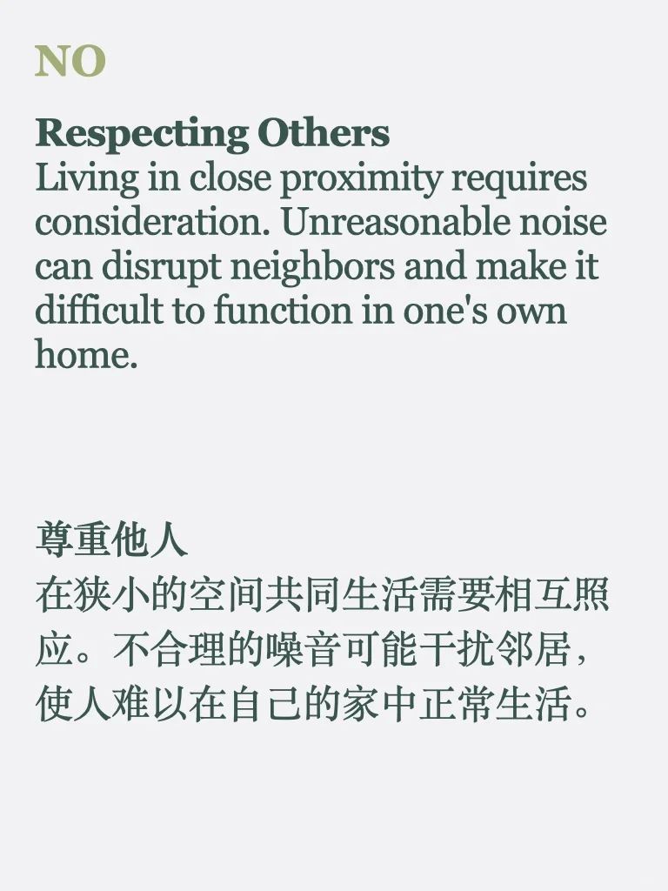
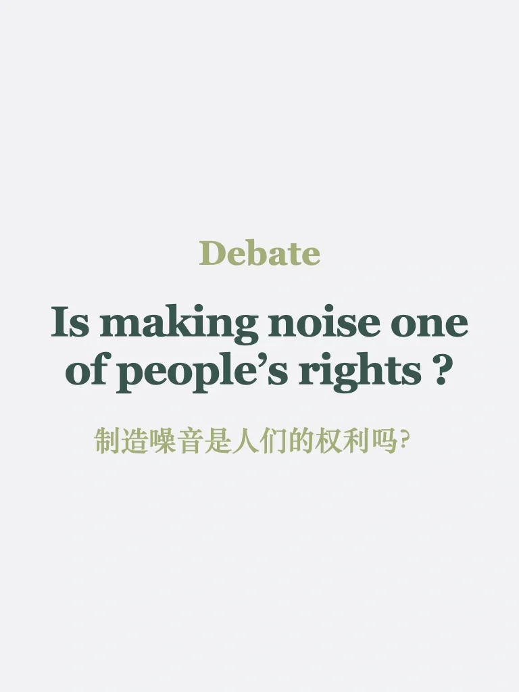
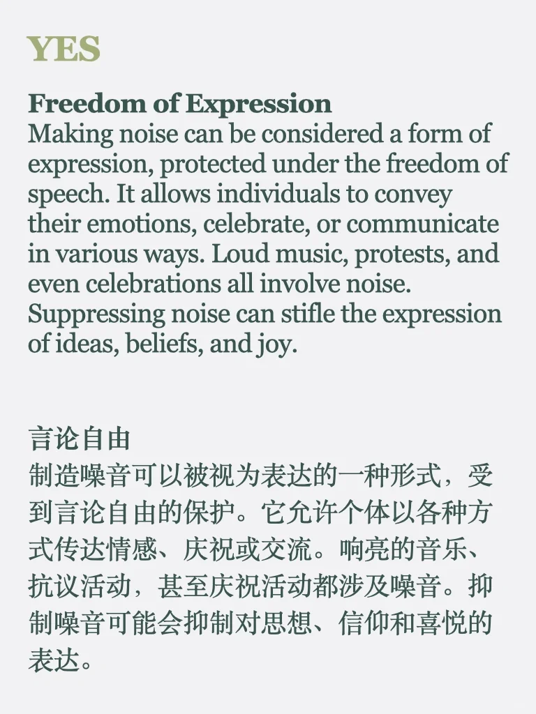
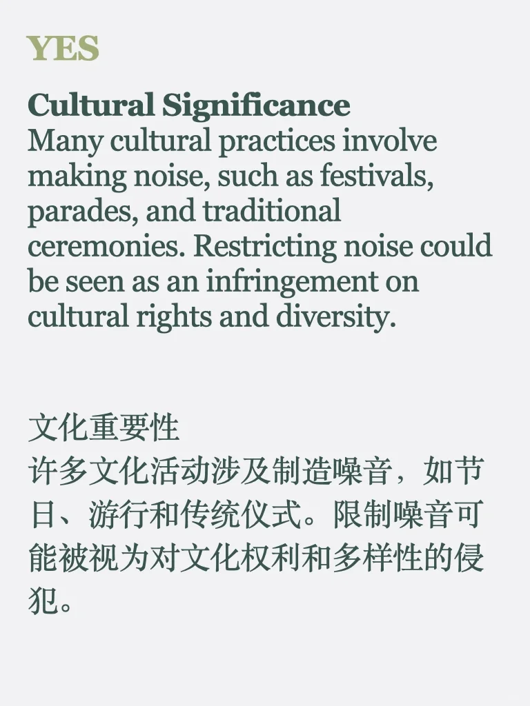
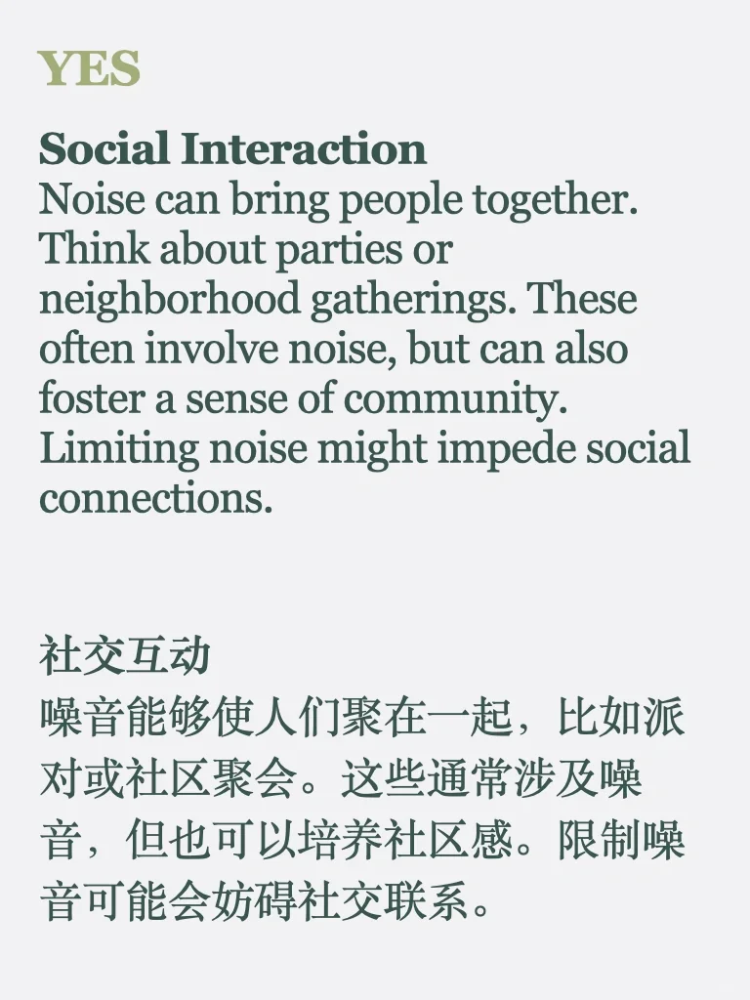
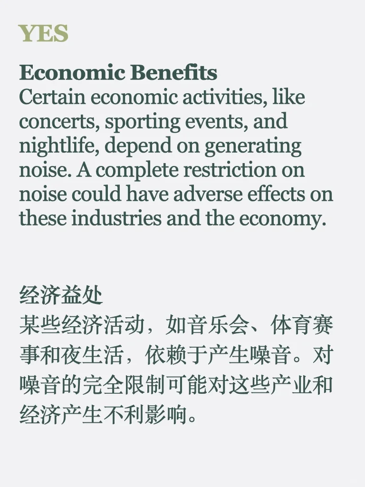
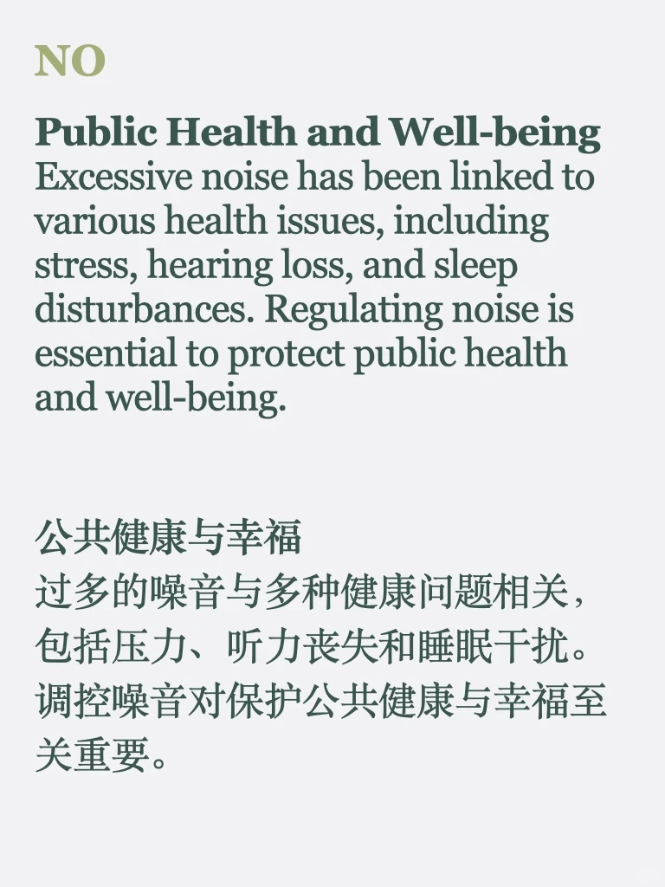
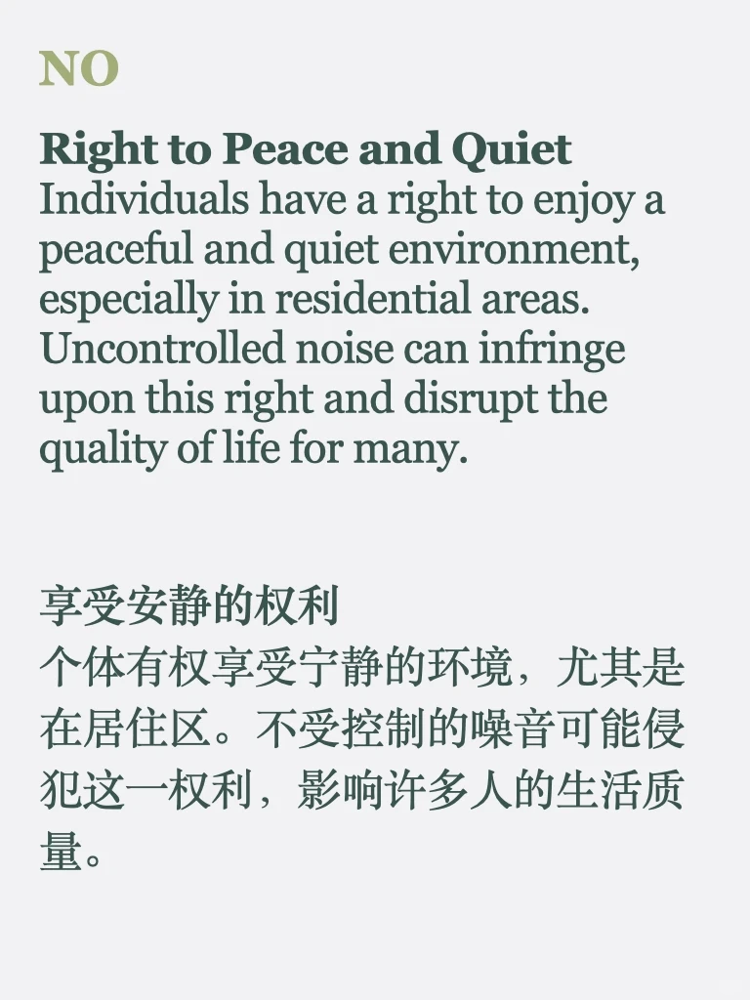
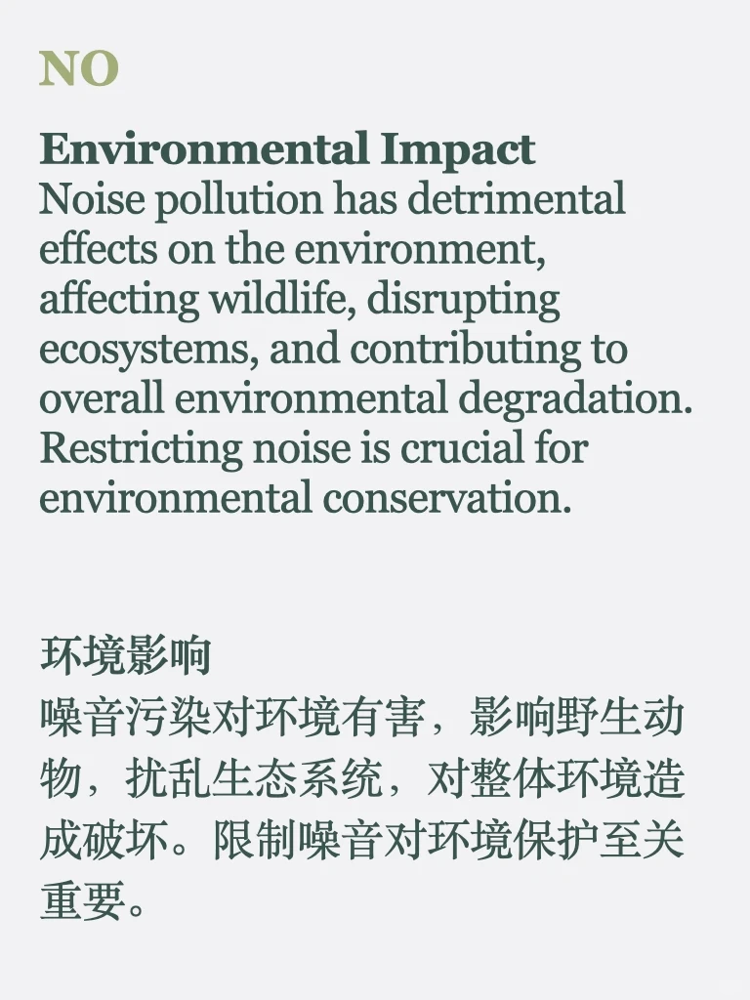

# 辩论Debate｜制造噪音是人们的权利吗？

来积累一些辩证素材～
#雅思 #雅思口语 #雅思备考 #雅思攻略 #素材 #英语口语 #英语写作 #英语地道表达

## 图片
| 图1 | 图2 | 图3 | 图4 |
| --- | --- | --- | --- |
|  |  |  |  |
|  |  |  |  |
|  |   |   |   |

生成时间：2025-11-14 23:50:47