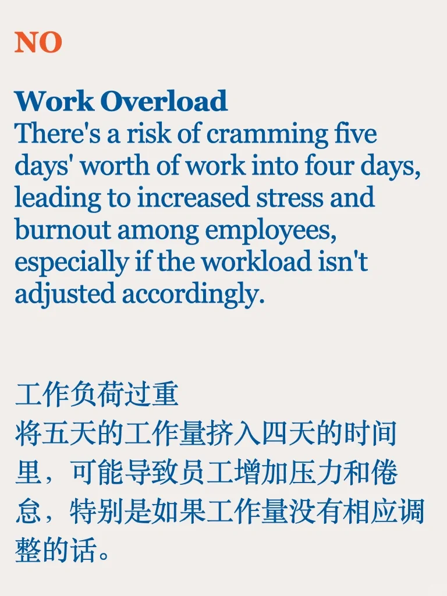
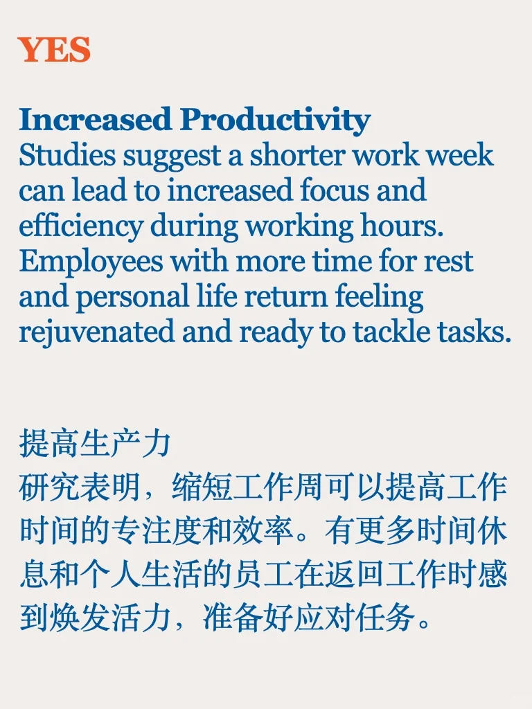
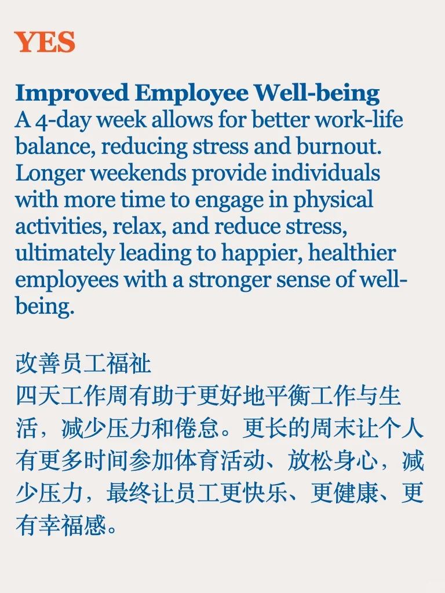
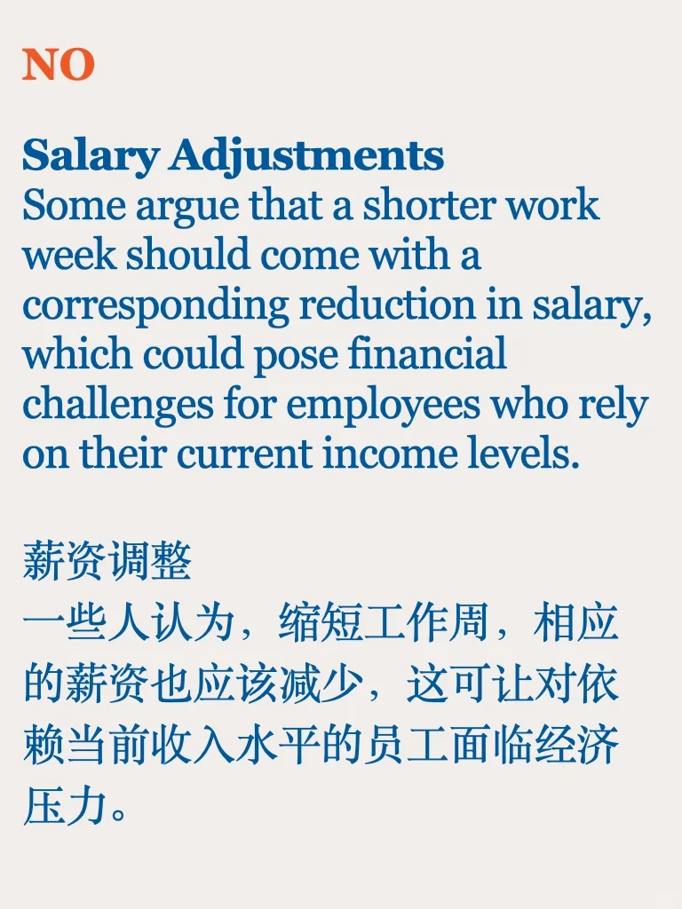

# Debate 辩论｜应该实行一周四天工作制吗

上四天班休息三天 美好的愿望还是要有的
#雅思 #雅思口语 #雅思备考 #雅思攻略 #雅思素材#论证素材 #雅思辩论话题 #一周四天工作制度

## 图片
| 图1 | 图2 | 图3 | 图4 |
| --- | --- | --- | --- |
|  |  |  |  |
|  |  |  |   |

生成时间：2025-11-14 23:48:34