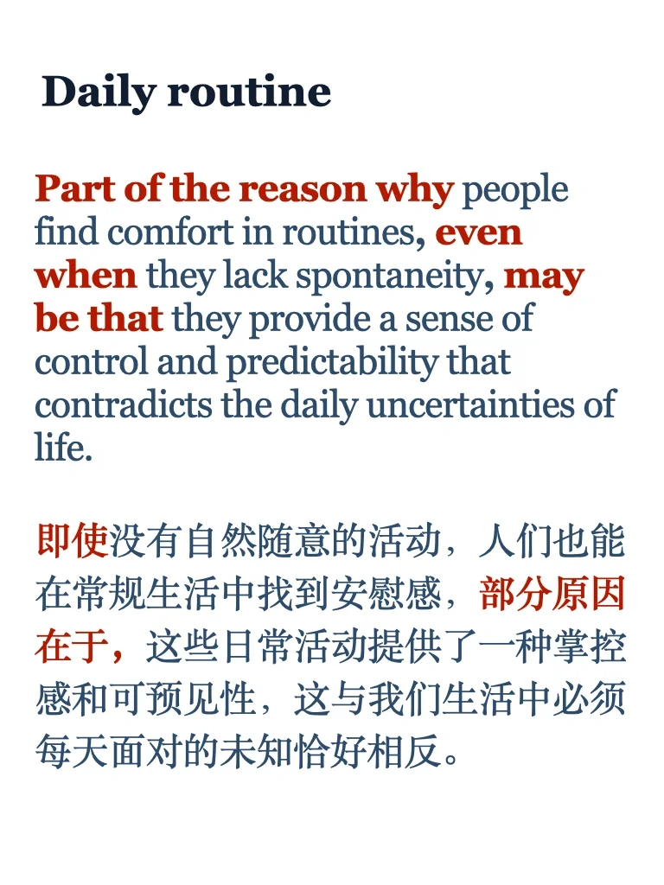
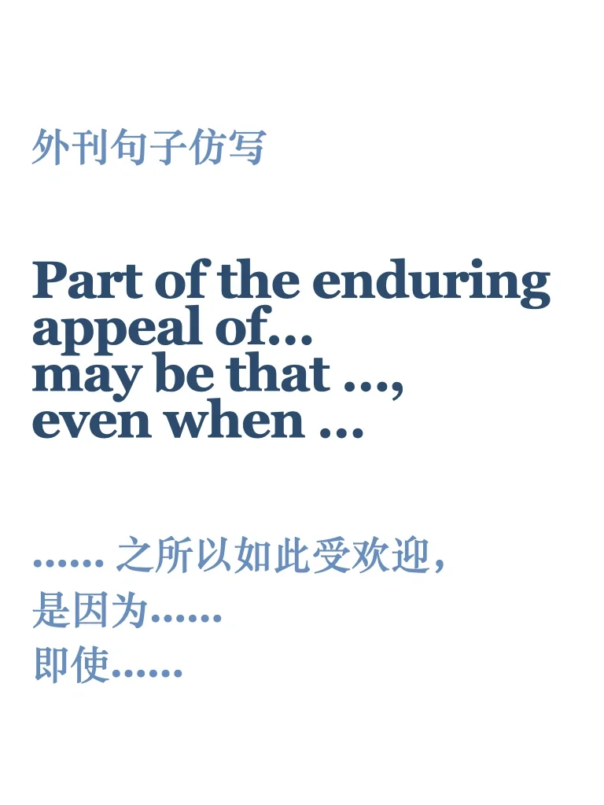
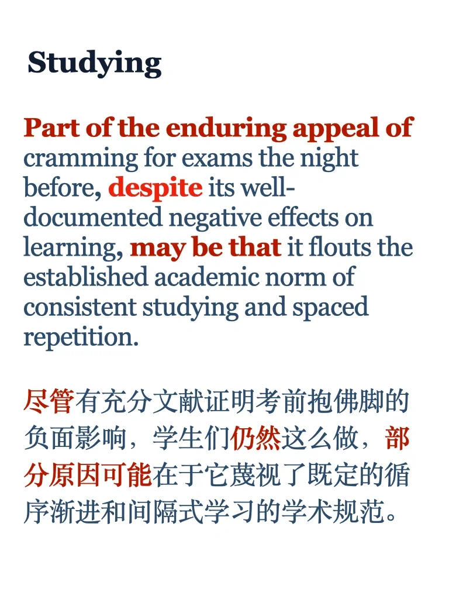

# 外刊句型｜让步+因果关系

原文：Is ‘Bed Rotting’ Good or Bad for Your Sleep? —Scientific American
	
原句：Part of the enduring appeal of lying in bed for people who are otherwise able to be mobile may be that it flouts the pervasive norm that exercise and activity are good for our body and mind, even when they feel like the opposite.
#雅思备考 #雅思攻略 #外刊阅读 #英语阅读 #英语写作 #英语长难句

## 图片
| 图1 | 图2 | 图3 | 图4 |
| --- | --- | --- | --- |
|  |  |  |  |
|  |   |   |   |

生成时间：2025-11-14 23:34:16