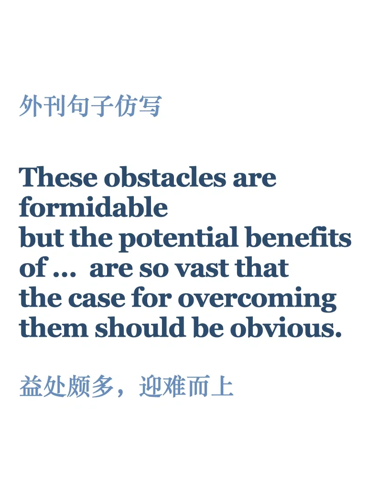
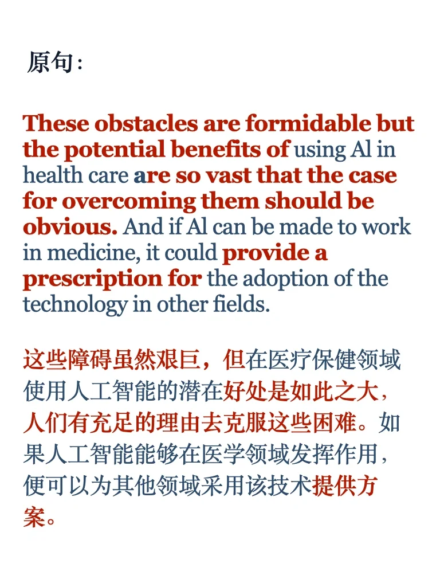

# 外刊句子仿写｜有挑战又有益处，迎难而上

原句来自经济学人，文章标题：The AI doctor will see you … eventually
#雅思备考 #雅思攻略 #外刊 #外刊精读 #英语外刊 #经济学人 #英语外刊精读 #经济学人精读打卡 #雅思写作

## 图片
| 图1 | 图2 | 图3 | 图4 |
| --- | --- | --- | --- |
|  |  |  |   |

生成时间：2025-11-14 16:12:57