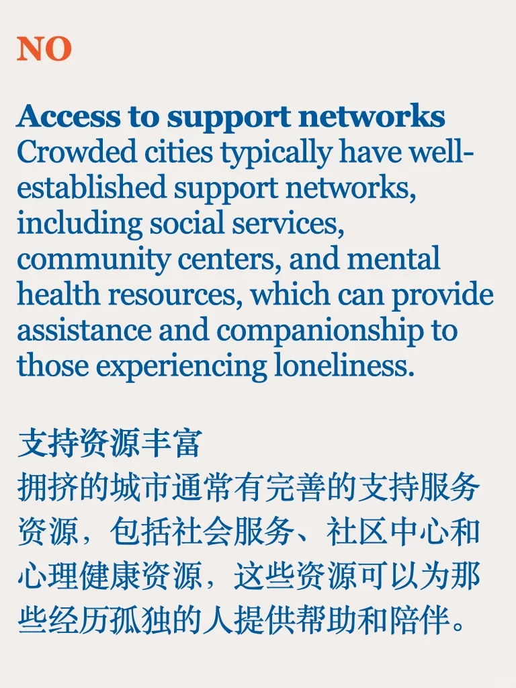
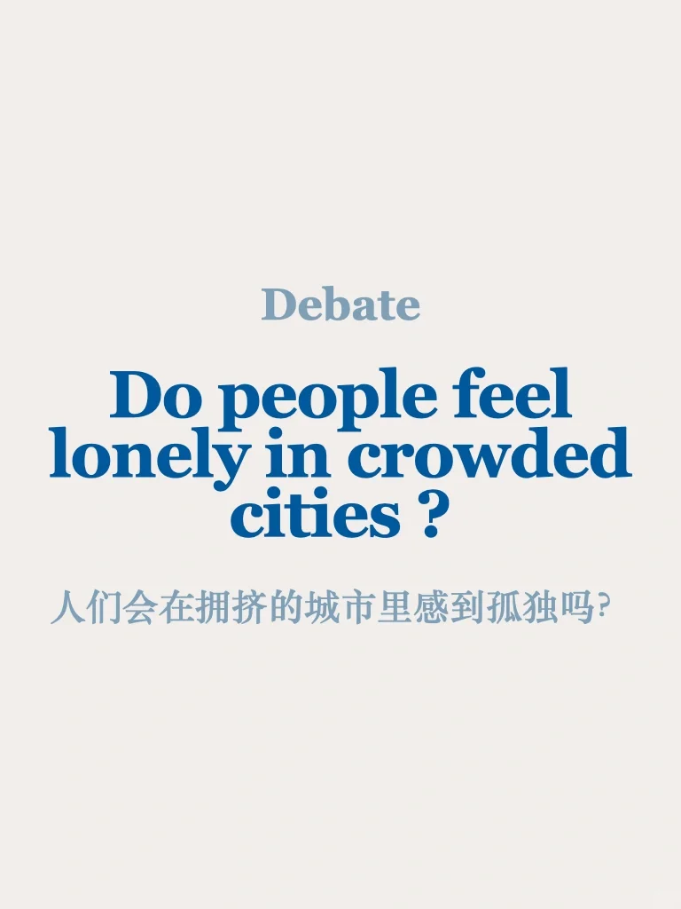
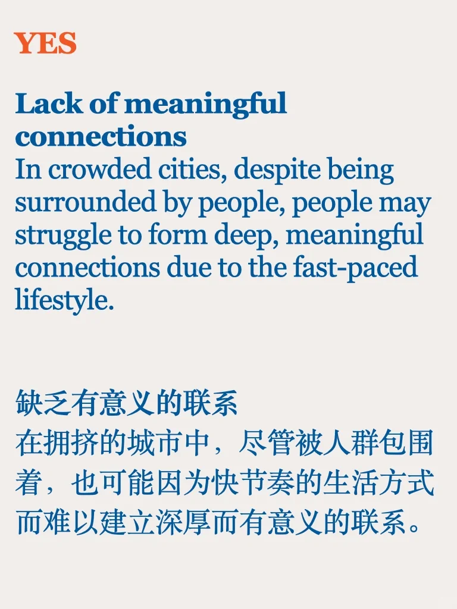
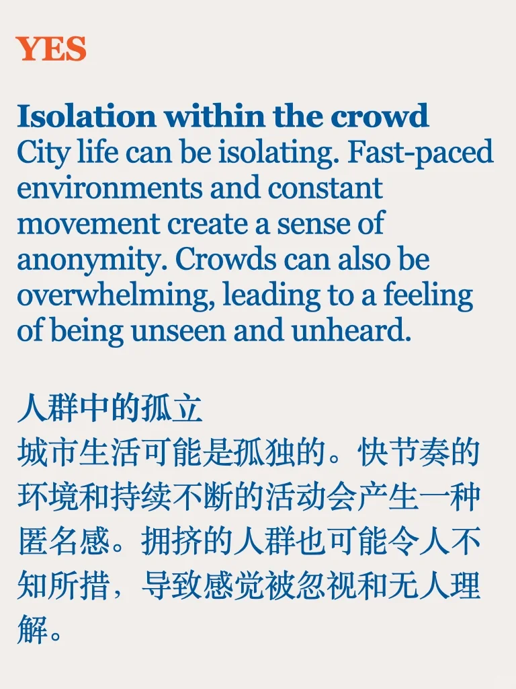
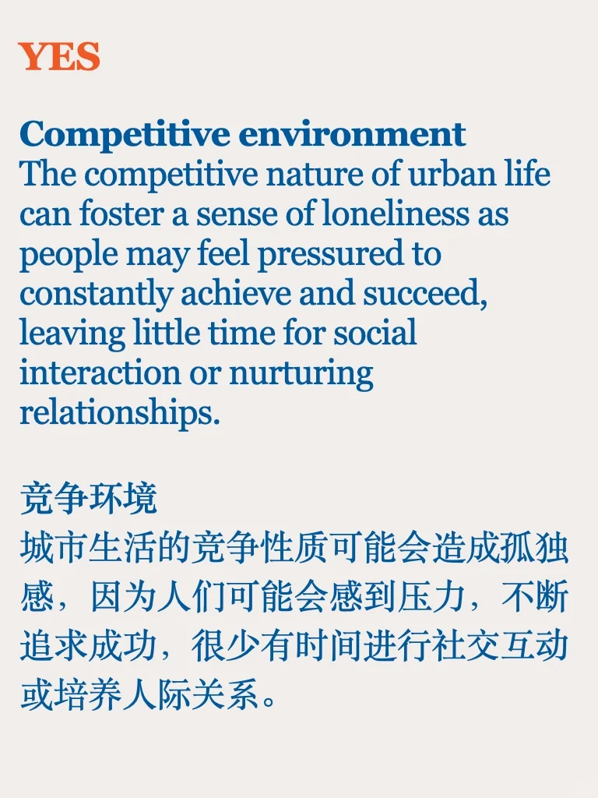
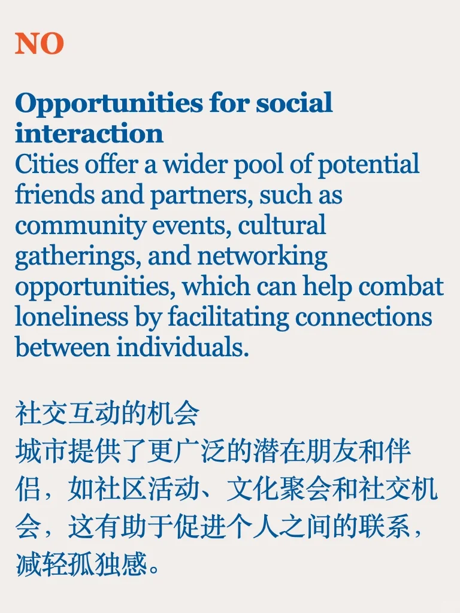
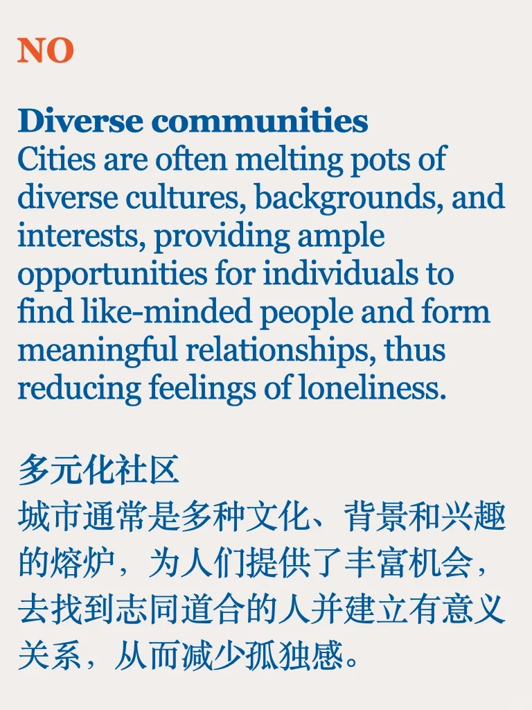

# Debate 辩论｜拥挤的城市里人会孤独吗

来自雅思口语题库的part3问题，正反思路都可以，重点要justify your opinion #雅思备考 #雅思口语 #雅思攻略 #辩论 #写作素材 #雅思素材

## 图片
| 图1 | 图2 | 图3 | 图4 |
| --- | --- | --- | --- |
|  |  |  |  |
|  |  |  |   |

生成时间：2025-11-14 23:28:48