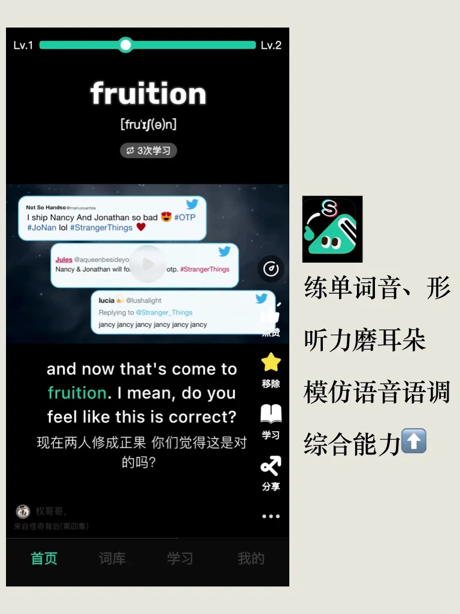

# 习语积累｜come to fruition 取得成果

今天的习语灵感来自于 — 刷刷英语app
学习形式类似刷短视频，语料主要来自英美剧，所以整体学起来很轻松。
可以在在真实语境中学习单词，更自然更高效。
同一个单词多种语境学习，深度理解一词多义，轻松掌握习语用法。
软件还设计了检测方式，听、读输入 ，说、写输出，多形式练习。
刷刷英语Help your English learning “come to fruition”
#英语学习 #学习 #英语学习打卡 #英语单词 #看剧学英语 #刷刷英语 #刷刷英语APP

## 图片
| 图1 | 图2 | 图3 | 图4 |
| --- | --- | --- | --- |
|  |  |  |  |
|  |  |   |   |

生成时间：2025-11-14 23:22:13