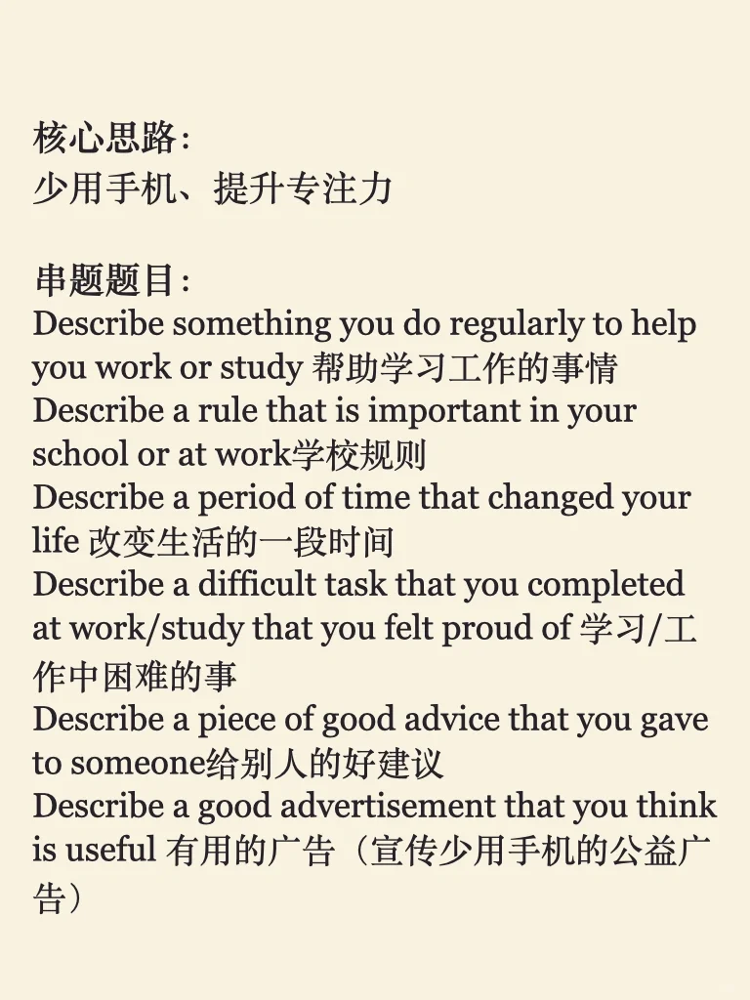
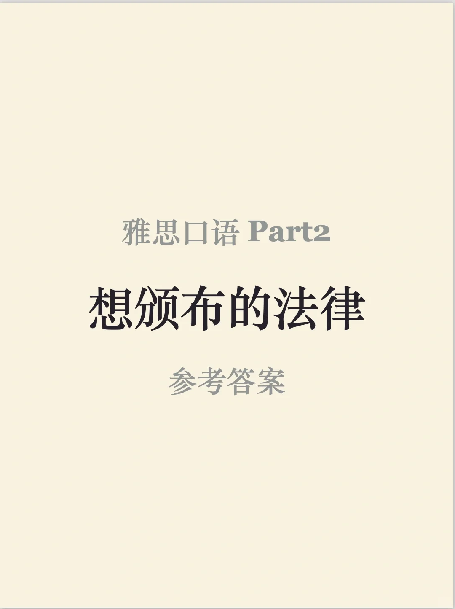
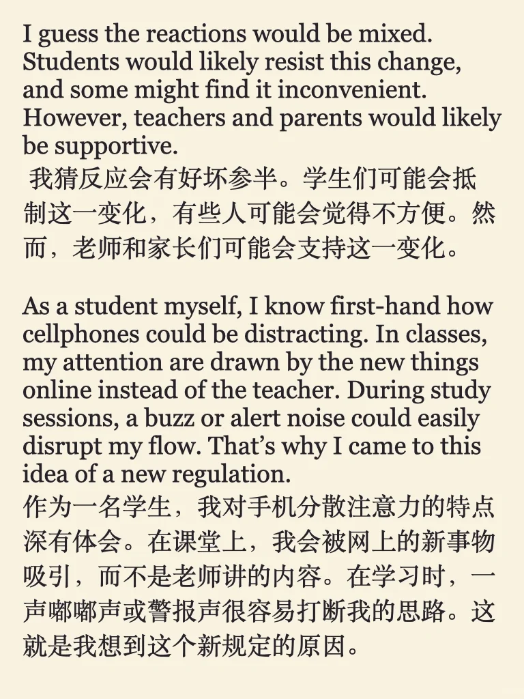
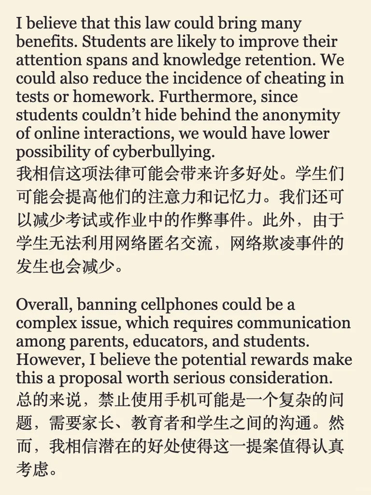

# 雅思口语参考答案｜P2 法律

目前考试题目变动比较大，大家面对陌生题目，可以尽量沿用熟练素材，锻炼“串题”的能力。同时注意保持自然交流感、充分点题。
今天分享的答案，主题是 少用手机，提高效率，可以参考的串题在最后一图
#雅思 #雅思口语 #雅思备考 #雅思攻略 #雅思口语part2 #雅思口语part2串题 #雅思口语换题 #雅思口语参考答案

## 图片
| 图1 | 图2 | 图3 | 图4 |
| --- | --- | --- | --- |
|  |  |  |  |
|  |   |   |   |

生成时间：2025-11-14 23:18:54