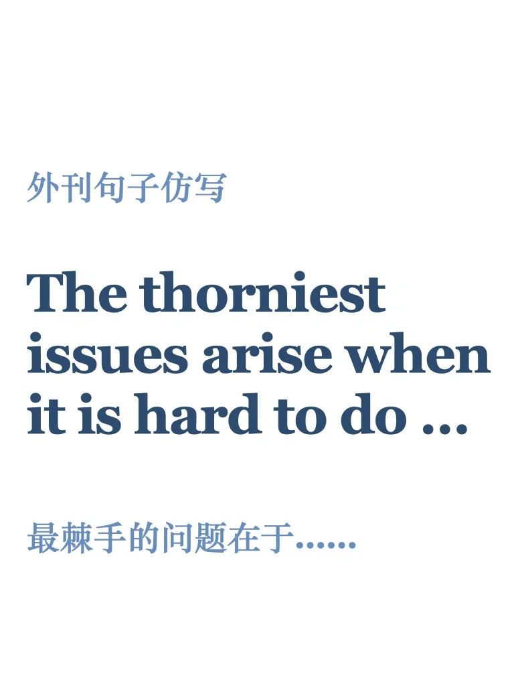
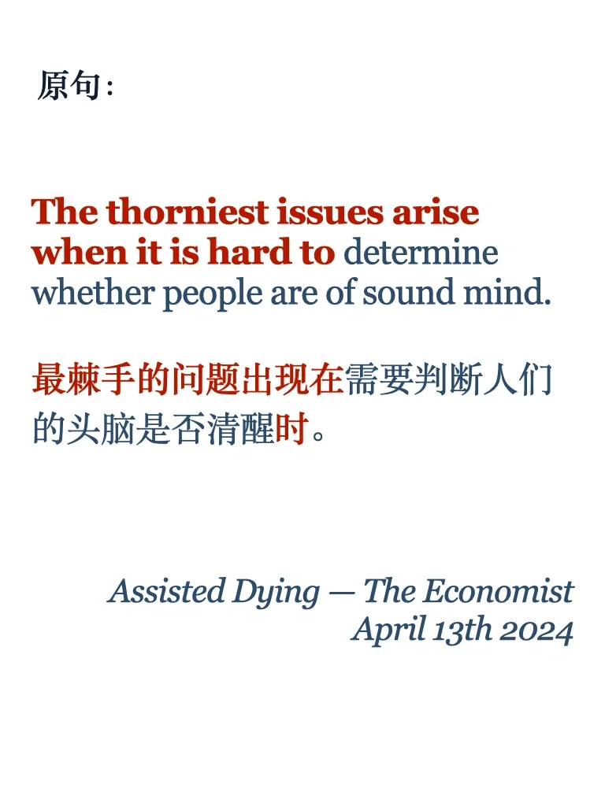
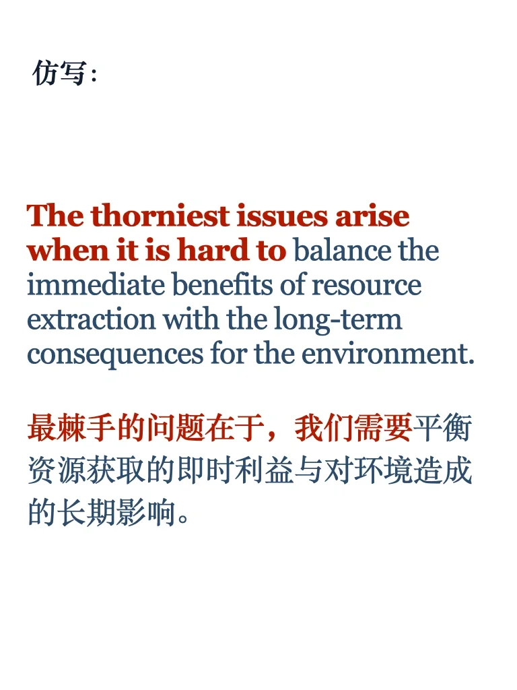
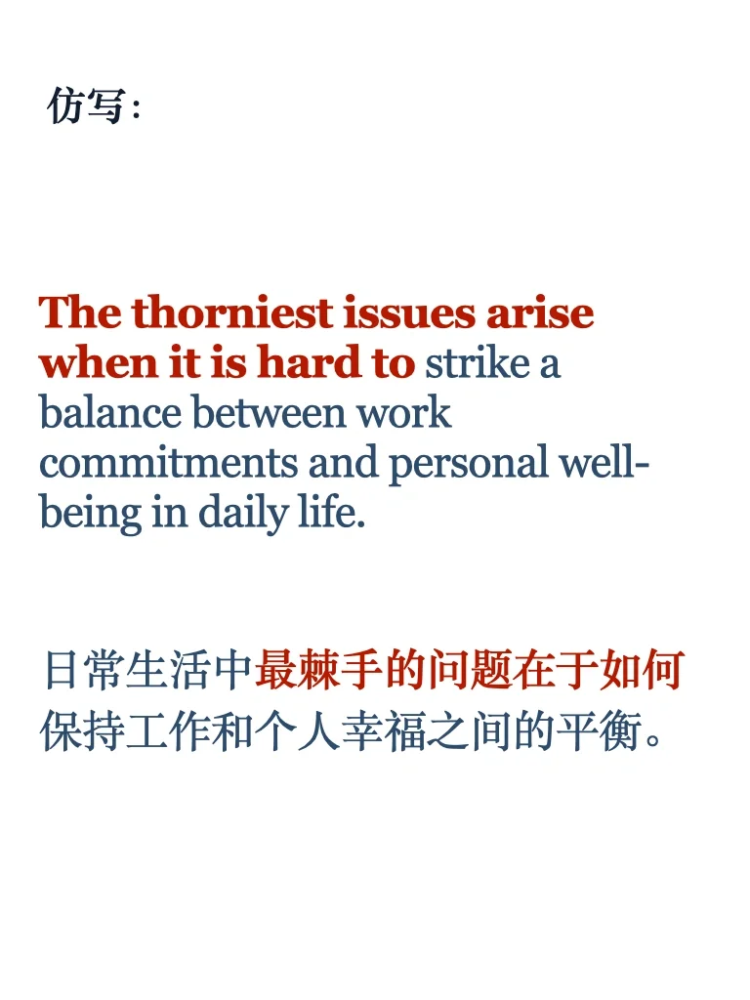
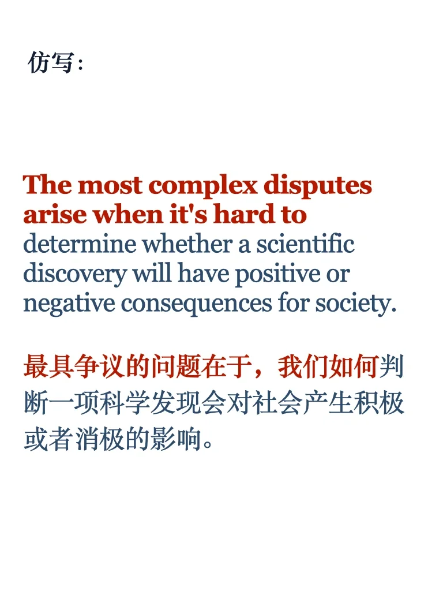

# 外刊句子仿写｜棘手难题

#英语写作 #外刊精读 #每日一句 #英文写作 #每日一读 #学习 #雅思备考 #雅思口语 #雅思攻略 #英语外刊 #雅思写作 #英文句式

## 图片
| 图1 | 图2 | 图3 | 图4 |
| --- | --- | --- | --- |
|  |  |  |  |
|  |  |   |   |

生成时间：2025-11-14 16:11:50