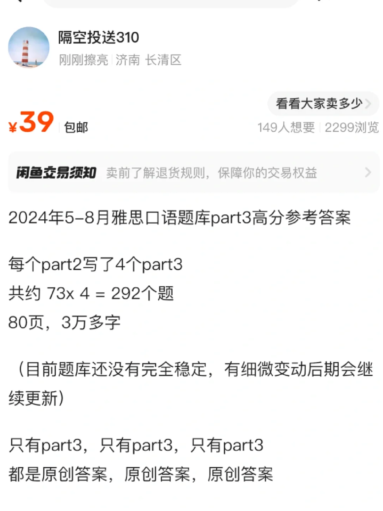
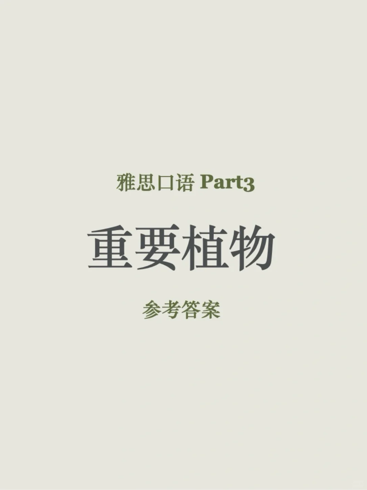
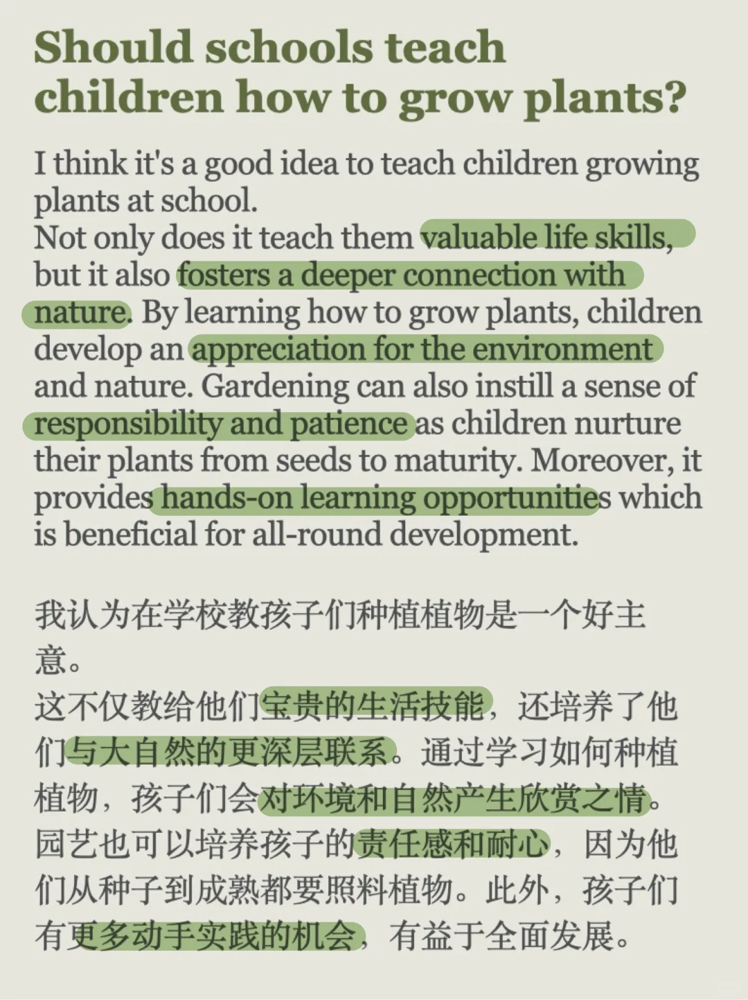
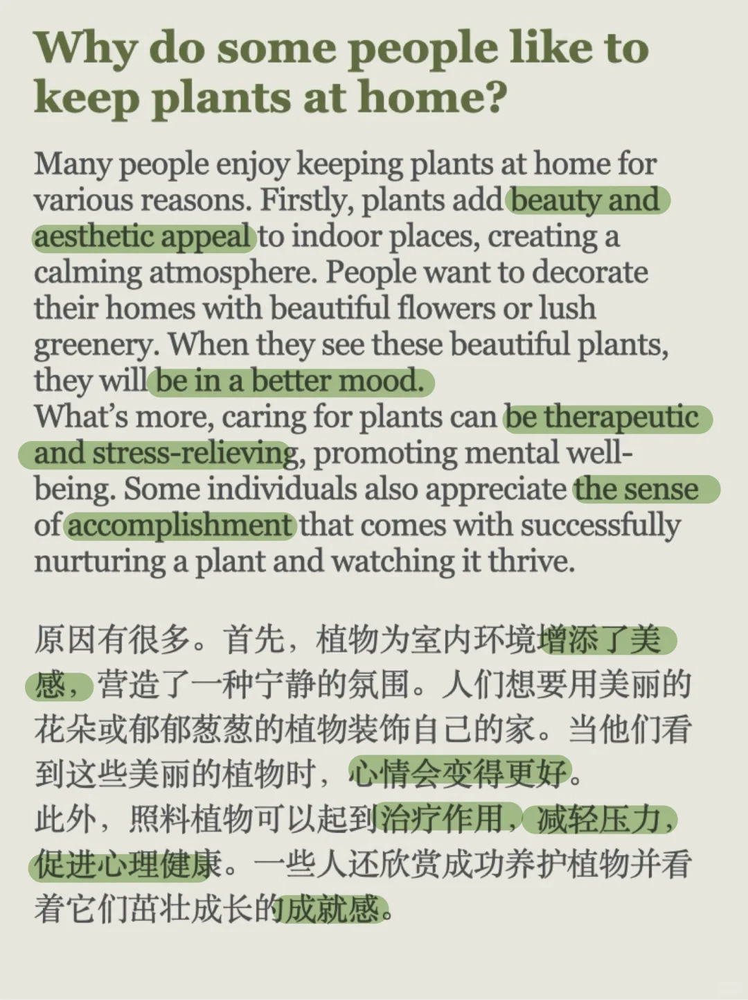
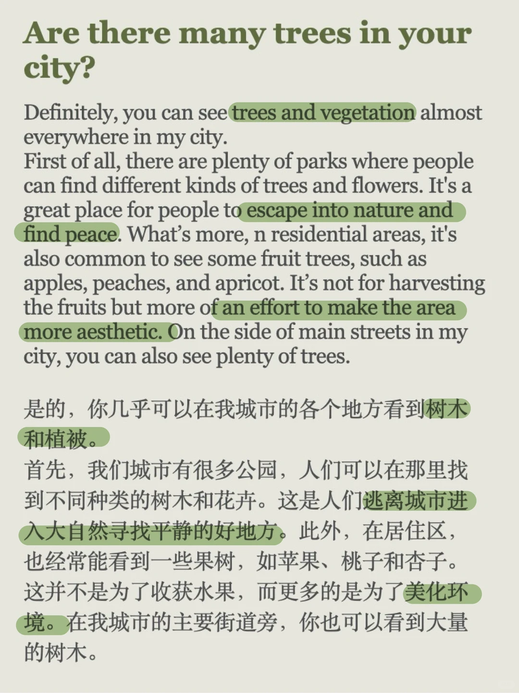

# 雅思口语答案｜重要植物Part3

今天分享的part3 答案对应“重要植物”话题
新季度part3整理差不多了，需要的同学可以看一下最后一张图
#屠雅攻略 #雅思考试 #雅思备考 #雅思口语 #雅思攻略 #雅思口语素材 #雅思口语题库 #雅思口语part3 #雅思口语part3高分答案

## 图片
| 图1 | 图2 | 图3 | 图4 |
| --- | --- | --- | --- |
|  |  |  |  |
|  |  |   |   |

生成时间：2025-11-14 23:12:20