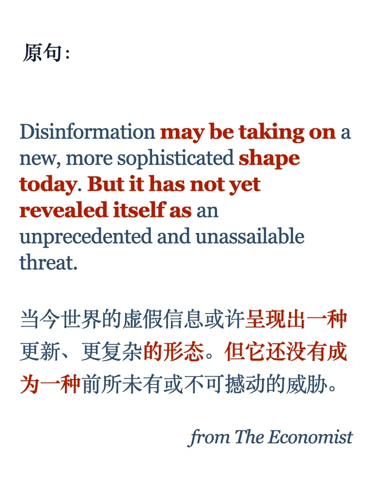

# 外刊句型｜有新的形态，但也并不是不可抵抗

#雅思备考 #雅思攻略 #雅思口语 #雅思写作 #外刊 #外刊精读 #外刊阅读 #外刊句型 #从外刊中积累写作句型
新一期Economist, The New Yorker, Atlantic 有需要的小伙伴进群，分享给大家🌹

## 图片
| 图1 | 图2 | 图3 | 图4 |
| --- | --- | --- | --- |
|  |  |  |  |
|  |   |   |   |

生成时间：2025-11-14 23:02:27