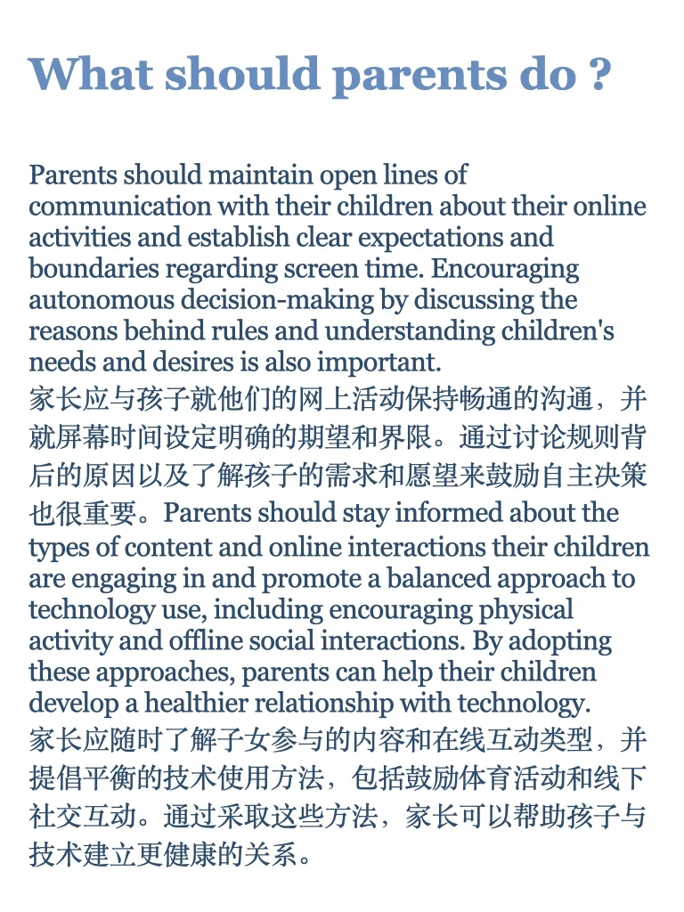
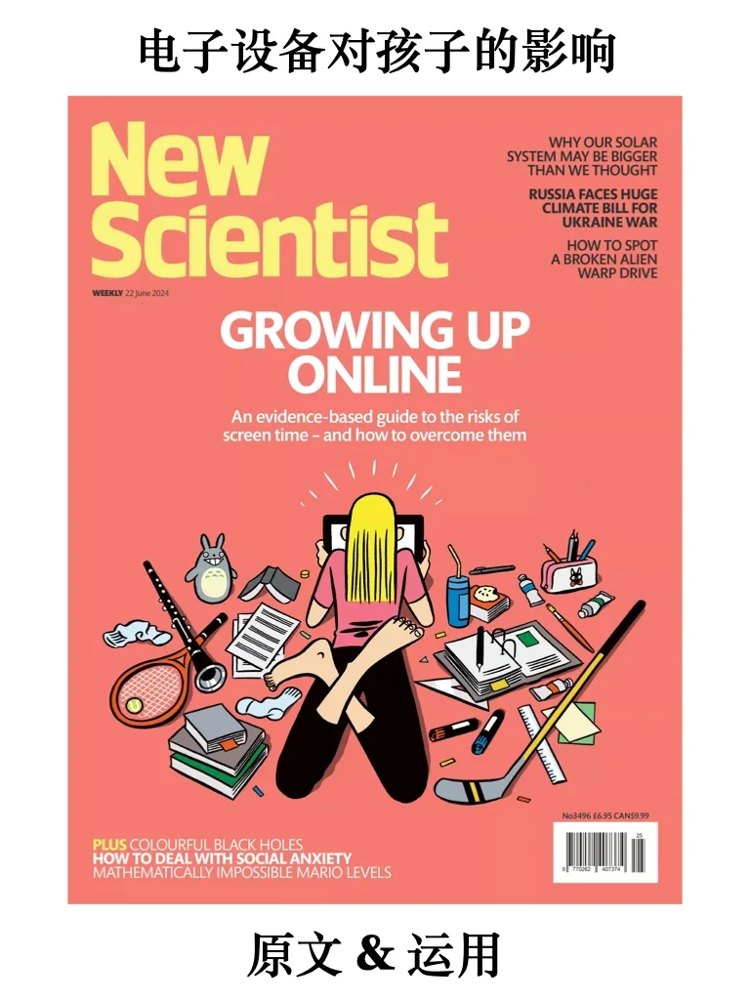
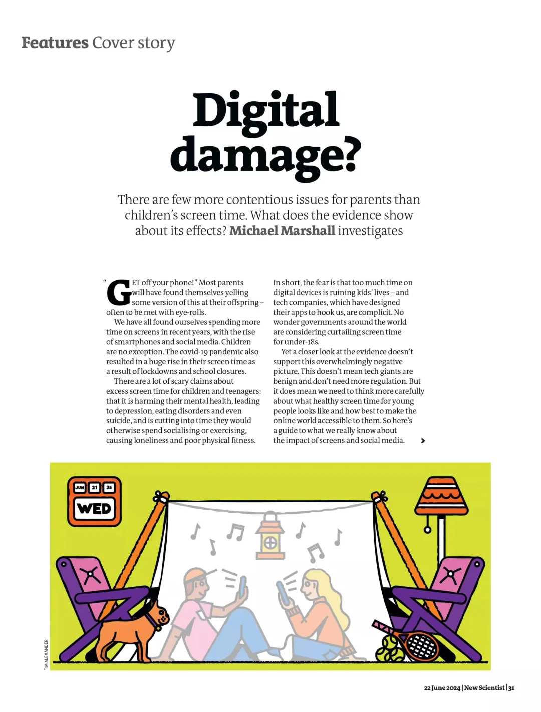
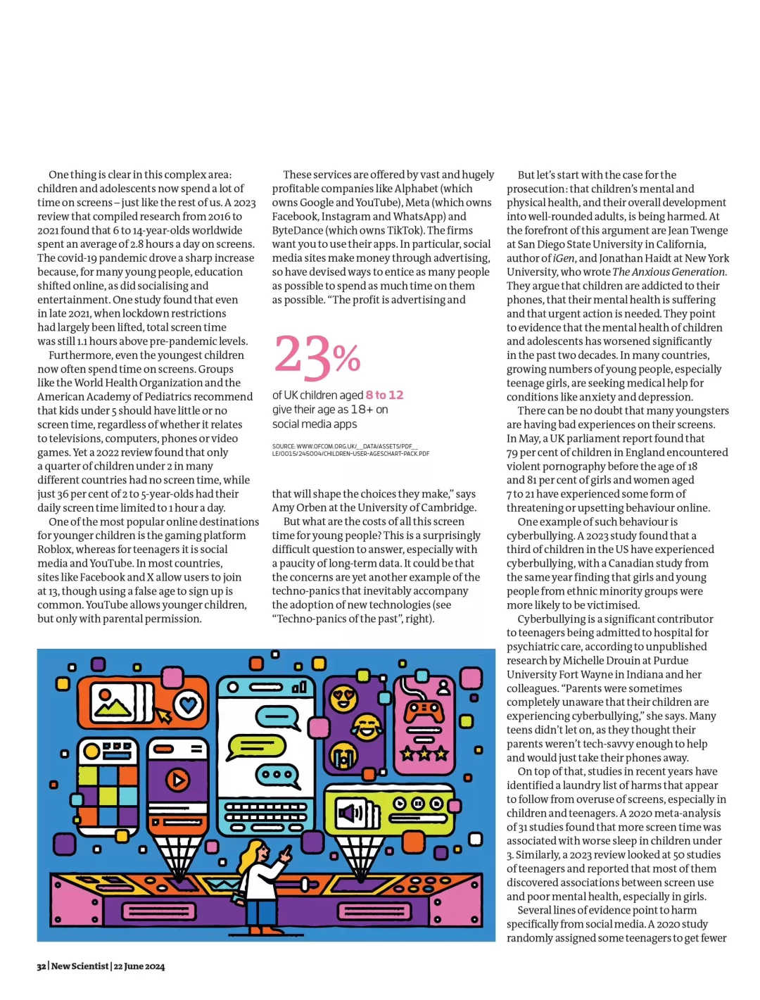
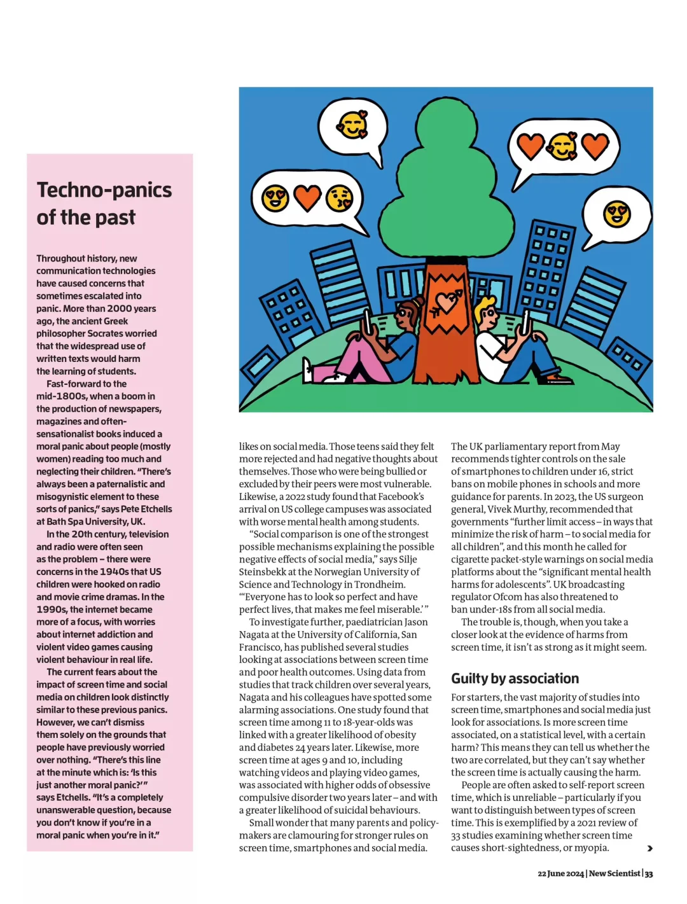
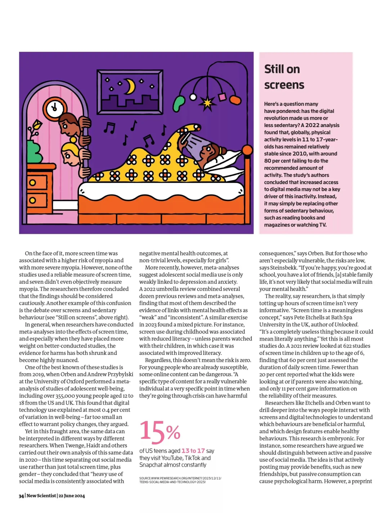
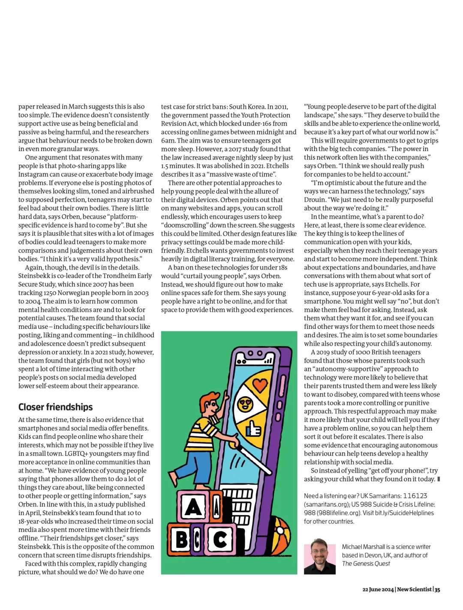
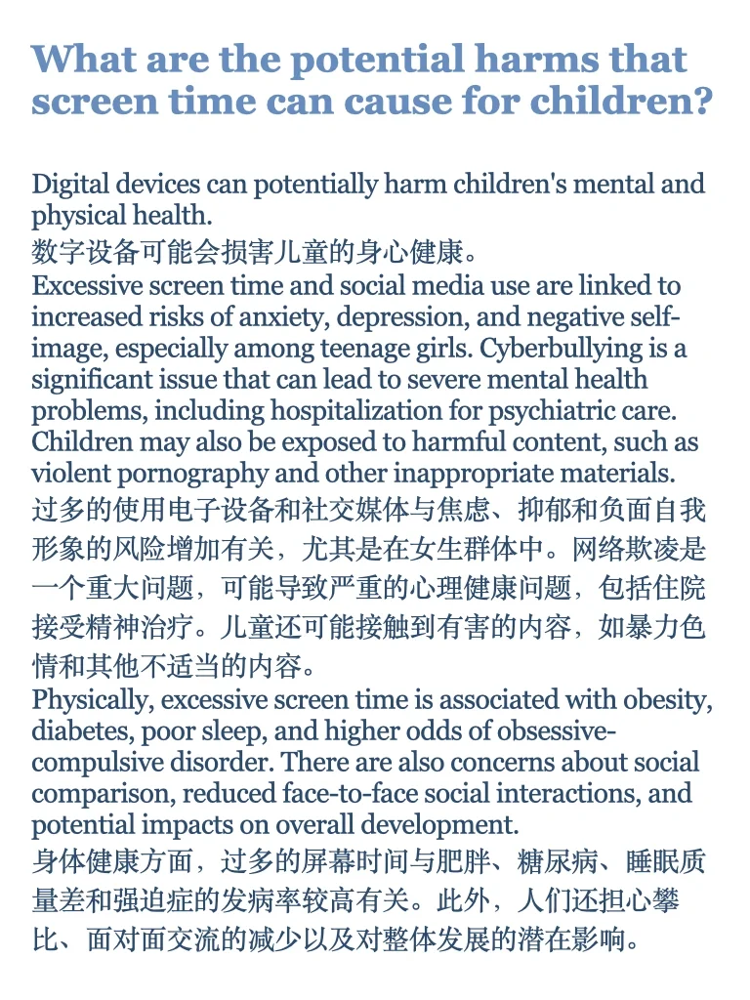
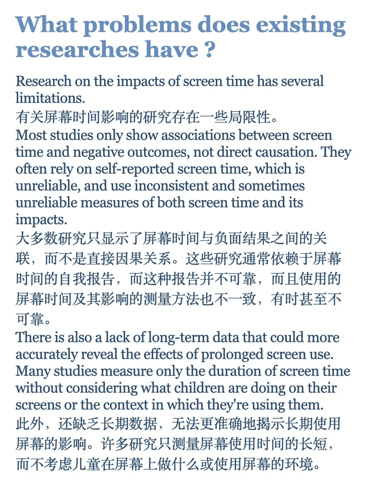
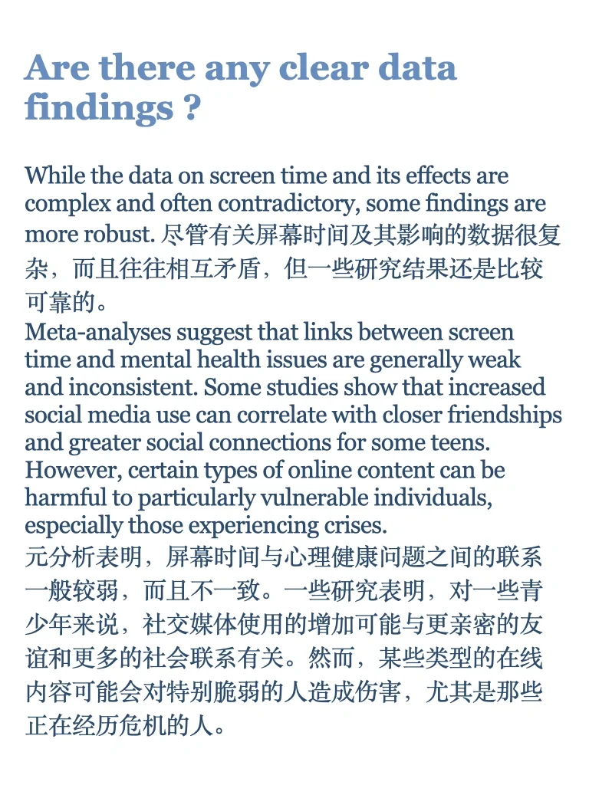

# 外刊阅读&amp;运用 ｜Digital Damage 电子设备

读完文章可以思考一下这几个问题：
- What are the potential harms that screen time can cause for children?
	
- What problems does existing researches have ?
	
- Are there any clear data findings ?
	
- What should parents do ?
	
参考答案在最后4页～
	
#外刊 #英文阅读 #外刊阅读 #雅思 #英语泛读 #雅思口语 #雅思写作 #雅思备考 #英语四六级 #考研英语

## 图片
| 图1 | 图2 | 图3 | 图4 |
| --- | --- | --- | --- |
|  |  |  |  |
|  |  |  |  |
|  |  |   |   |

生成时间：2025-11-14 22:37:13