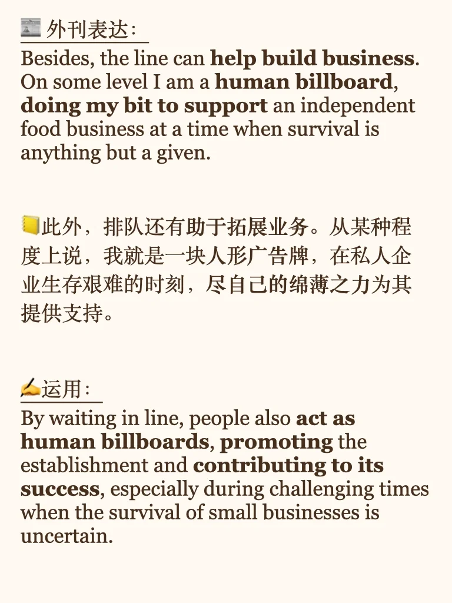
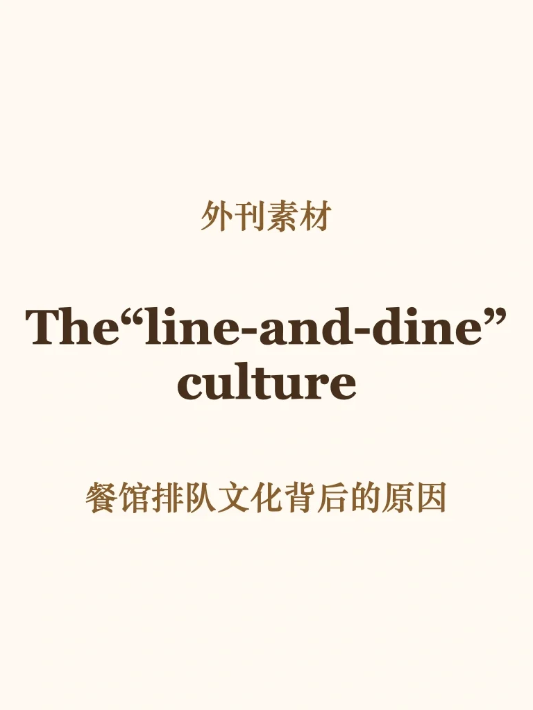
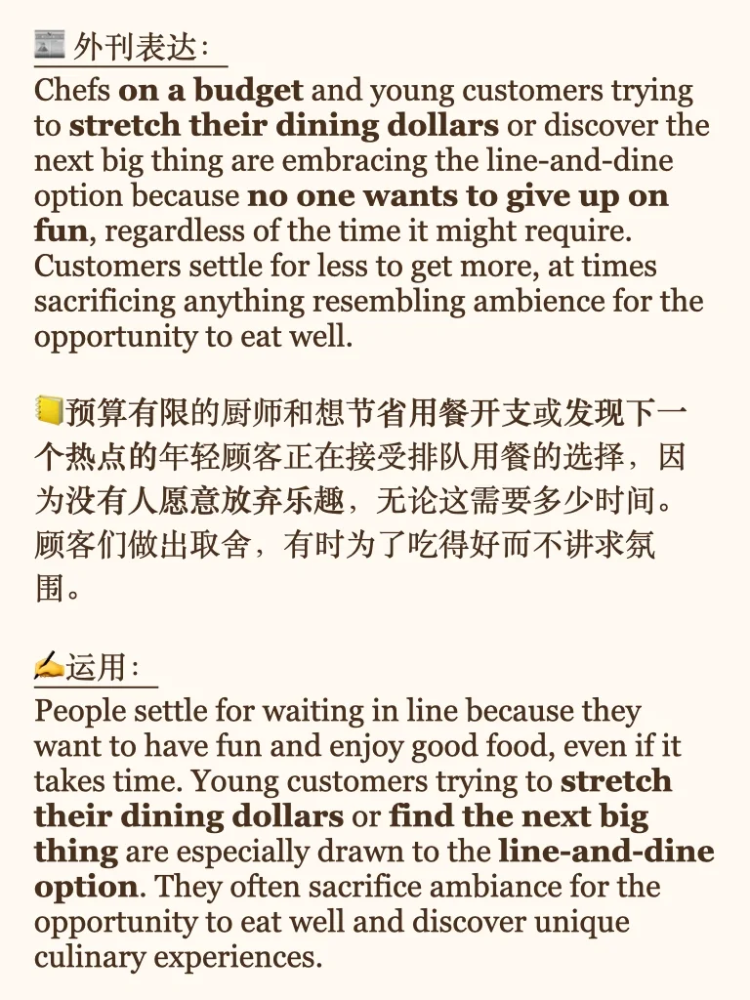
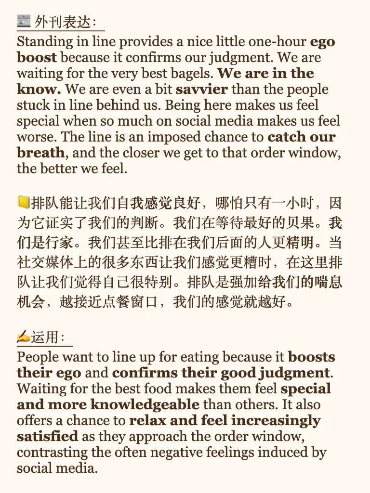
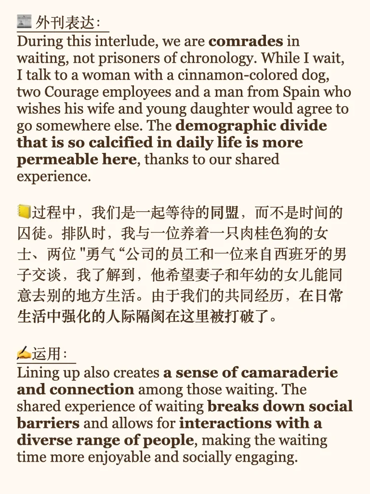

# 外刊运用｜餐馆排队现象背后的原因

原文来自 New York Times - The Future of Dining Is Lining Up
作者分析排队现象背后有几层原因：
- 年轻一代经济压力大，有时为了美味牺牲精致。
- 年轻人都不想错过独特、有趣、流行的体验。
- 排队人越多，越证明自己的选择是正确的，让人自我感觉良好。
- 队伍中的人，为了同一件事聚在一起，有归属感。
- 排队起到宣传作用，顾客为自己喜欢的餐馆做出一点贡献，餐馆也从中获益。
#外刊精读 #外刊打卡 #雅思备考 #英语四六级 #考研英语 #英语写作 #英语口语 #排队 #餐馆

## 图片
| 图1 | 图2 | 图3 | 图4 |
| --- | --- | --- | --- |
|  |  |  |  |
|  |   |   |   |

生成时间：2025-11-14 22:28:21