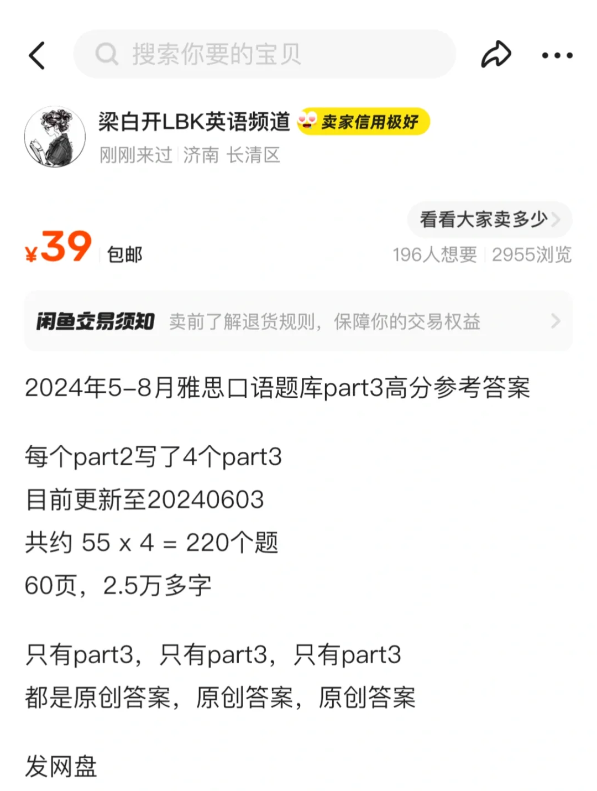
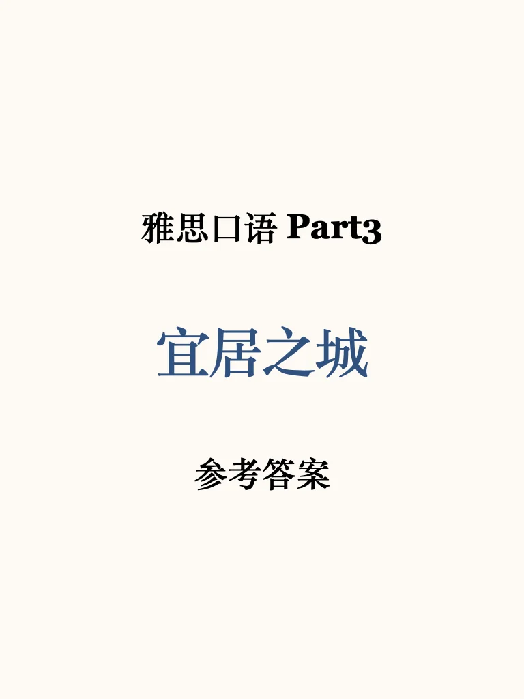
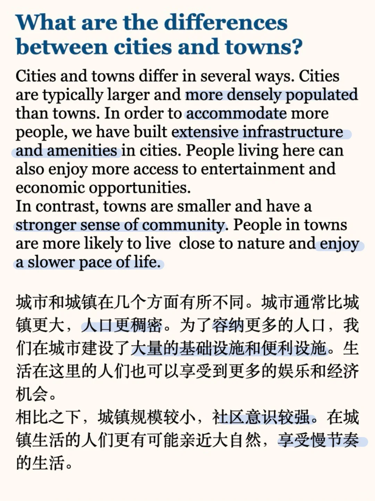
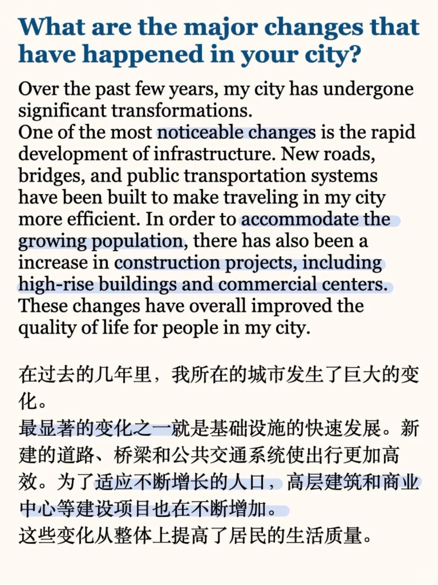
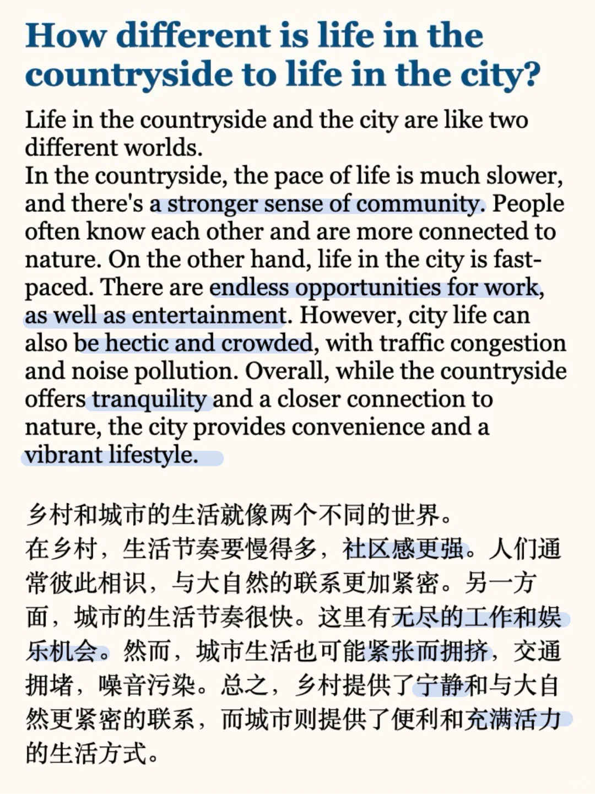

# 雅思口语参考答案｜宜居之城 P3

#雅思预测 #屠雅攻略 #雅思考试 #雅思备考 #雅思口语 #雅思口语part3 #雅思口语part3高分答案 #雅思口语高分答案

## 图片
| 图1 | 图2 | 图3 | 图4 |
| --- | --- | --- | --- |
|  |  |  |  |
|  |  |   |   |

生成时间：2025-11-14 22:25:04