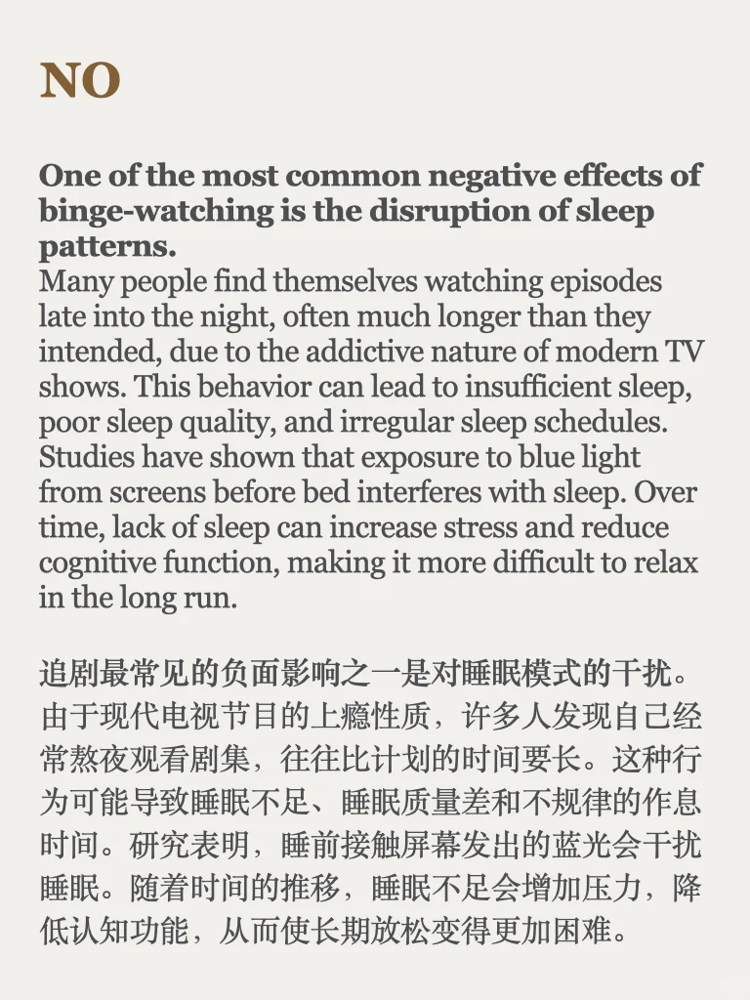
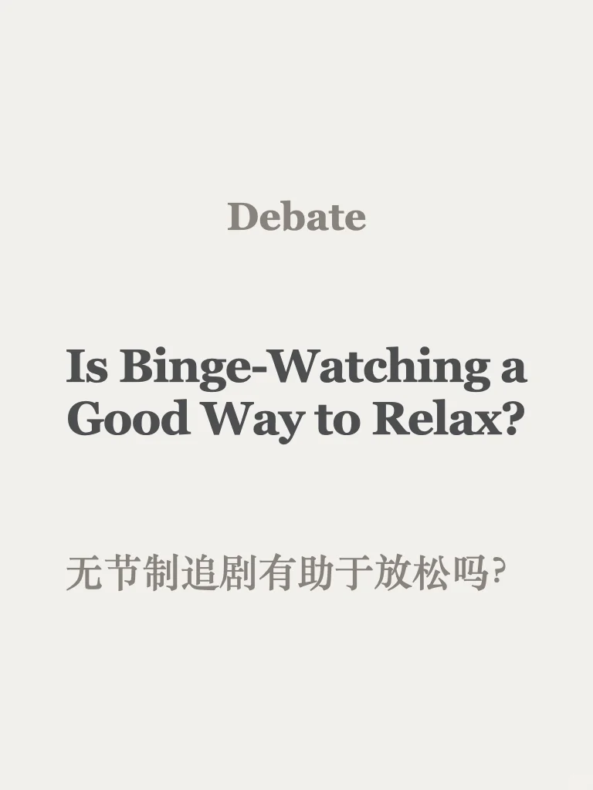
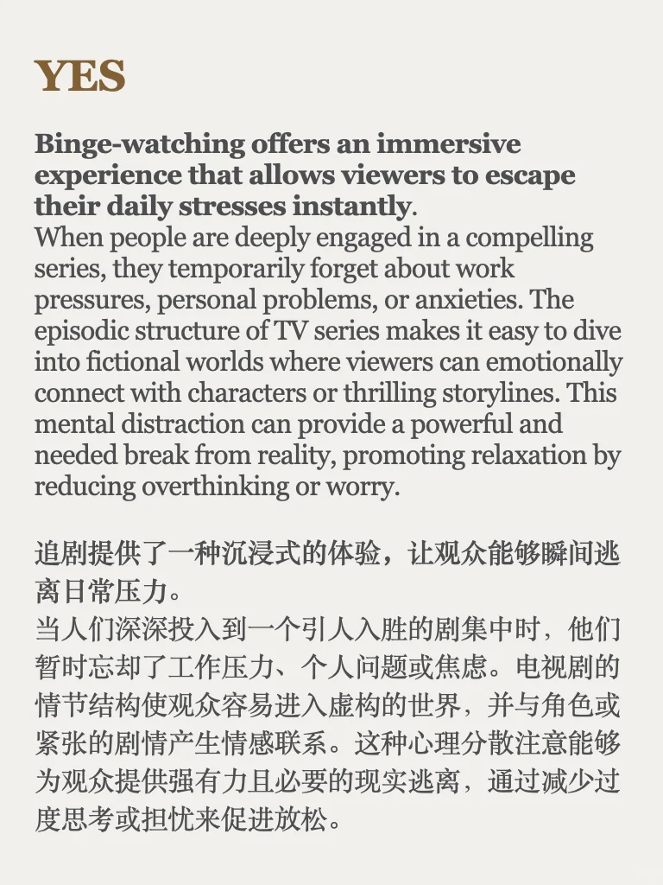
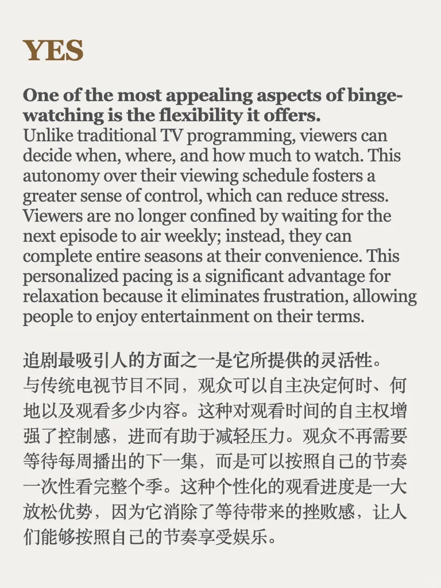
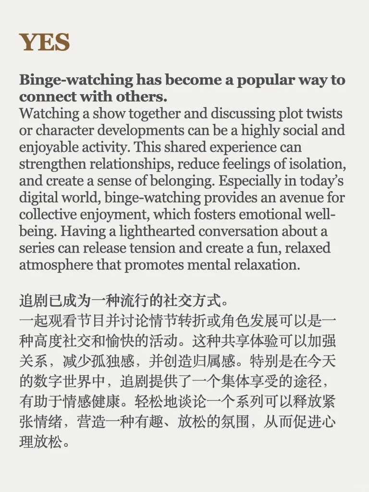
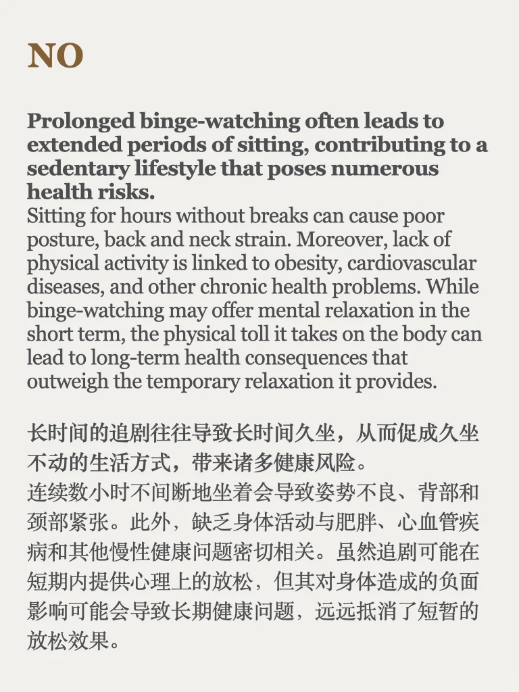
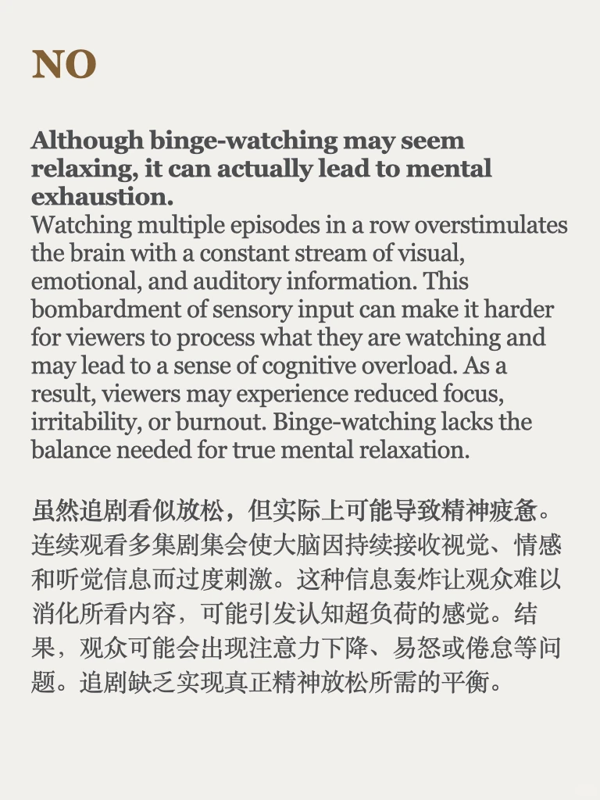

# 辩论 Debate ｜ 追剧有助于放松吗？

#口语素材 #写作素材 #雅思备考 #雅思攻略 #雅思口语 #追剧日常 #雅思写作 #英语辩论 #四六级 #考研英语

## 图片
| 图1 | 图2 | 图3 | 图4 |
| --- | --- | --- | --- |
|  |  |  |  |
|  |  |  |   |

生成时间：2025-11-14 21:49:56