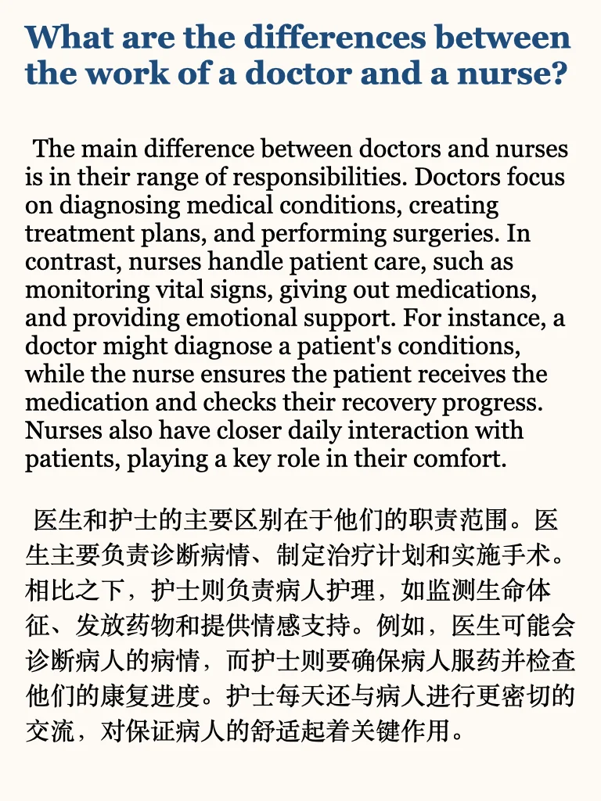
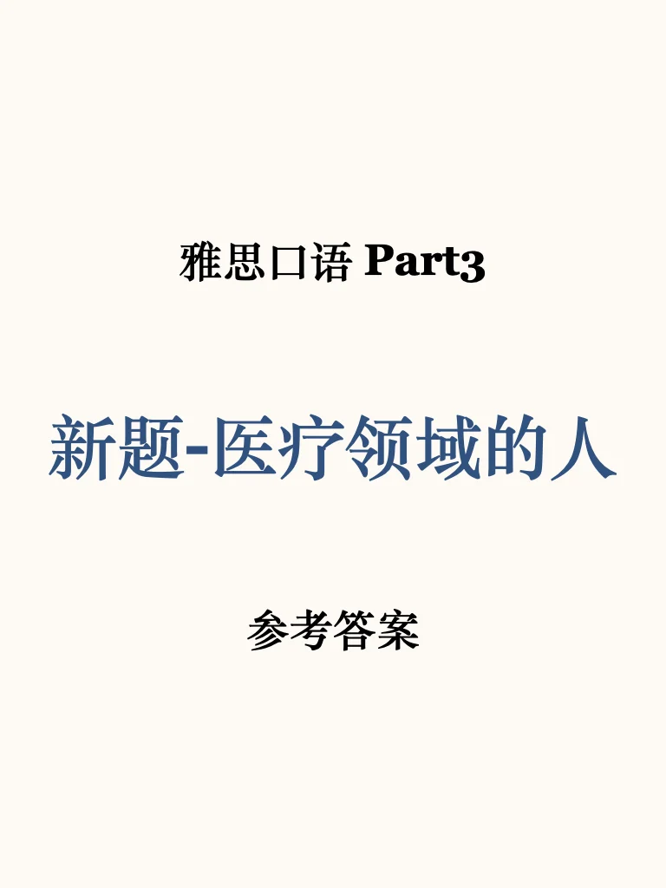
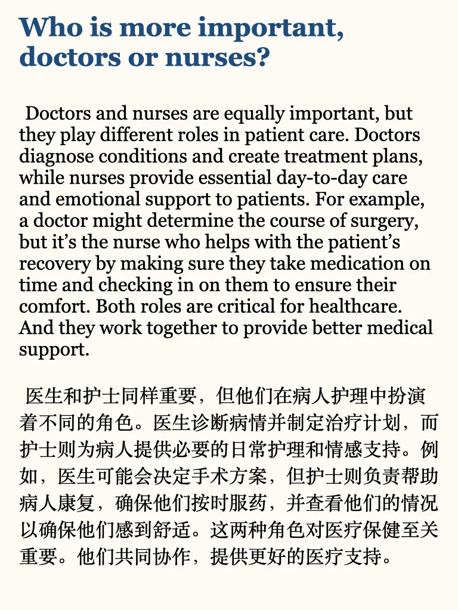
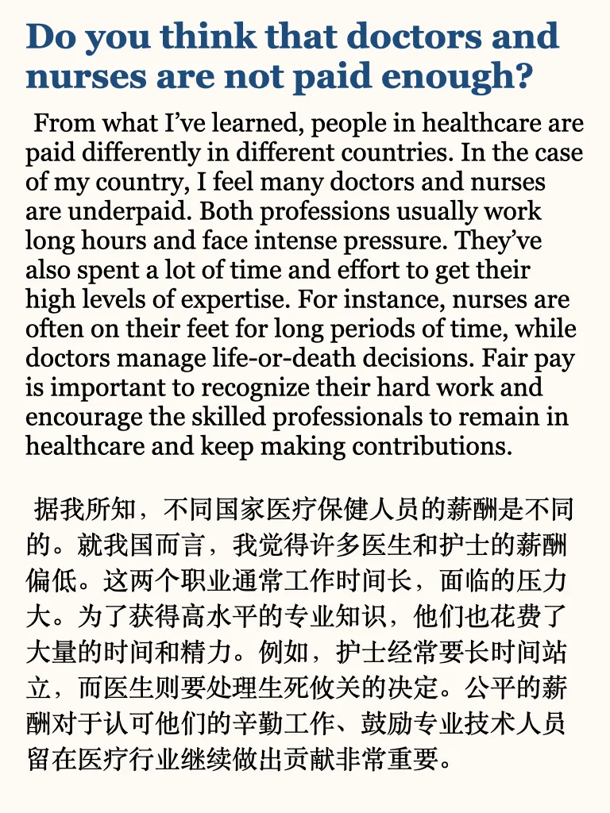
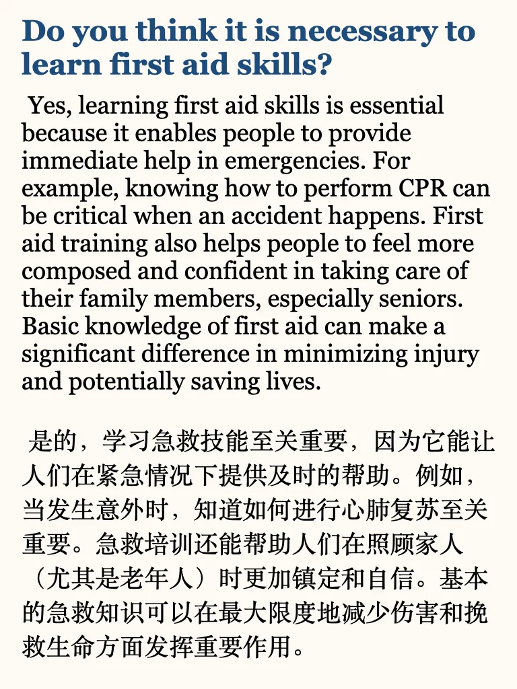

# 雅思口语新题P3｜医疗领域的人

#雅思 #雅思备考 #雅思口语 #雅思攻略 #雅思口语p3 #雅思口语高分示范 #雅思口语新题 #雅思口语参考答案 #雅思考试

## 图片
| 图1 | 图2 | 图3 | 图4 |
| --- | --- | --- | --- |
|  |  |  |  |
|  |   |   |   |

生成时间：2025-11-14 21:48:49