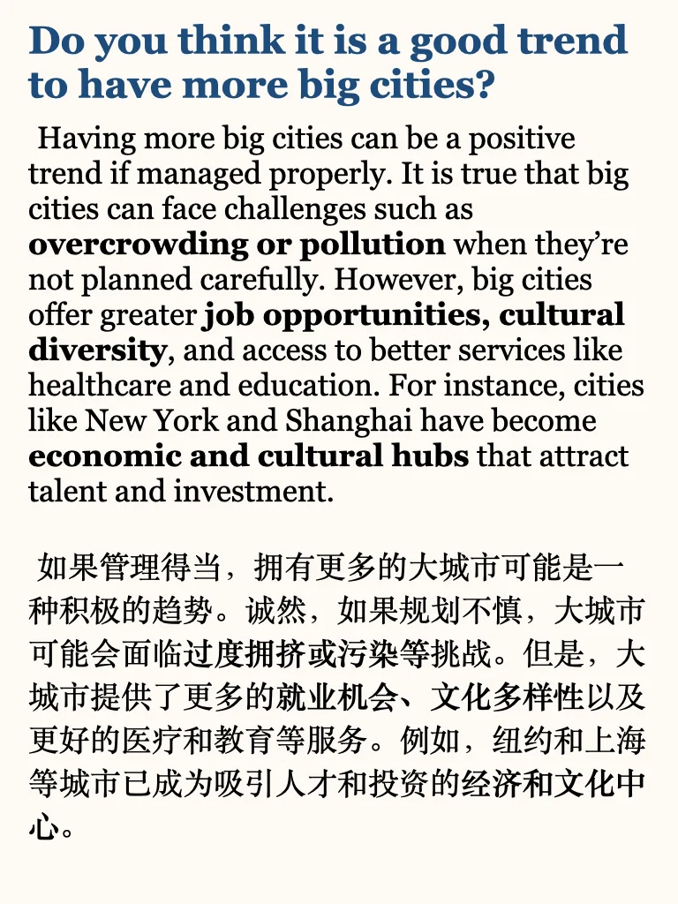
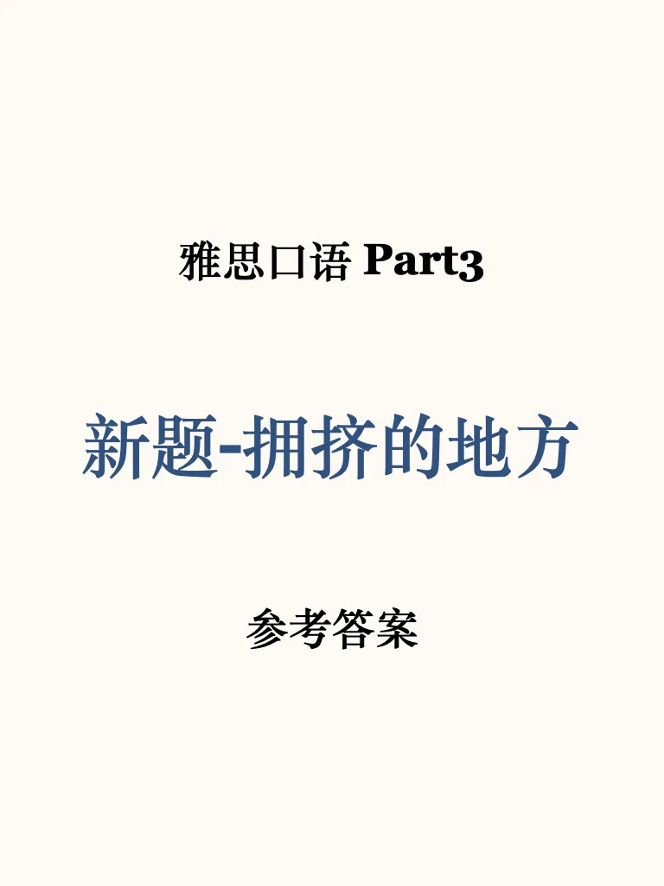
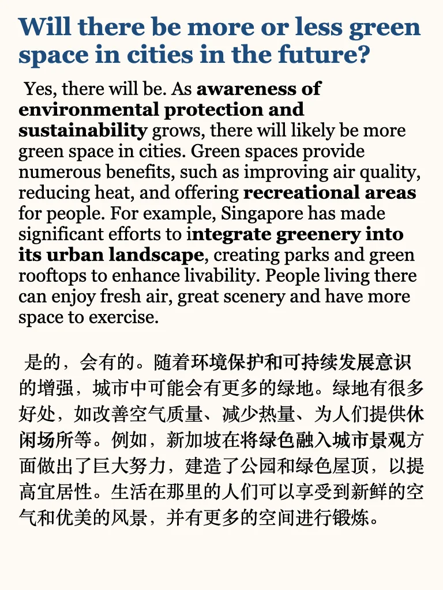
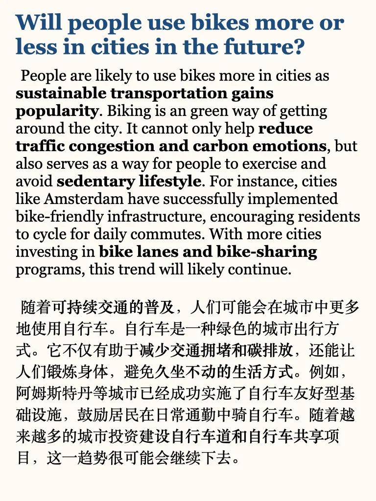
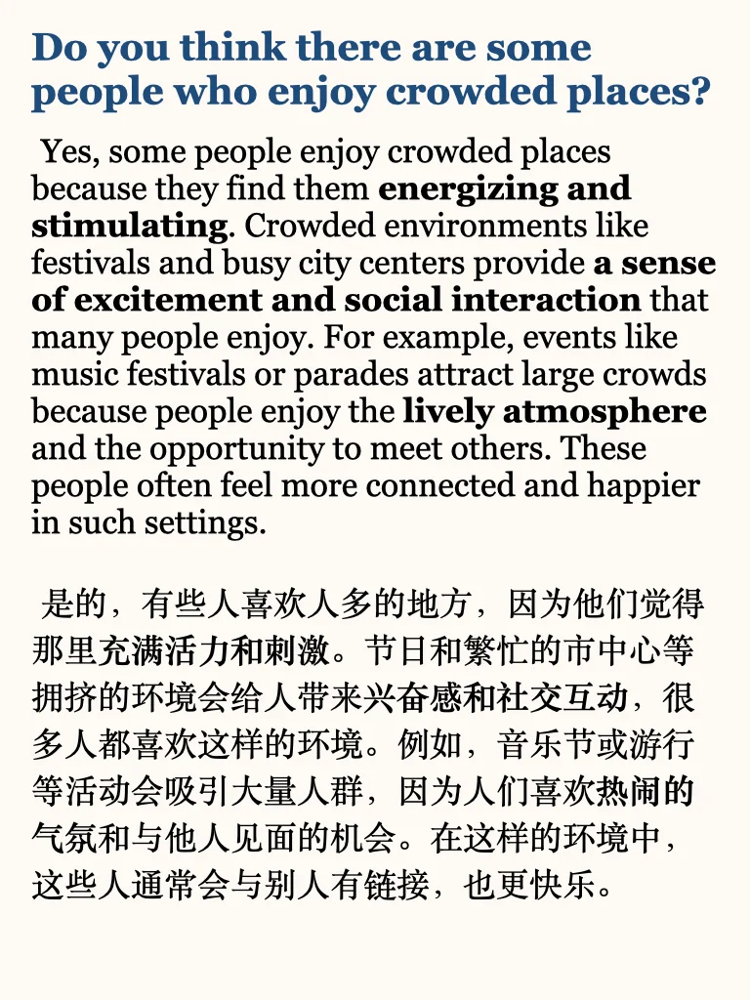

# 雅思口语高分参考｜拥挤地方P3

Keywords：
recreational areas
休闲区域
made significant efforts
做出了重大努力
integrate greenery into its urban landscape
将绿色融入城市景观
sustainable transportation
可持续交通
getting around the city
在城市中出行
avoid sedentary lifestyle
避免久坐生活方式
bike-friendly infrastructure
自行车友好的基础设施
bike-sharing programs
自行车共享计划
energizing and stimulating
充满活力和刺激
social interaction
社交互动
music festivals or parades
音乐节或游行
managed properly
妥善管理
overcrowding
过度拥挤
cultural diversity
文化多样性
economic and cultural hubs
经济和文化中心
#雅思 #雅思口语 #雅思攻略 #雅思口语素材 #雅思口语题库 #雅思口语换题 #雅思口语高分示范 #雅思口语part3

## 图片
| 图1 | 图2 | 图3 | 图4 |
| --- | --- | --- | --- |
|  |  |  |  |
|  |   |   |   |

生成时间：2025-11-14 21:47:43