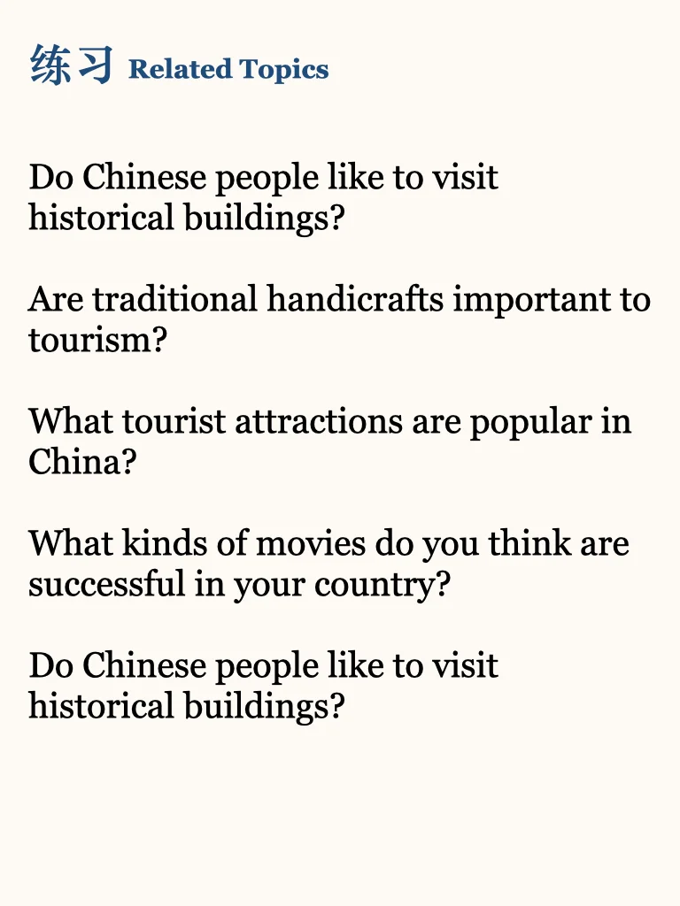
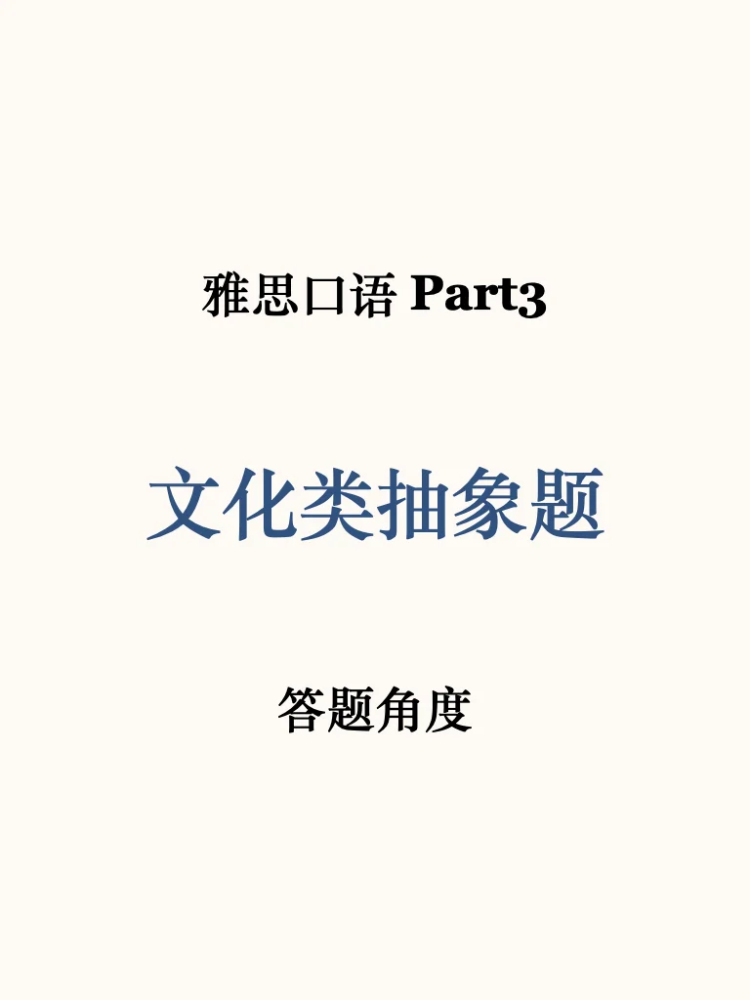
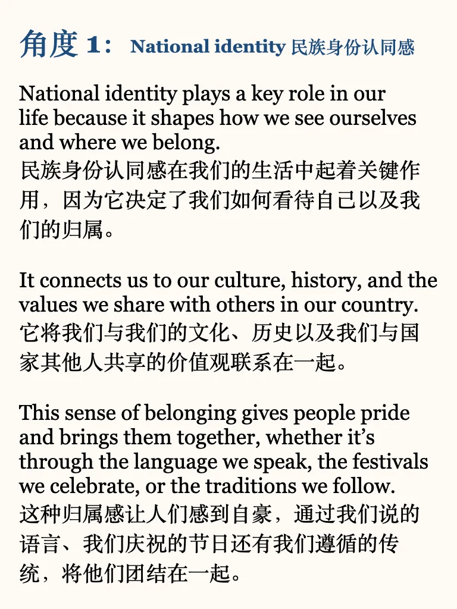
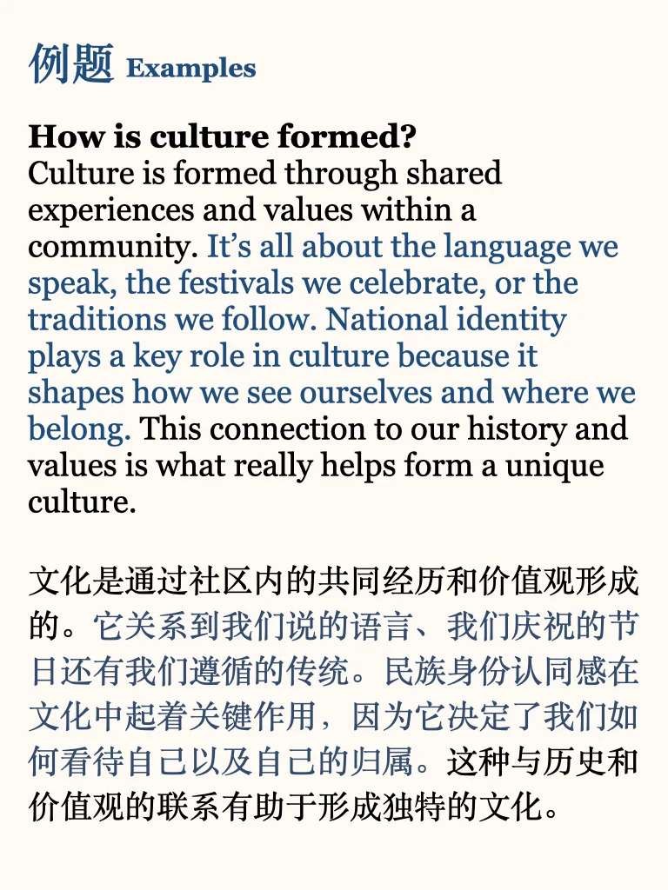
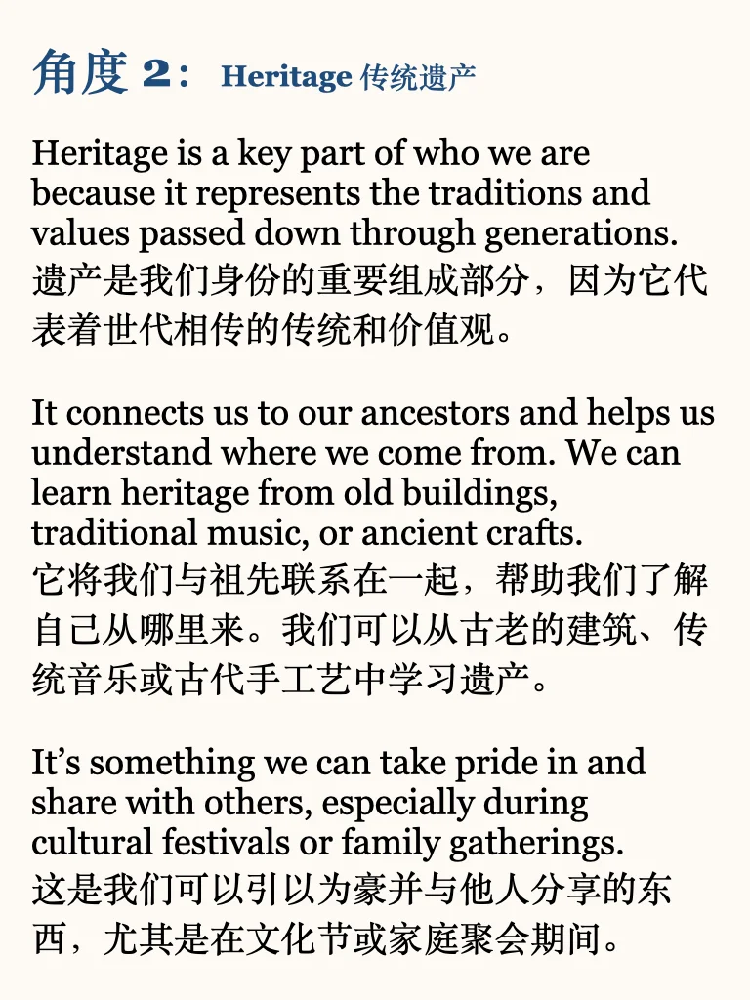
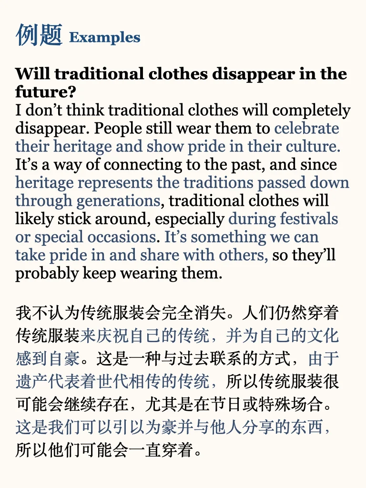

# 雅思口语part3 ｜文化类难题答题角度

有关于文化、历史、传统等有些抽象的话题，试试这两个角度
🌟National identity plays a key role in our life because it shapes how we see ourselves and where we belong.
民族身份认同感在我们的生活中起着关键作用，因为它决定了我们如何看待自己以及我们的归属。
🌟Heritage is a key part of who we are because it represents the traditions and values passed down through generations.
遗产是我们身份的重要组成部分，因为它代表着世代相传的传统和价值观。
#雅思备考 #雅思口语 #雅思攻略 #雅思口语素材 #雅思口语换题 #雅思口语part3 #雅思口语新题答案 #屠雅攻略 #分手吧雅思 #雅思考试

## 图片
| 图1 | 图2 | 图3 | 图4 |
| --- | --- | --- | --- |
|  |  |  |  |
|  |  |   |   |

生成时间：2025-11-14 21:44:26