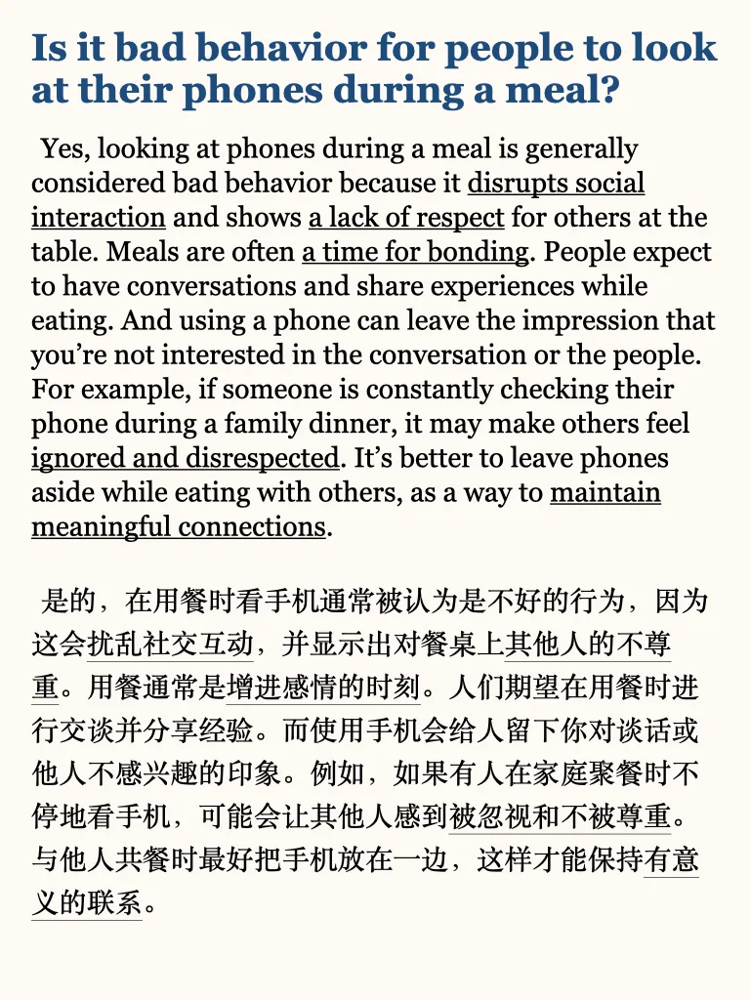
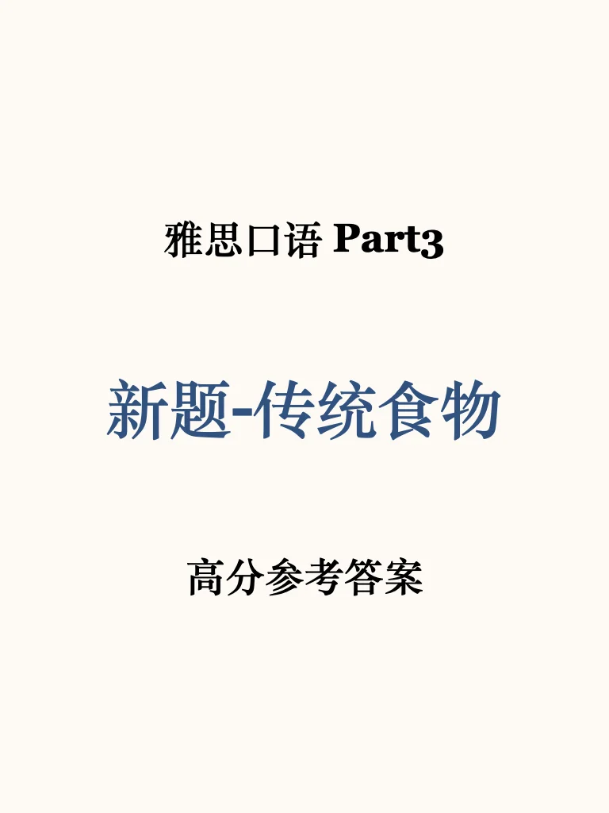
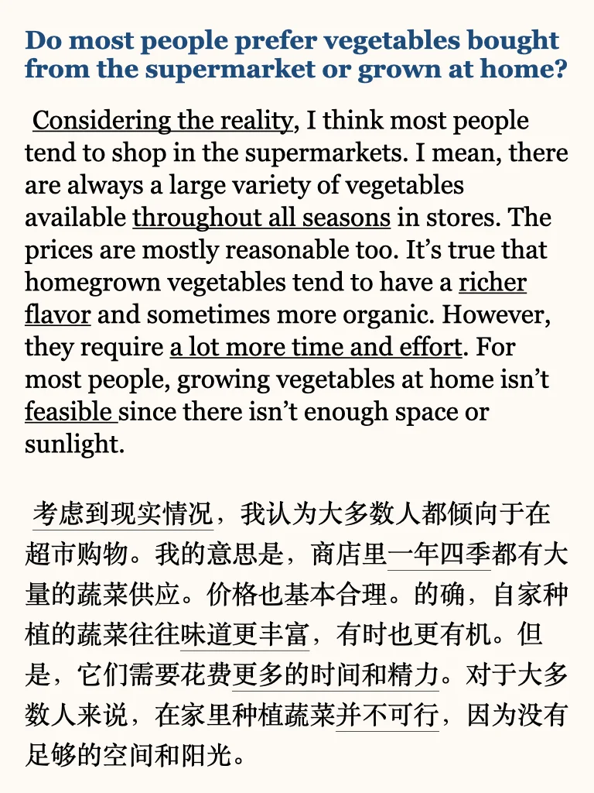

# 雅思口语高分参考｜传统食物P3

#雅思备考 #雅思口语 #雅思攻略 #雅思口语素材 #雅思口语题库 #雅思口语part3新题答案  #英语口语 #雅思口语答案 #雅思口语part3

## 图片
| 图1 | 图2 | 图3 | 图4 |
| --- | --- | --- | --- |
|  |  |  |  |
|  |   |   |   |

生成时间：2025-11-14 21:42:14