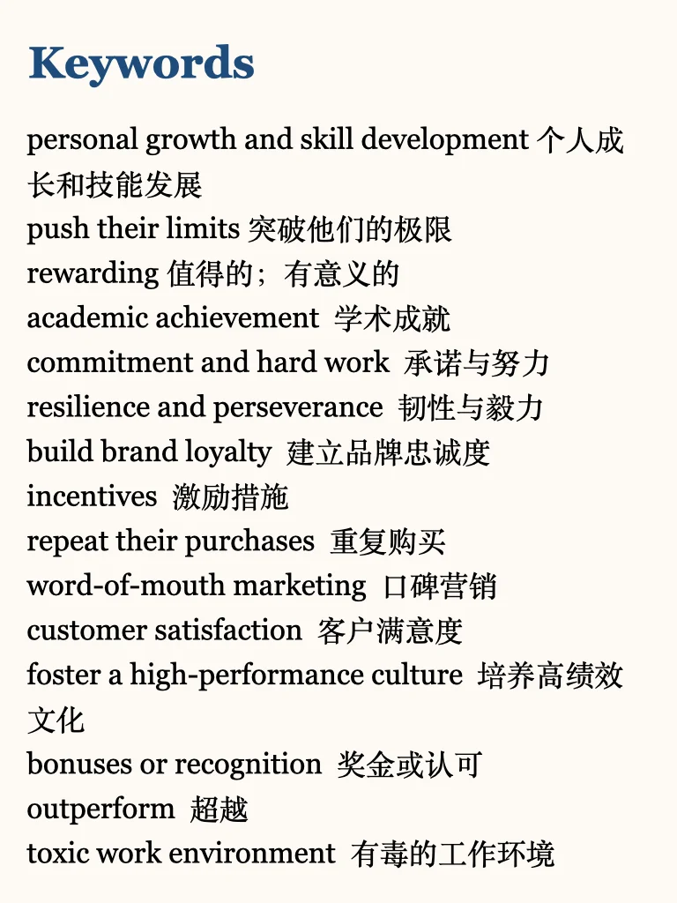
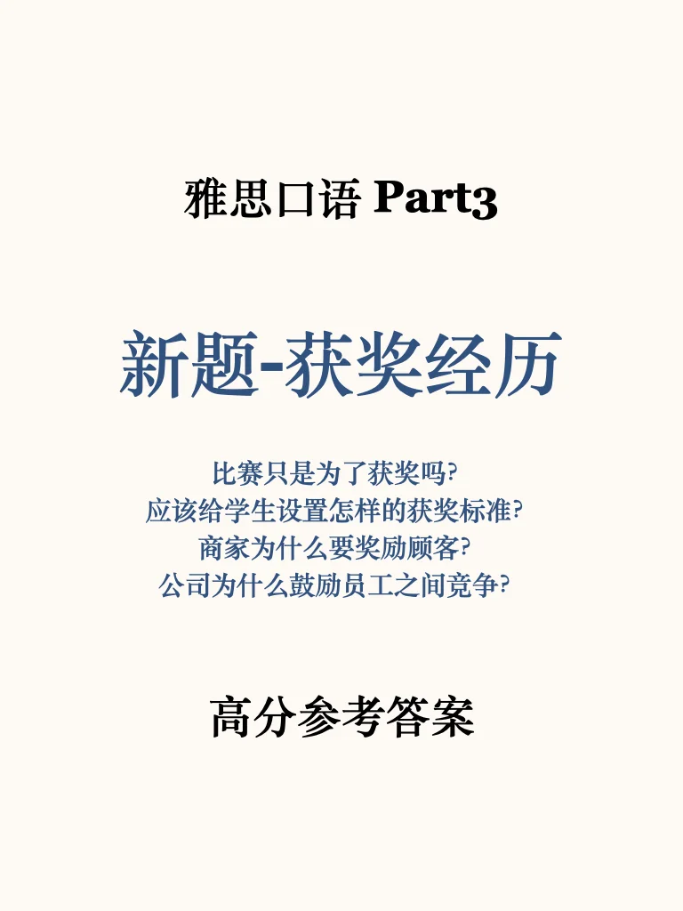
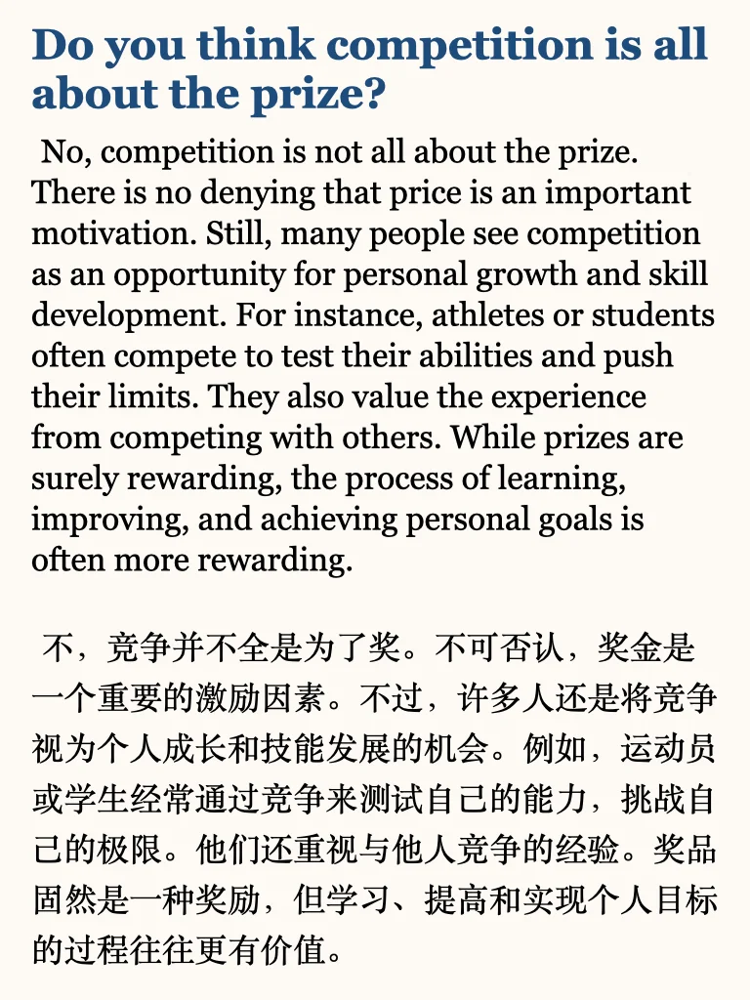
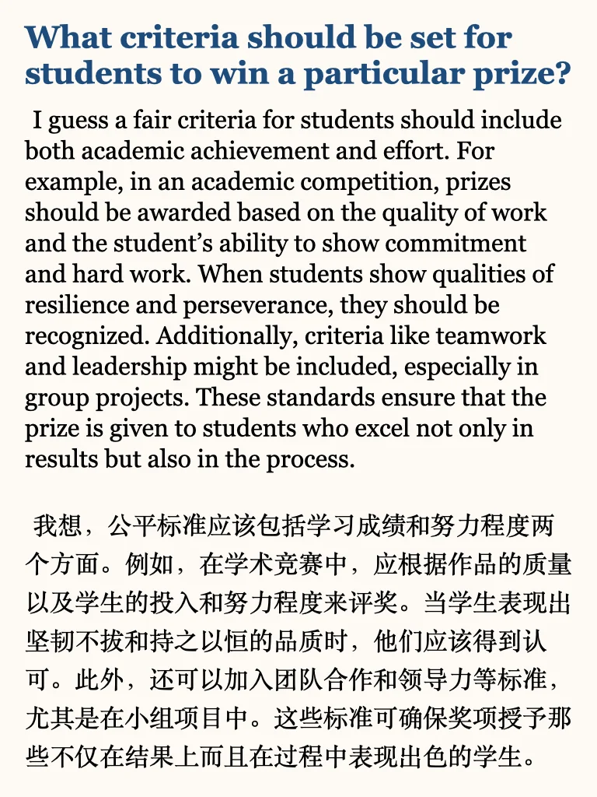
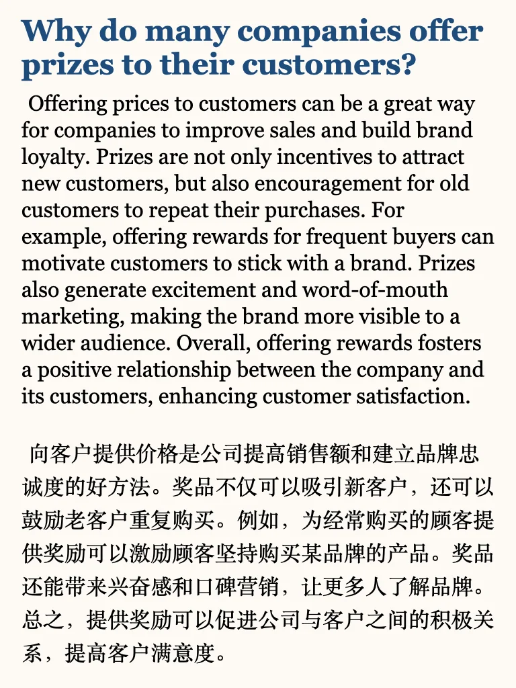
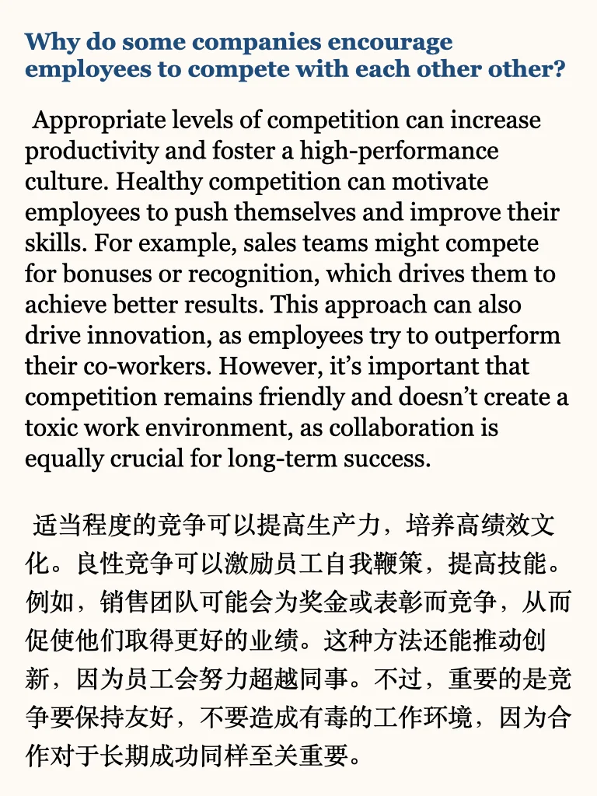

# 雅思口语P3｜获奖

🌟 keywords
personal growth and skill development 个人成
长和技能发展
push their limits 突破他们的极限
rewarding 值得的；有意义的
academic achievement 学术成就
commitment and hard work 投入与努力
resilience and perseverance 韧性与毅力
build brand loyalty 建立品牌忠诚度
incentives 激励措施
repeat their purchases 重复购买
word-of-mouth marketing 口碑营销
customer satisfaction 客户满意度
foster a high-performance culture 培养高绩效
文化
bonuses or recognition 奖金或认可
outperform 超越
toxic work environment 有毒的工作环境
#雅思考试 #雅思口语 #雅思备考 #雅思攻略 #雅思口语part3 #雅思口语高分示范 #雅思口语part3新题答案

## 图片
| 图1 | 图2 | 图3 | 图4 |
| --- | --- | --- | --- |
|  |  |  |  |
|  |  |   |   |

生成时间：2025-11-14 21:37:50