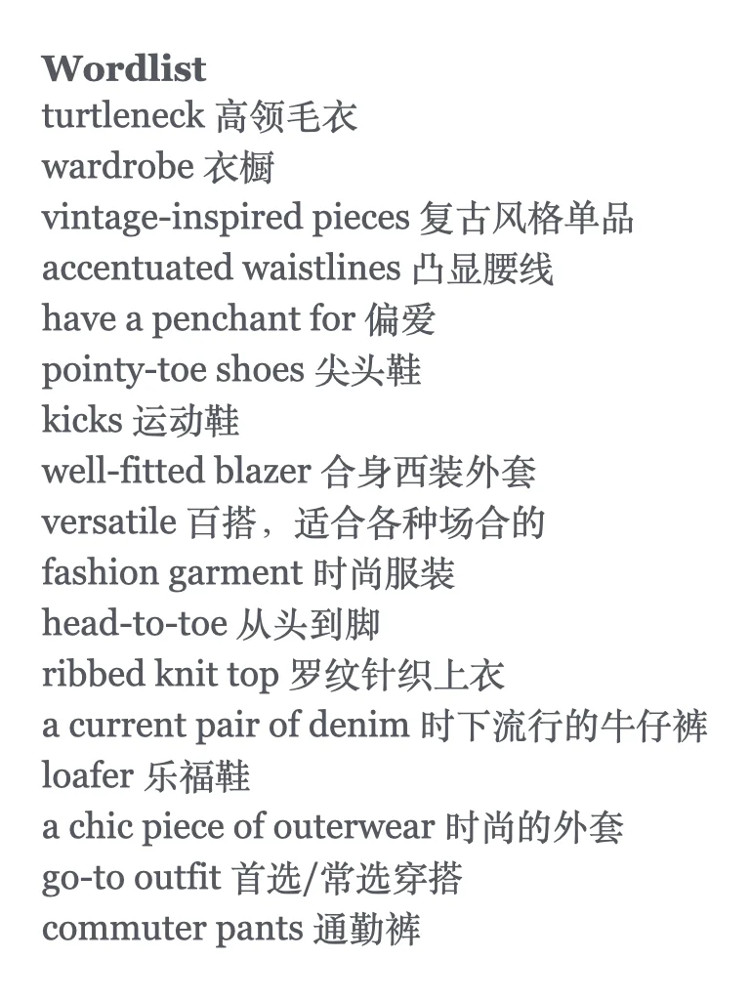
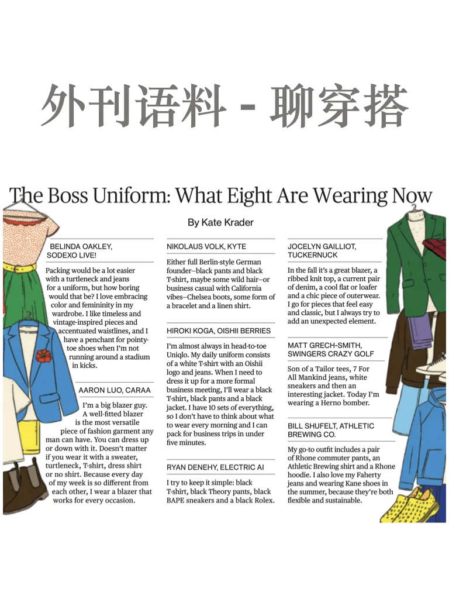
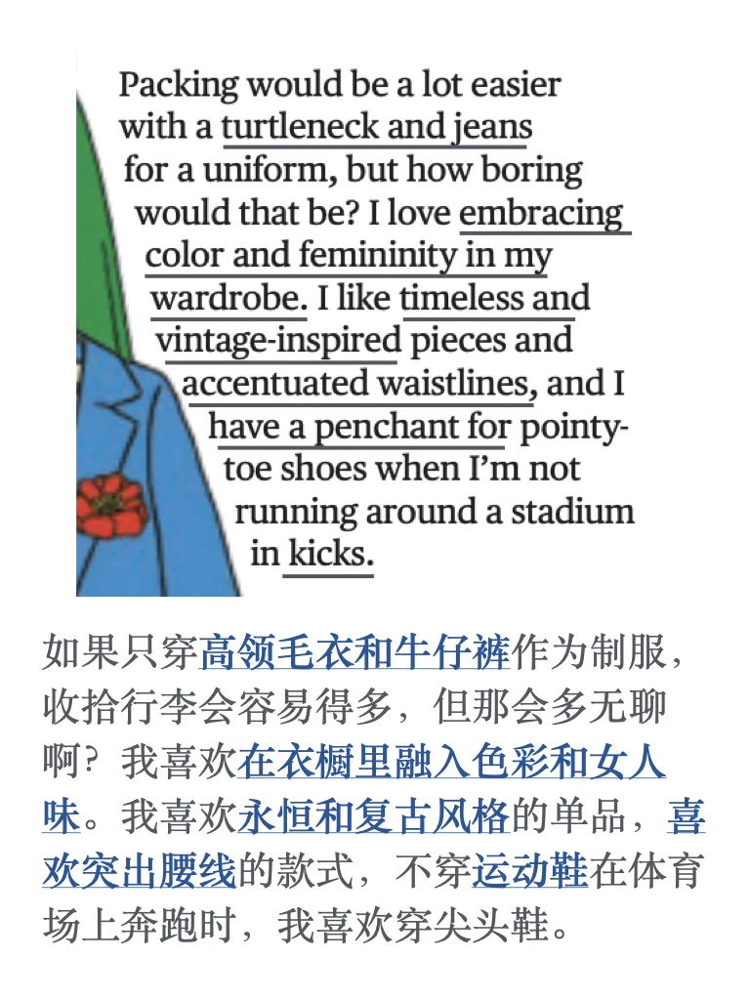
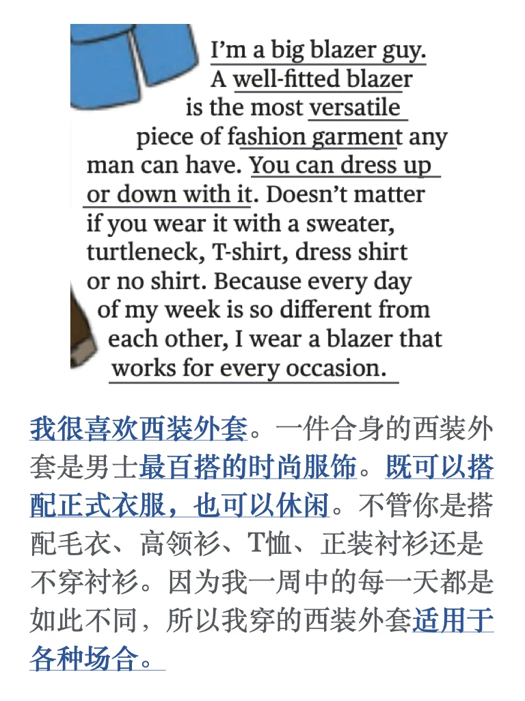
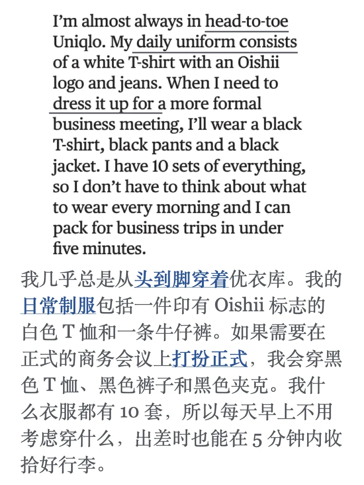
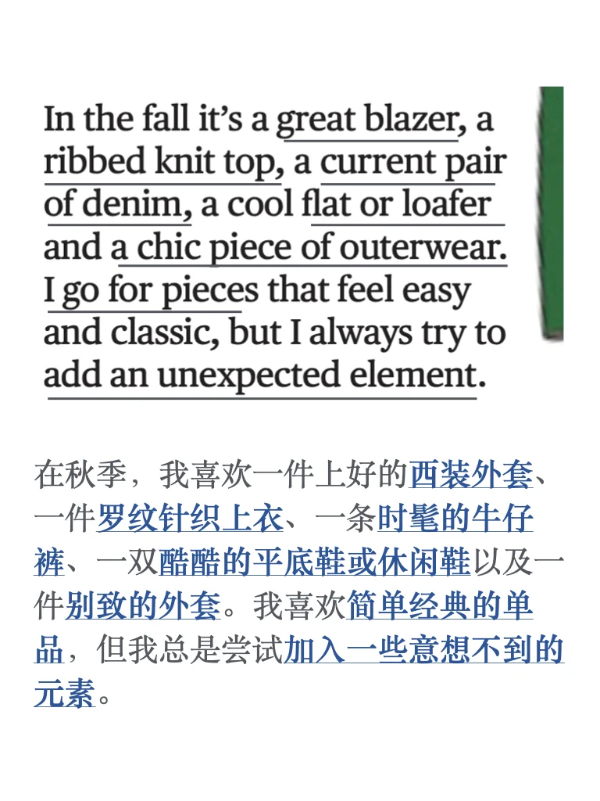
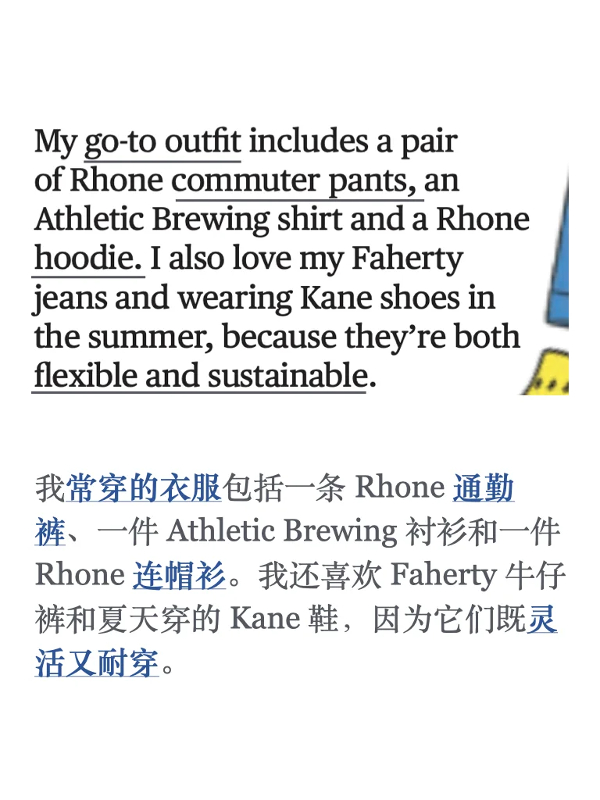

# 外刊语料｜看完也聊聊你的ootd

原文来自Bloomberg 十月刊，有兴趣学习原刊的同学可以进群，我分享给大家
🌟词汇积累
turtleneck 高领毛衣
wardrobe 衣橱
vintage-inspired pieces 复古风格单品
accentuated waistlines 凸显腰线
have a penchant for 偏爱
pointy-toe shoes 尖头鞋
kicks 运动鞋
well-fitted blazer 合身西装外套
versatile 百搭，适合各种场合的
fashion garment 时尚服装
head-to-toe 从头到脚
ribbed knit top 罗纹针织上衣
a current pair of denim 时下流行的牛仔裤
loafer 乐福鞋
a chic piece of outerwear 时尚的外套
go-to outfit 首选/常选穿搭
commuter pants 通勤裤
#外刊精读 #外刊阅读 #英语地道表达 #雅思口语 #雅思备考 #雅思攻略 #雅思口语素材 #每日穿搭 #外刊表达 #外刊表达积累

## 图片
| 图1 | 图2 | 图3 | 图4 |
| --- | --- | --- | --- |
|  |  |  |  |
|  |  |  |   |

生成时间：2025-11-14 21:35:37