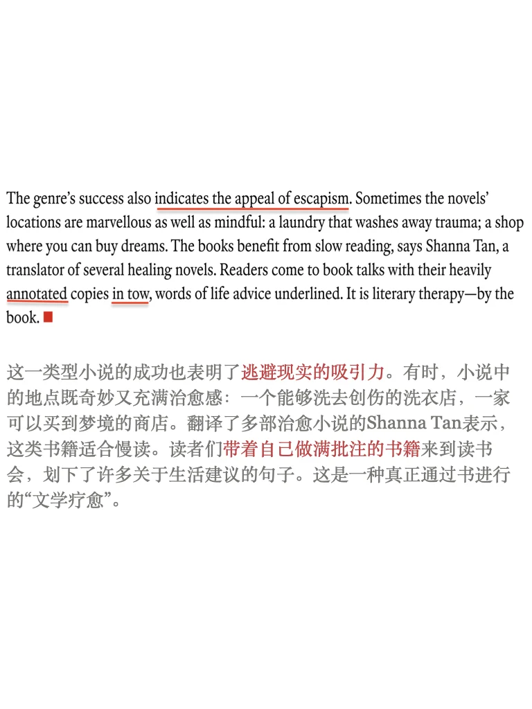
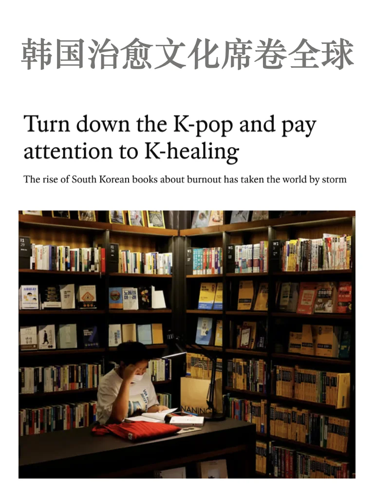
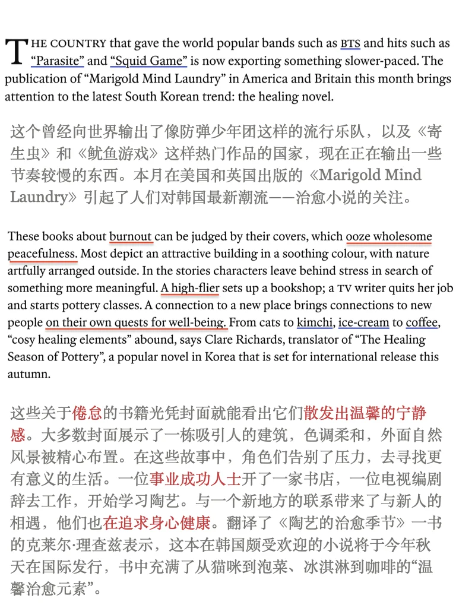
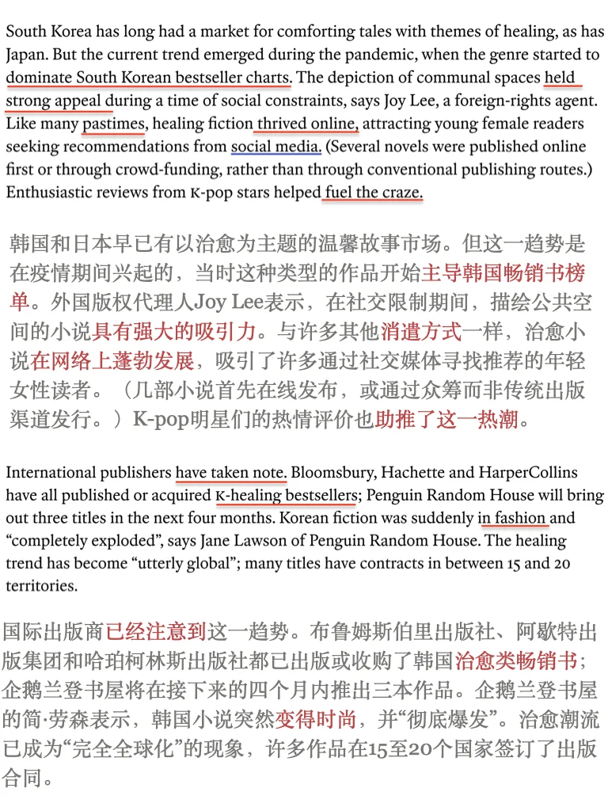
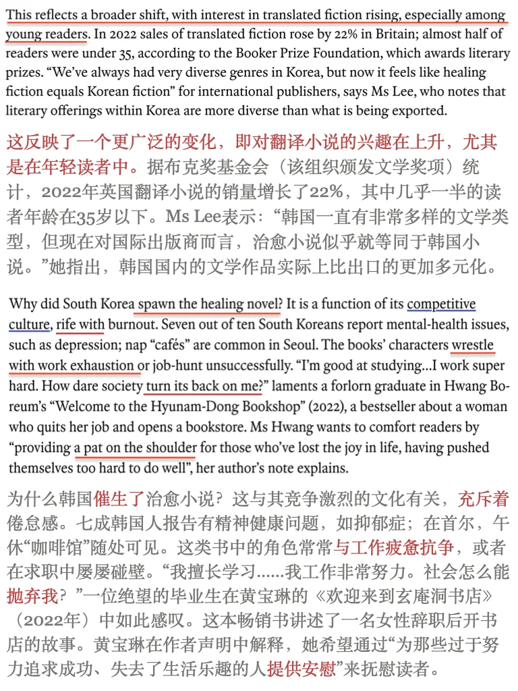

# 经济学人｜韩国治愈文化席卷全球

韩国“治愈小说”文学潮流在疫情期间出现，聚焦于情感恢复和逃离压力重重的竞争生活，触动了经历倦怠的读者。书中的角色通常辞去高压工作，寻找更有意义、更加平静的生活。这一类型小说的成功不仅反映了韩国竞争文化的现状，也反映了全球对逃避现实和文学疗愈的日益关注。
🌟keywords
Burnout 倦怠
High-flier 事业成功的人
On the quest for 寻求
Hold strong appeal 具有强大的吸引力
Spawn 产生/催生​
Take note 注意到
Rife with 充斥着
Turn its back on (someone) 抛弃（某人）
A pat on the shoulder 给予安慰
Push oneself too hard 过于努力
Escapism 逃避现实
	
#外刊精读  #阅读分享 #英语阅读打卡 #韩国文化 #英语地道表达 #外刊阅读 #外刊经济学人 #外刊表达 #外刊地道表达

## 图片
| 图1 | 图2 | 图3 | 图4 |
| --- | --- | --- | --- |
|  |  |  |  |
|  |   |   |   |

生成时间：2025-11-14 21:34:31