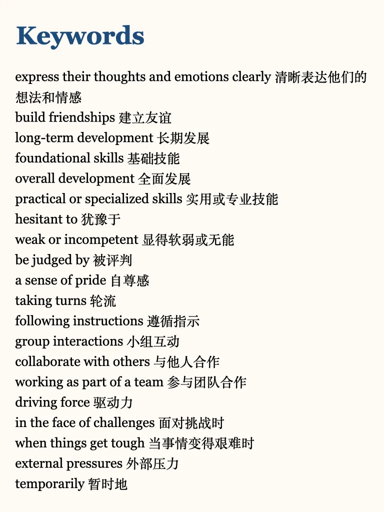
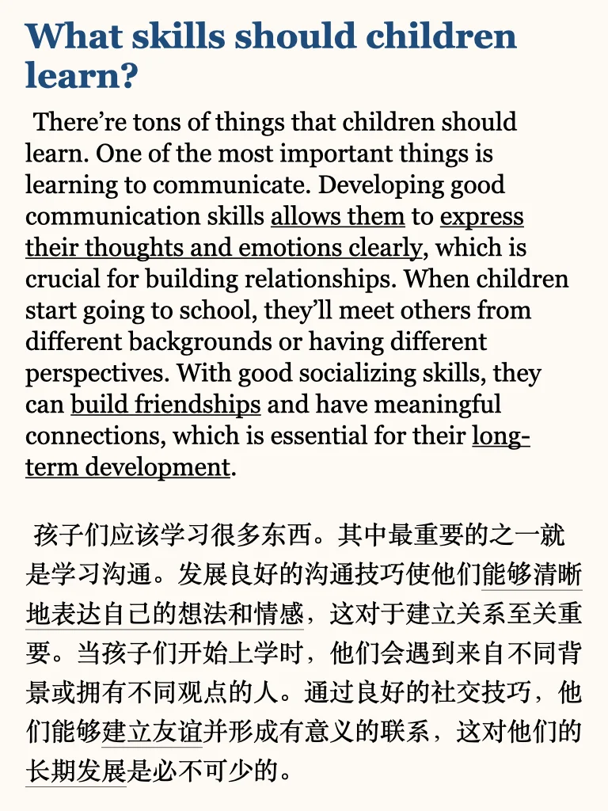
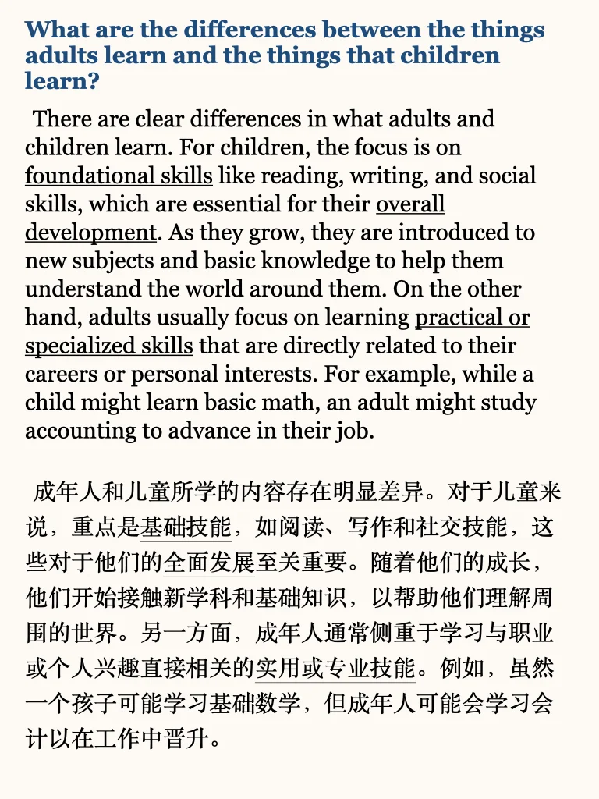
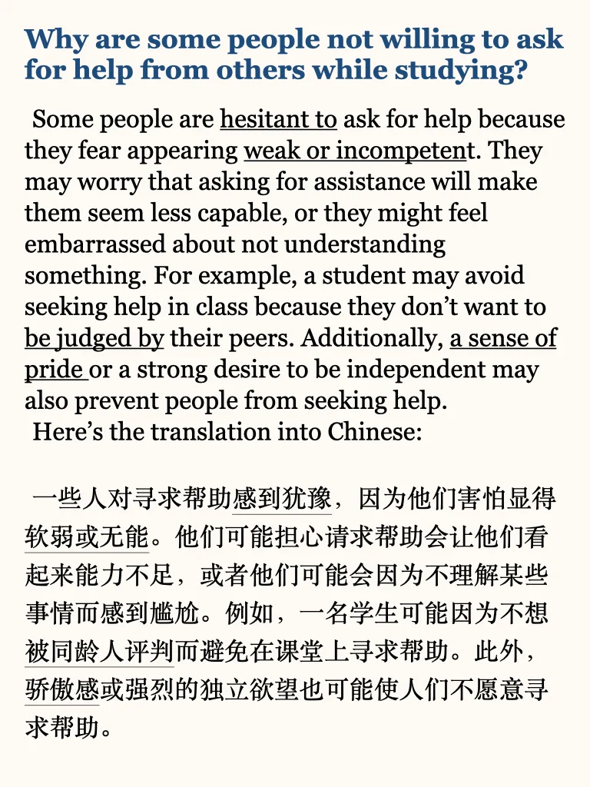
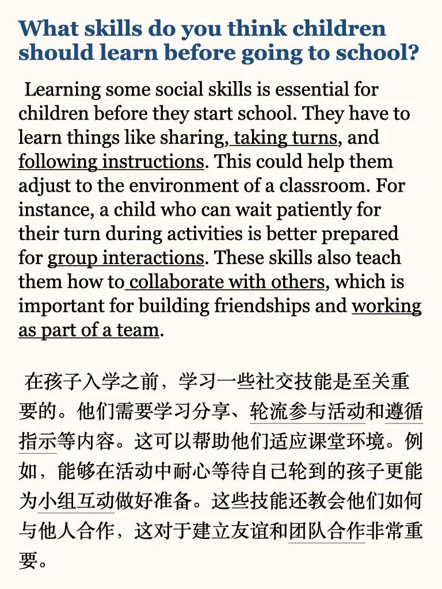
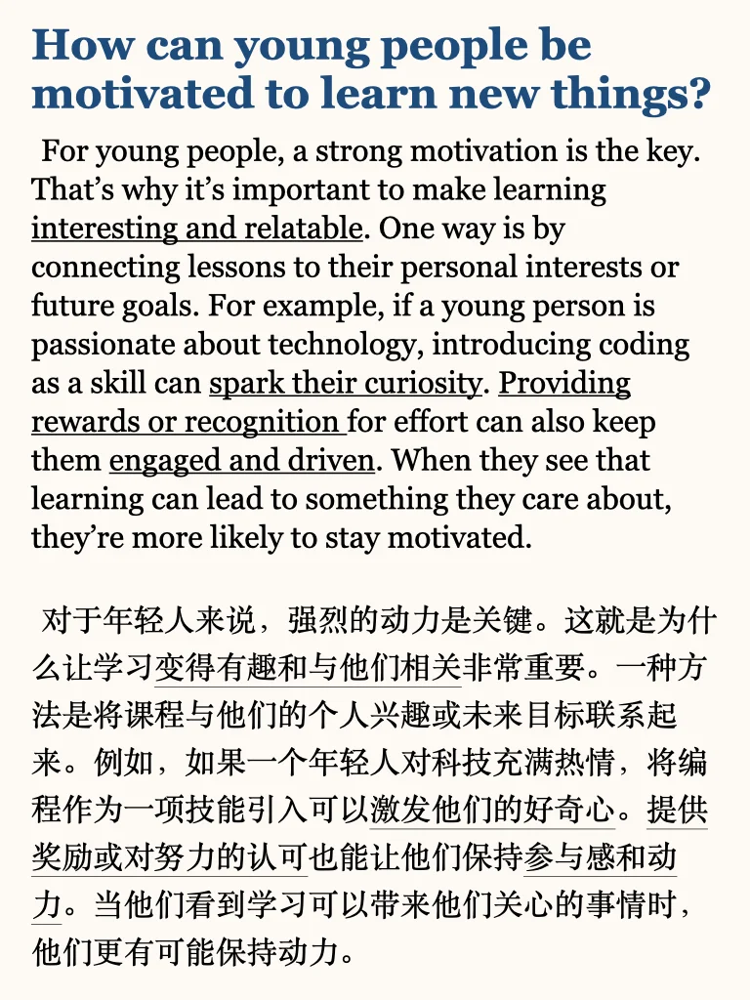
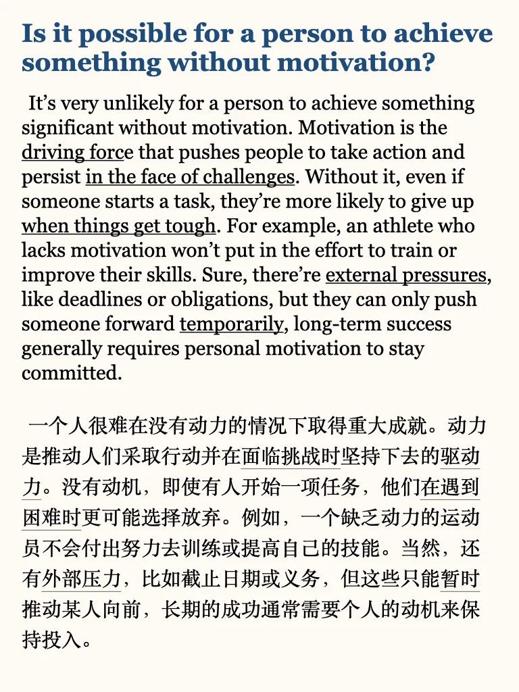

# 雅思口语P3｜向小辈展示新东西

今天的话题主要讨论长辈与晚辈、老年人与年轻人之间的关系，一般要求明确不同群体的特点，答题时需要结合具体例子说明原因，使回答更具逻辑性和深度。
🌟进行对比
明确区分这两类人群的需求、兴趣和行为方式。例如
- 老年人喜欢待在家中，因为熟悉的环境让他们感到安心。
- 年轻人更喜欢探索新环境、结交朋友，这帮助他们扩大社交圈。
🌟人群对比句型推荐：
1. Compared to A, B tends to...
- Compared to younger people, older adults tend to prefer more traditional forms of entertainment.
2. A is more likely to do…, whereas B...
- Young people are more likely to embrace new technology, whereas older generations may take longer to adapt.
3. In contrast to A, B...
- In contrast to men, women often show more empathy in social situations.
5. Both A and B do…, but A...
- Both children and adults enjoy traveling, but children are usually more excited about the experience itself.
参考答案中每个part2话题下精选了题型经典或难度较高的四个题目，搭配了中文翻译和关键词提炼，欢迎需要的小伙伴咨询选购🌹
#雅思 #雅思口语 #雅思备考 #雅思攻略 #雅思口语part3 #雅思口语高分示范 #雅思口语part3高分答案 #英语口语 #口语练习

## 图片
| 图1 | 图2 | 图3 | 图4 |
| --- | --- | --- | --- |
|  |  |  |  |
|  |  |  |  |

生成时间：2025-11-14 21:32:20