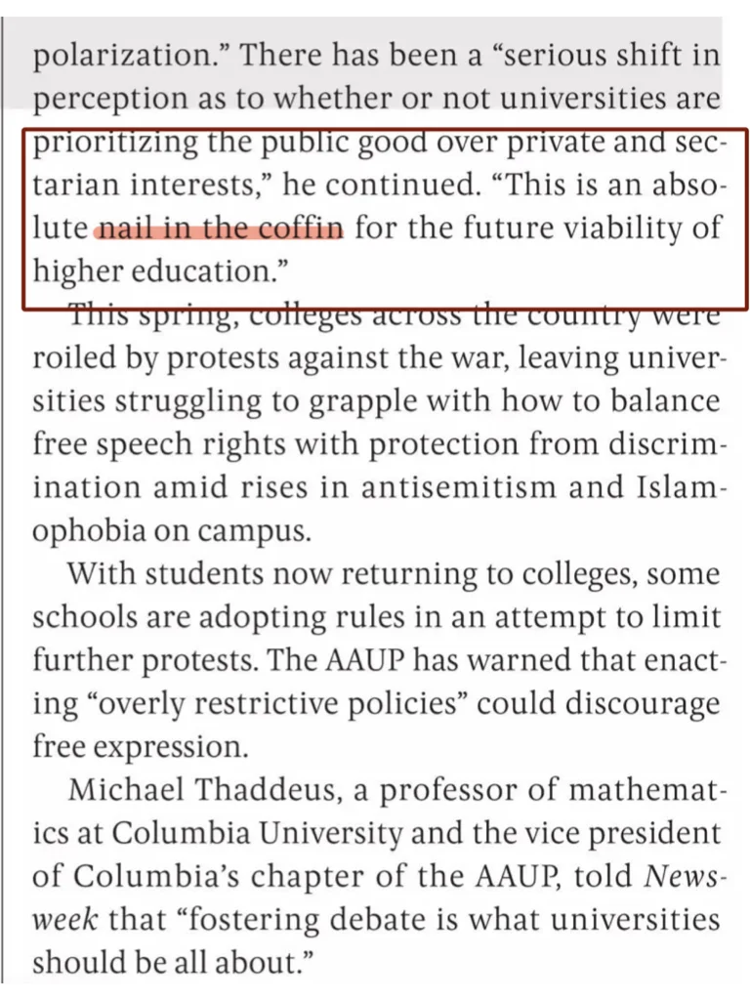
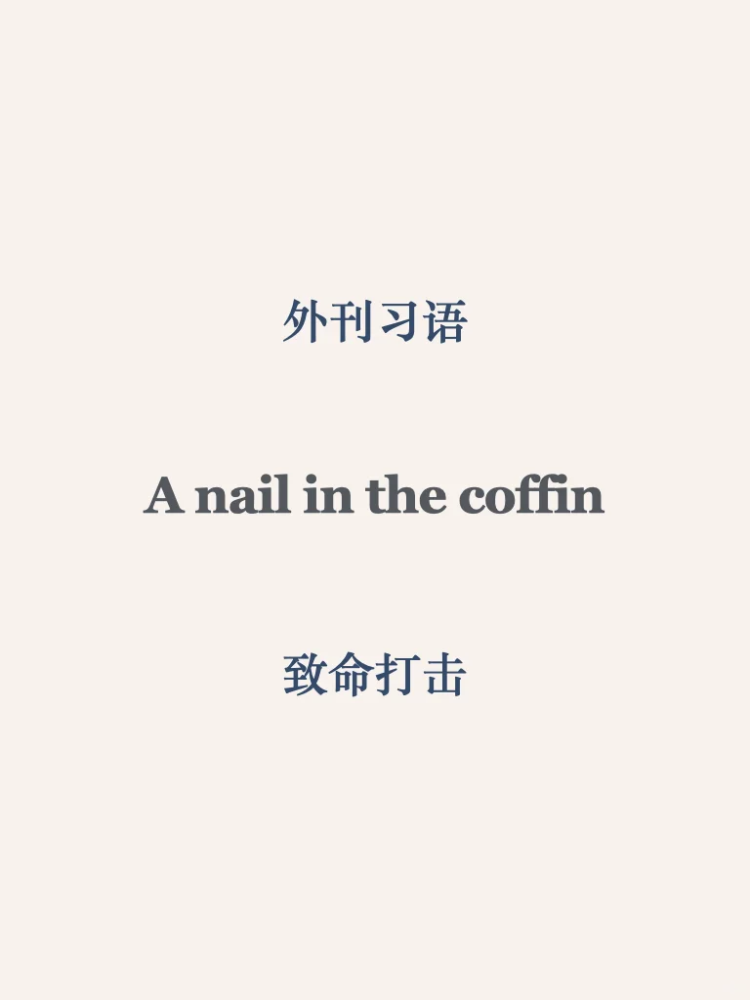
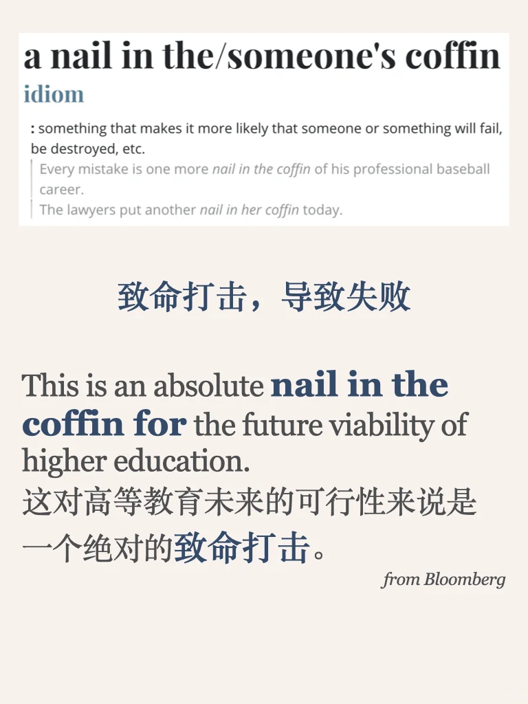
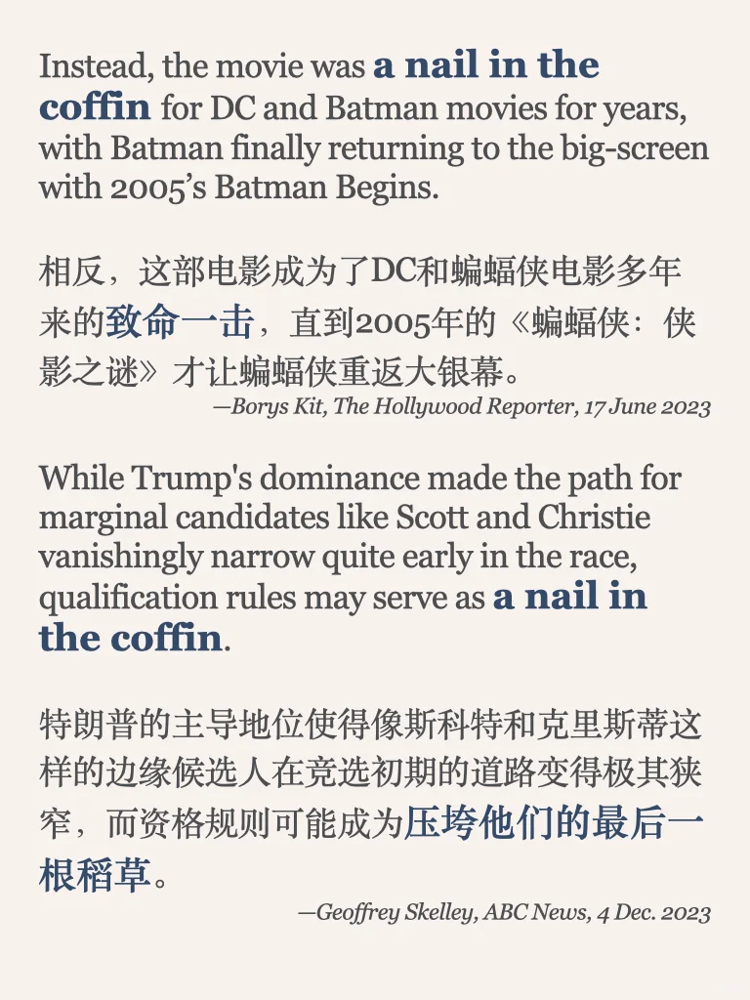

# 外刊习语｜致命一击

🌟A nail in the coffin
	
something that makes it more likely that someone or something will fail, be destroyed
今天的习语来自Bloomberg一篇讨论“大学意义与困境”的文章，原句：This is an absolute nail in the coffin for the future viability of higher education.
	
#外刊精读 #英语学习打卡 #英语阅读打卡 #英语地道表达 #外刊 #习语 #英语原版阅读 #雅思备考 #四六级 #考研英语

## 图片
| 图1 | 图2 | 图3 | 图4 |
| --- | --- | --- | --- |
|  |  |  |  |

生成时间：2025-11-14 21:31:13