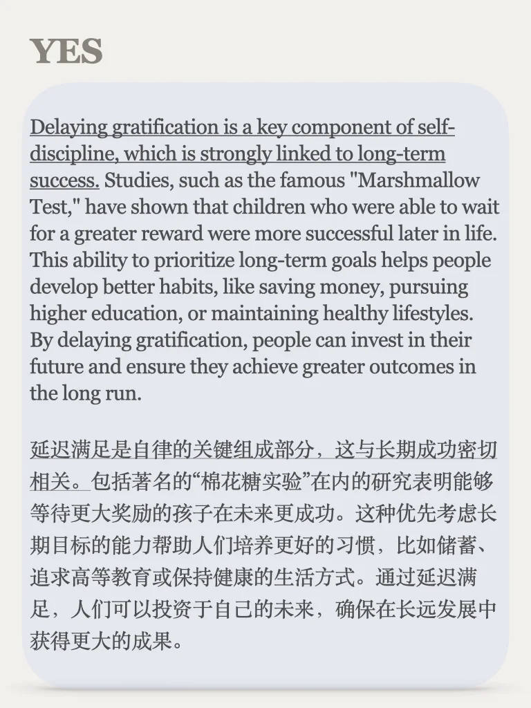
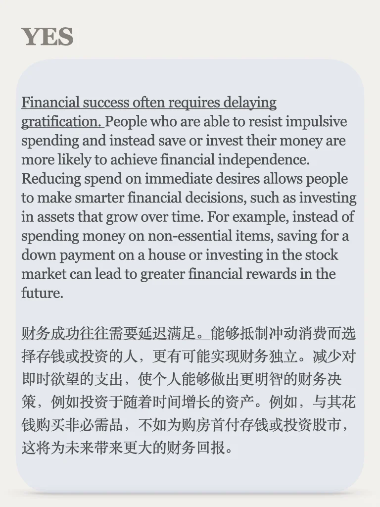
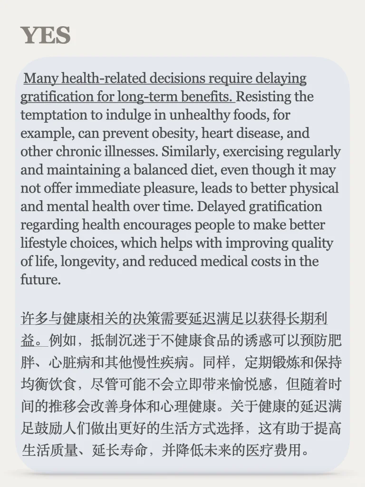
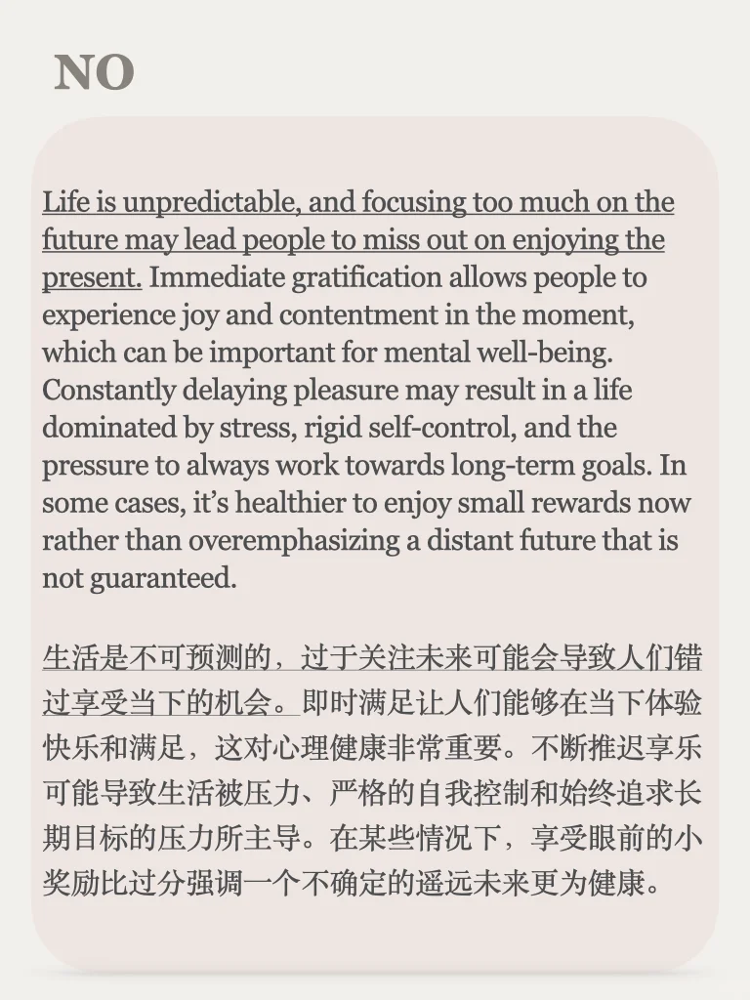
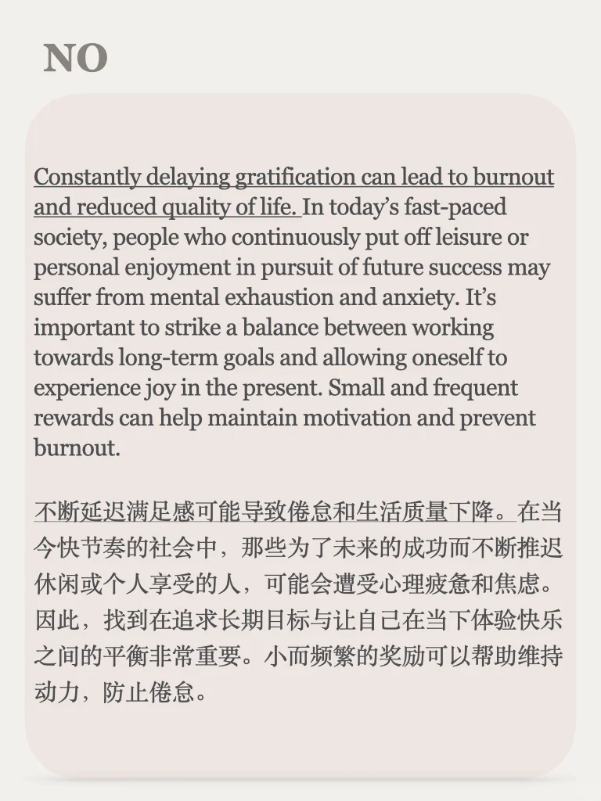

# 辩论思考Debate｜先苦后甜还是及时行乐

今天是辩论栏目的第45期，主题：应该及时行乐，还是先苦后甜？
灵感来自于“What's So Bad About Instant Gratification? - JSTOR Daily” 明天会给大家分享原文～
辩论栏目每周一个新话题，欢迎关注
所有辩论语料合集可以点击笔记同款商品获得，9.9永久订阅
#英文学习 #英语地道表达 #英语辩论 #雅思口语 #四六级 #考研英语 #英语素材 #写作观点与素材 #雅思攻略 #雅思作文观点积累

## 图片
| 图1 | 图2 | 图3 | 图4 |
| --- | --- | --- | --- |
|  |  |  |  |
|  |  |  |   |

生成时间：2025-11-14 21:30:08