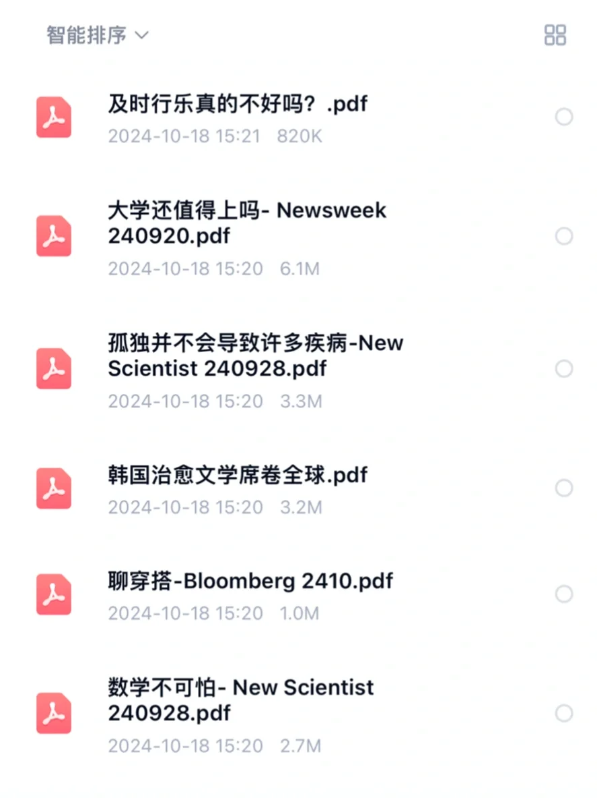
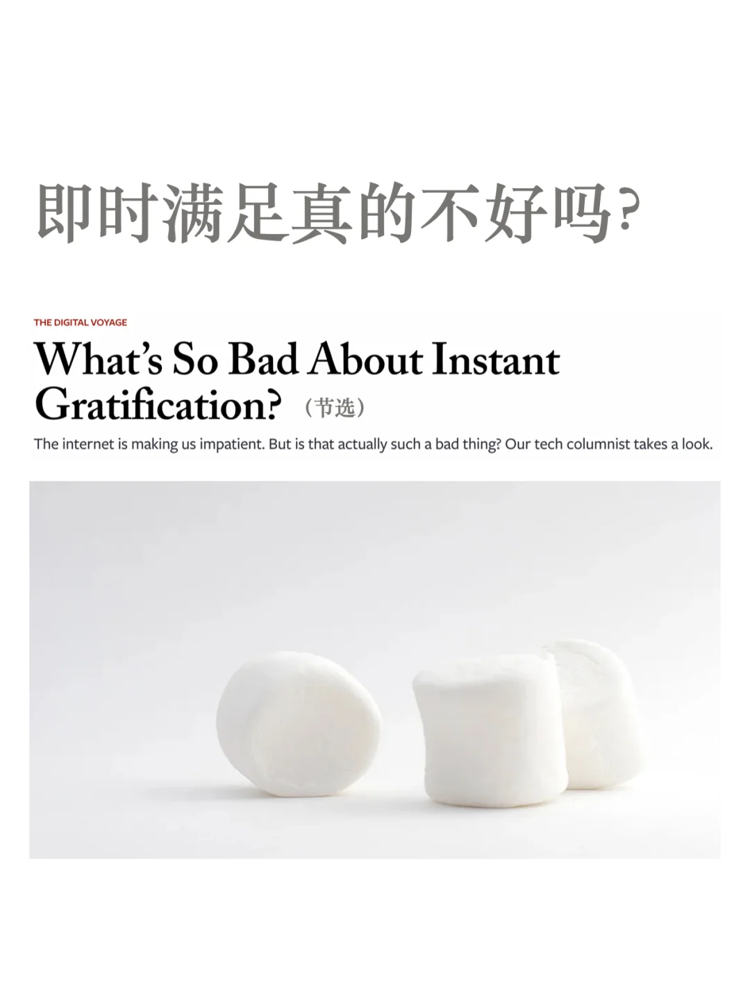
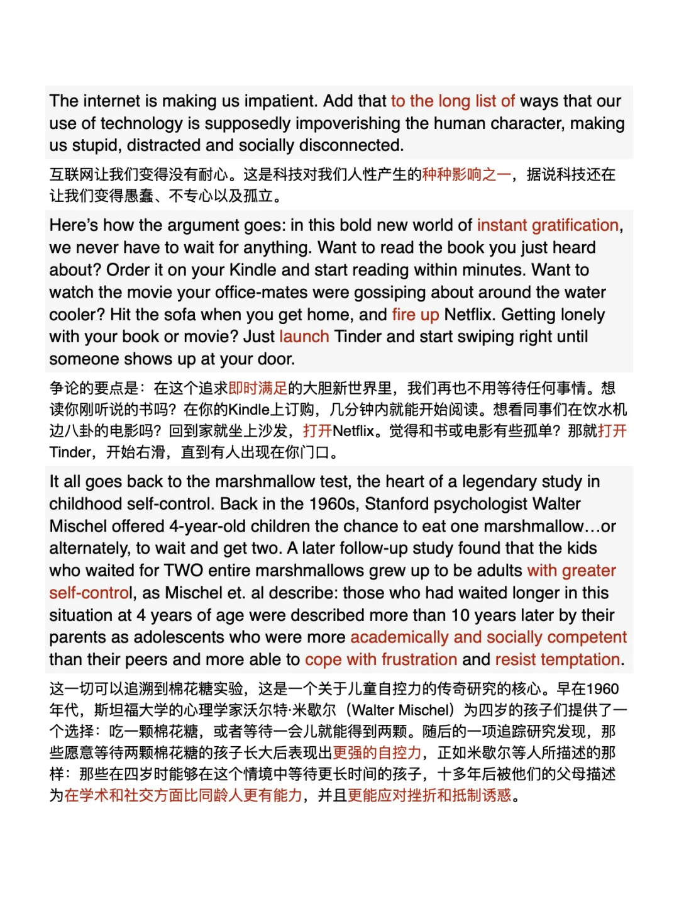
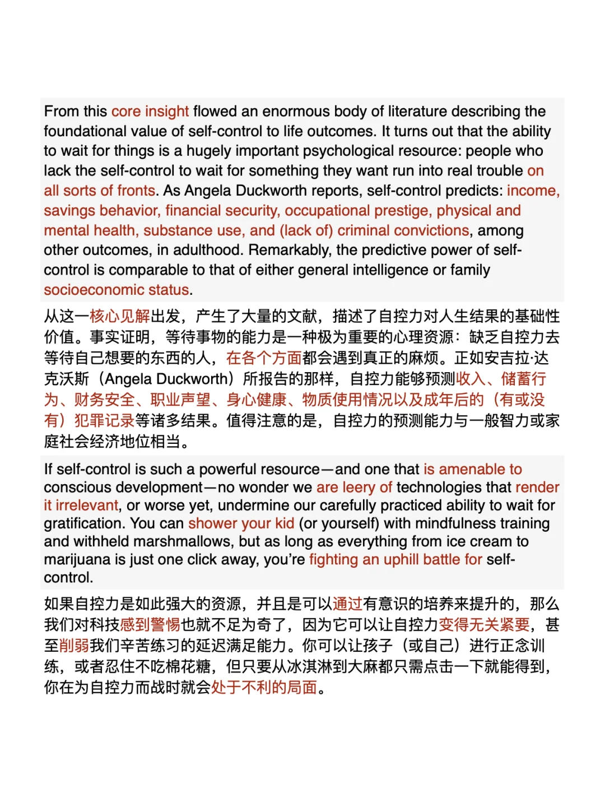
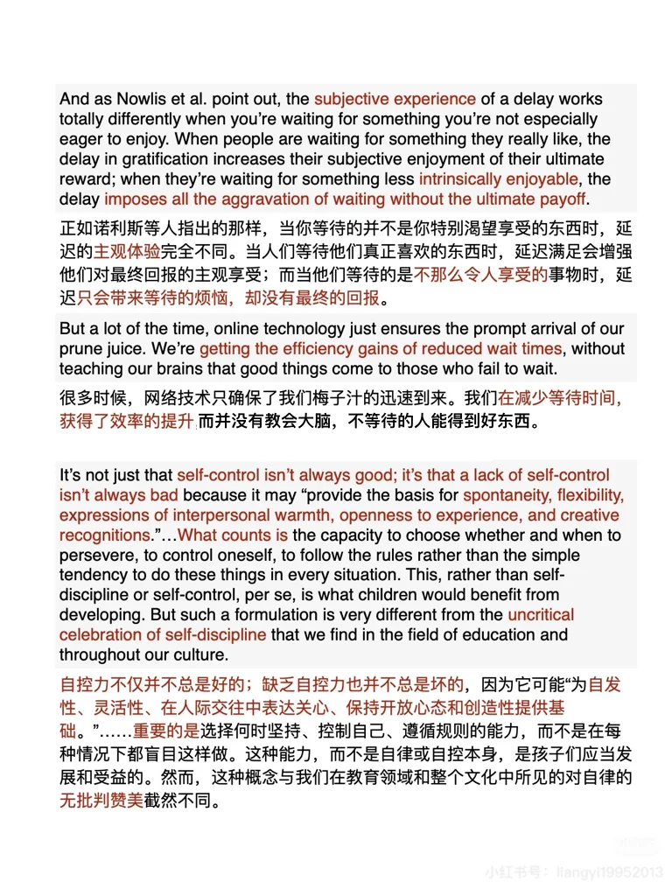
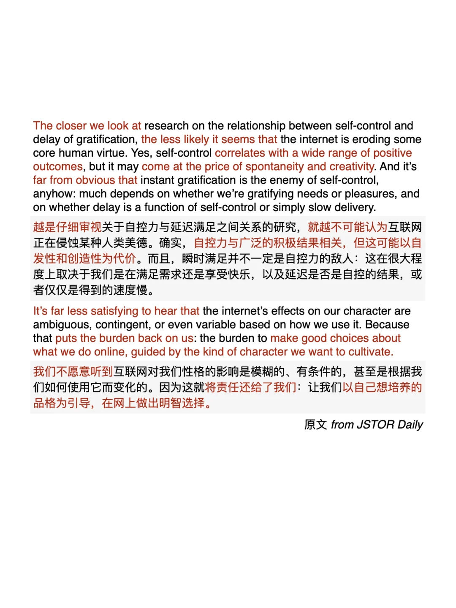

# 外刊阅读｜即时满足有什么不好？

平时分享的内容受篇幅限制，很多是段落节选或者词汇讲解，我把平时阅读的文章从期刊、网页中筛选出来，以PDF格式保存整理，想更阅读更完整的外刊原文，欢迎加入群聊👏
🌟keywords
instant gratification即时满足
academically and socially competent学术上和社交上都很有能力
cope with frustration应对挫折
resist temptation抵制诱惑
on all sorts of fronts在各个方面
socioeconomic status社会经济地位
is amenable to愿意接受
are leery of对……持怀疑态度
shower your kid with 给孩子大量的……
fighting an uphill battle for为……艰难奋斗
subjective experience主观体验
intrinsically enjoyable本质上令人愉悦
spontaneity自发性/随性而为的能力
flexibility灵活性
come at the price of以……为代价
文章讨论了自控力、即时满足与互联网的关系。
以往的证据表明，延迟满足对生活结果有积极影响，如著名的棉花糖实验；但也存在关于即时满足是否一定有害的质疑，研究表明，过度强调自控力可能会牺牲随性而为的能力和创造力。互联网对自控力和人类行为的影响并非简单直接，更多取决于人们如何选择使用它。
#外刊精读 #深度思考 #灵感 #英文写作 #外刊阅读 #英文阅读 #英语阅读打卡 #英语地道表达

## 图片
| 图1 | 图2 | 图3 | 图4 |
| --- | --- | --- | --- |
|  |  |  |  |
|  |  |   |   |

生成时间：2025-11-14 21:29:02