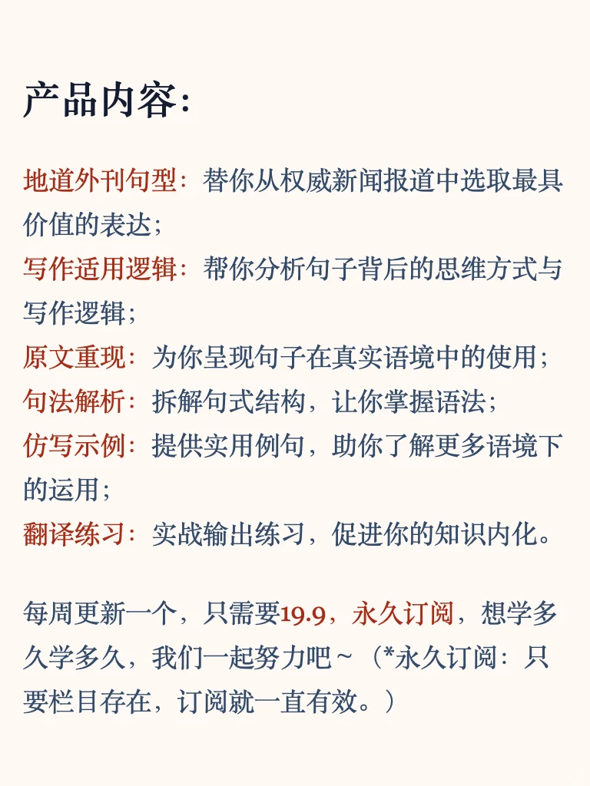
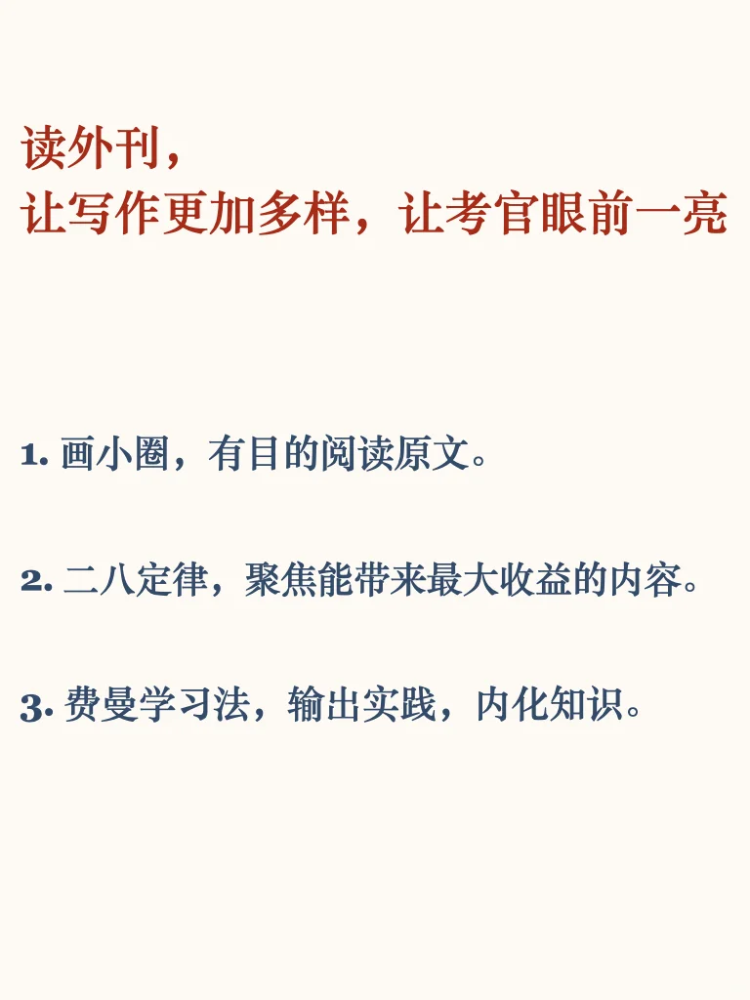
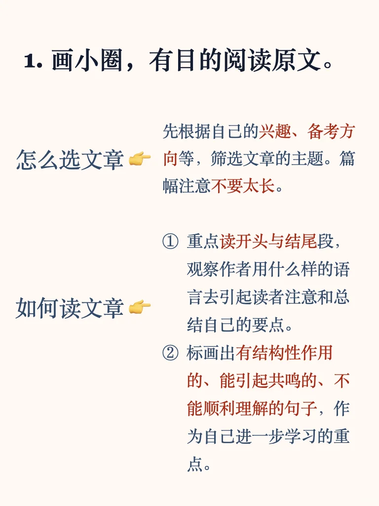
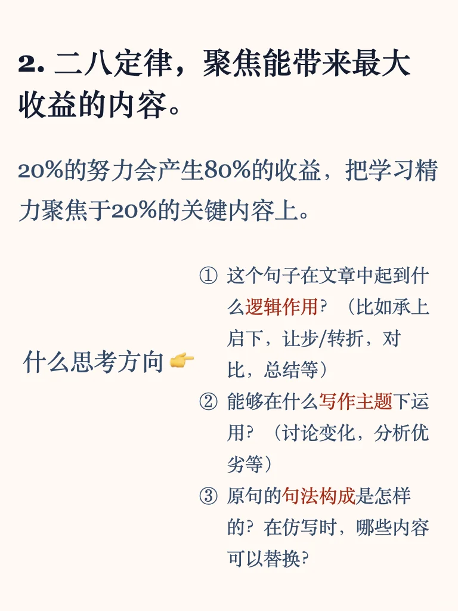

# 如何利用外刊有效提升写作？

很多同学都以外刊作为自己泛读和模仿的素材，但精读了许多文章之后，提笔写作时，仍然感觉句子简单直白、平淡无力或逻辑不清，达不到理想中生动灵活而简洁有力的效果。
想让自己的阅读真正有效提升写作，我推荐这样的方法：
1. 画小圈，有目的阅读原文。
2. 二八定律，聚焦能带来最大收益的内容。
3. 费曼学习法，输出实践，内化知识。
	
从专八优秀、二级笔译证书、雅思八分，到从事一线教研的近十年里，我一直在用这三个步骤读外刊，我的“外刊句型仿写”栏目已经做了28期，收到很多小伙伴支持和认可，非常感谢。只要大家认为有帮助，我会继续认真做下去。
	
为了让大家跟我一起深入系统的学习，现在增设了订阅制的产品，每一期都包括：
1.	地道外刊句型：替你从权威新闻报道中选取最具价值的表达；
2.	写作适用逻辑：帮你理解句子背后的思维方式与写作逻辑；
3.	原文重现：为你呈现句子在真实语境中的使用；
4.	句法解析：拆解句式结构，让你理解掌握语法；
5.	仿写示例：提供实用例句，助你了解更多语境下的运用；
6.	翻译练习：实战输出练习，促进你的知识内化。
	
每周更新一个，需要19.9，永久订阅，想学多久学多久，我们一起努力吧～
#写作技巧 #写作干货 #雅思写作 #四六级 #考研英语 #英专生 #专四专八 #外刊精读 #外刊写作 #雅思备考

## 图片
| 图1 | 图2 | 图3 | 图4 |
| --- | --- | --- | --- |
|  |  |  |  |
|  |   |   |   |

生成时间：2025-11-12 16:54:37