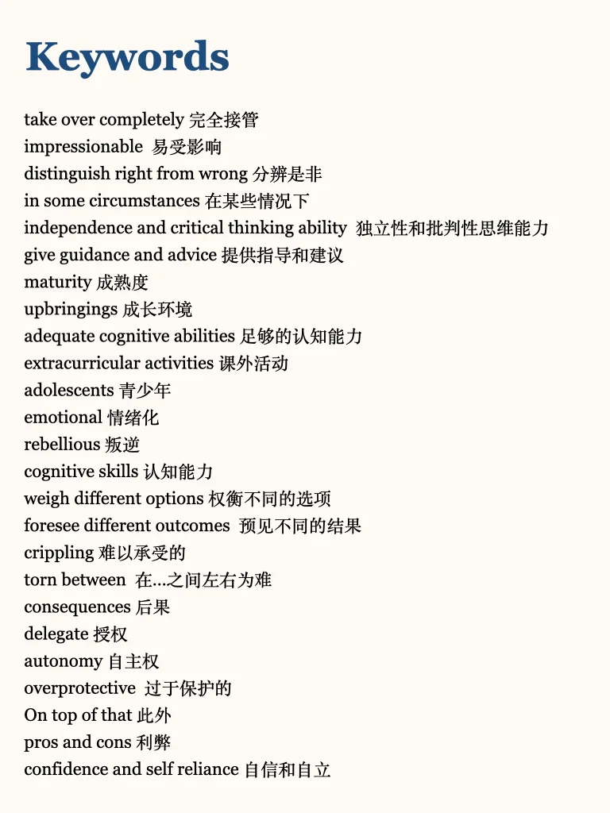
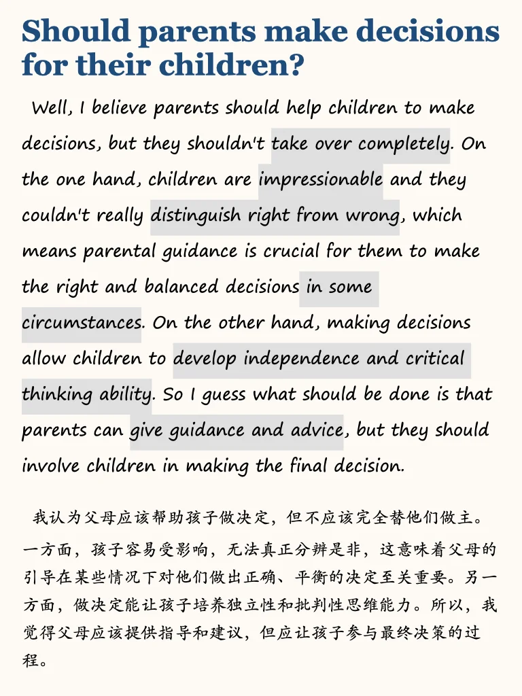
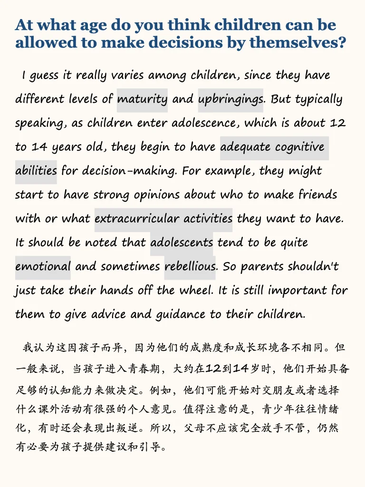
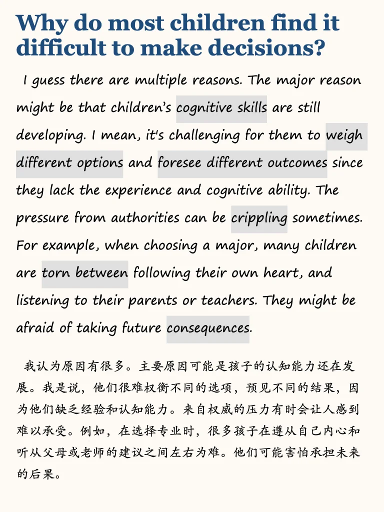
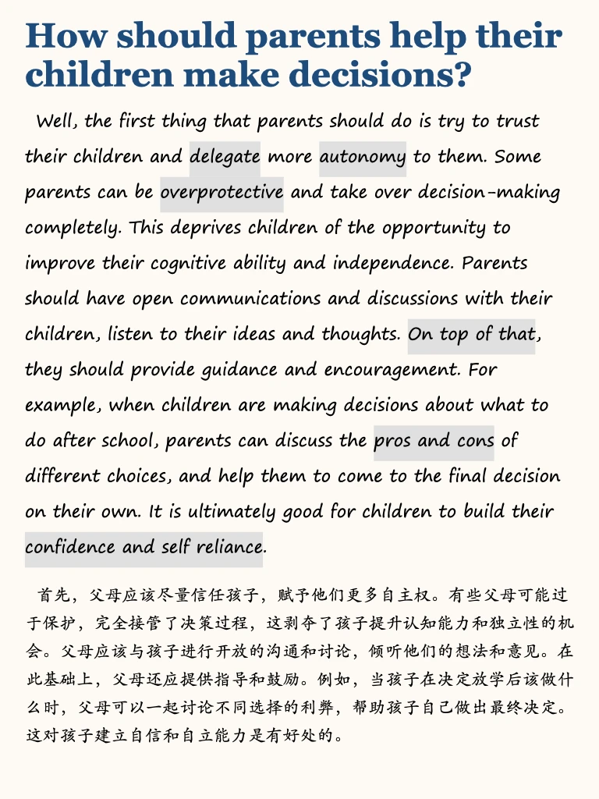

# 雅思口语P3｜别人做的好决定

分享一个近期考频较高的题目。话题集中讨论孩子，该群体的常用特点：
🌟Strong curiosity ： Children are eager to explore and learn about the world around them, which drives their constant questioning and discovery.
🌟Creativity and imagination ： Children often come up with unique ideas and stories, showing an ability to think outside the box.
🌟 Need for guidance and structure ：While they are curious and adaptable, they still rely on adults to provide direction and set boundaries.
	
需要本季度完整part3答案作为参考的同学可以点左下角获取

## 图片
| 图1 | 图2 | 图3 | 图4 |
| --- | --- | --- | --- |
|  |  |  |  |
|  |  |   |   |

生成时间：2025-11-14 21:26:48