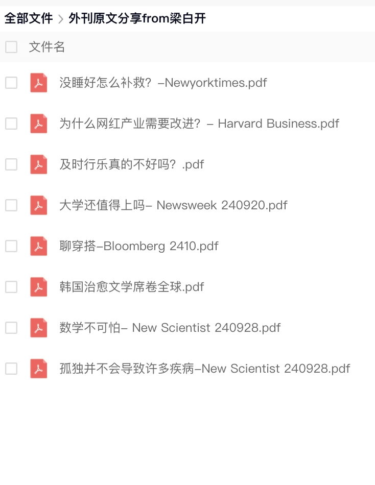
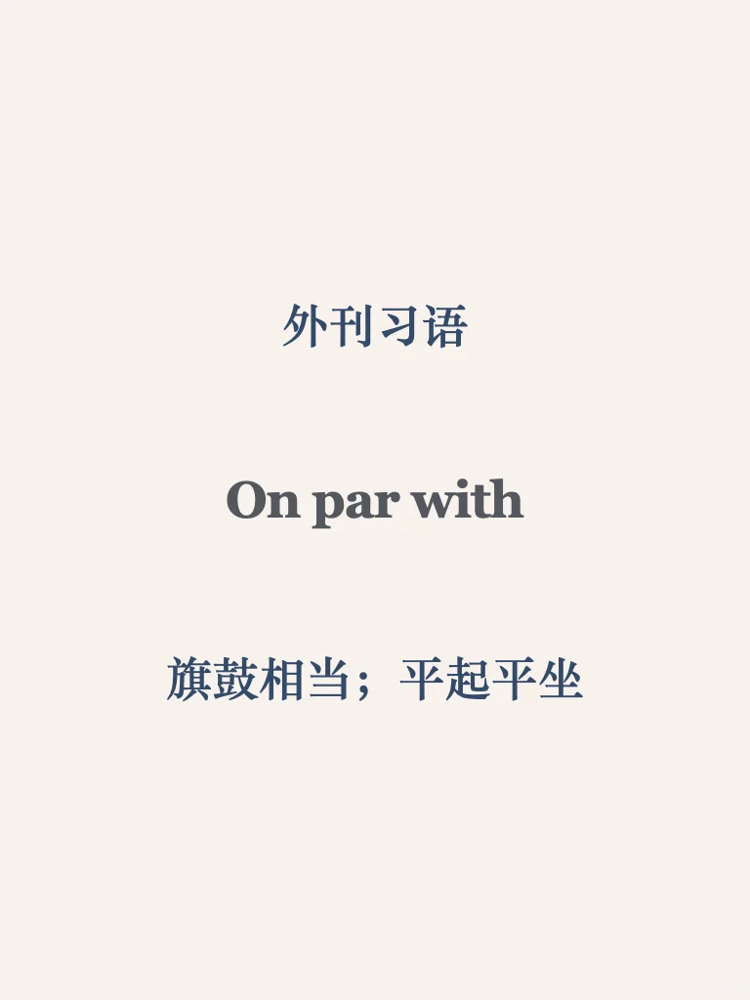
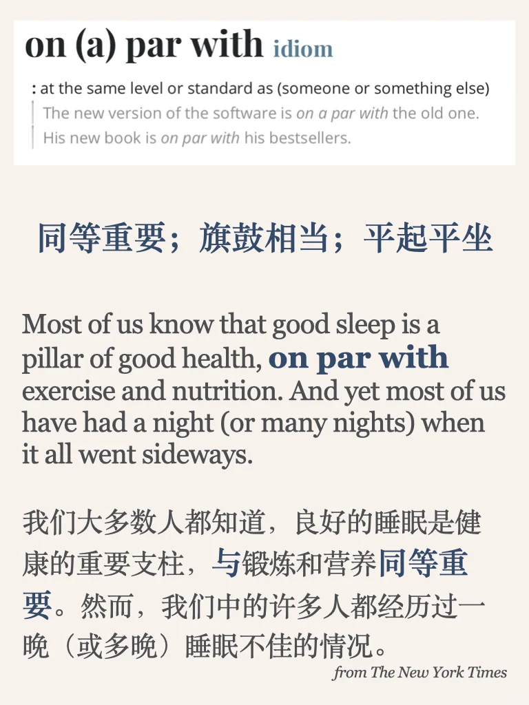

# 外刊习语积累｜on par with 平起平坐

选词来自New York Times 文章： How to Salvage Your Day After a Bad Night's Sleep
	
平时分享的内容受篇幅限制，很多是段落节选或者词汇讲解，我把平时阅读的文章从期刊、网页中筛选出来，以PDF格式保存整理，想更阅读更完整的外刊原文，欢迎加入群聊👏
#每日英语口语学习 #英语学习打卡 #外刊精读 #每日分享 #雅思备考 #英语地道表达 #雅思攻略 #习语 #外刊高级词汇积累

## 图片
| 图1 | 图2 | 图3 | 图4 |
| --- | --- | --- | --- |
|  |  |  |  |
|  |   |   |   |

生成时间：2025-11-14 21:25:42