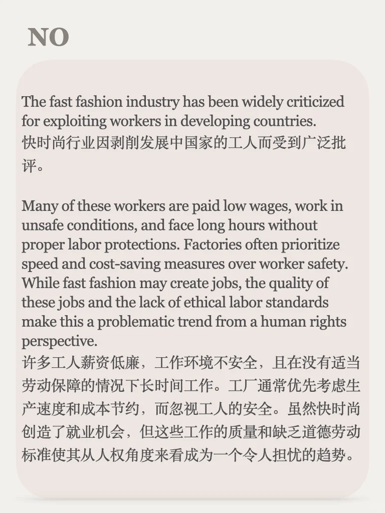
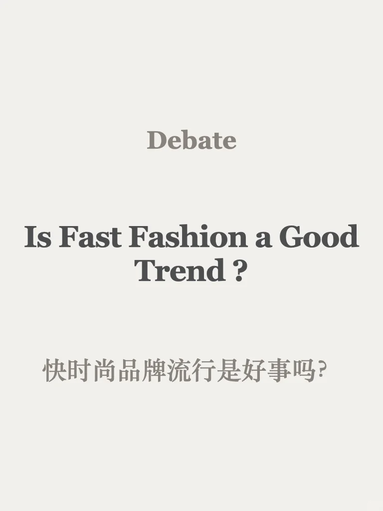
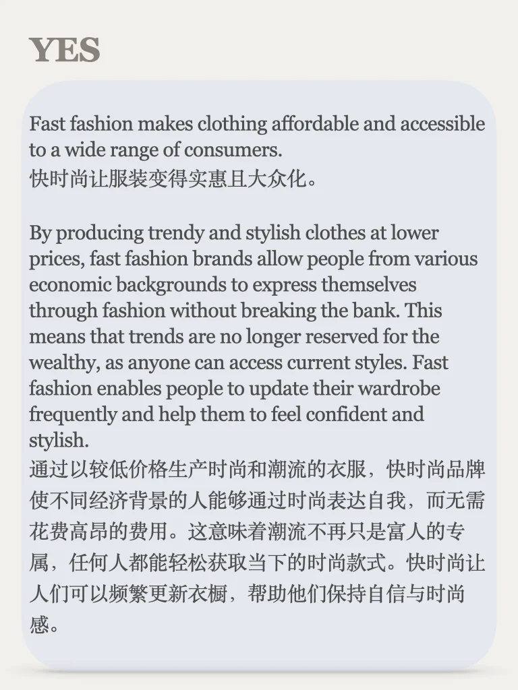
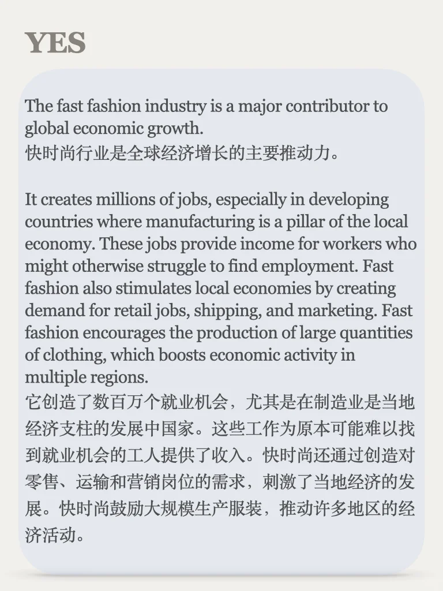
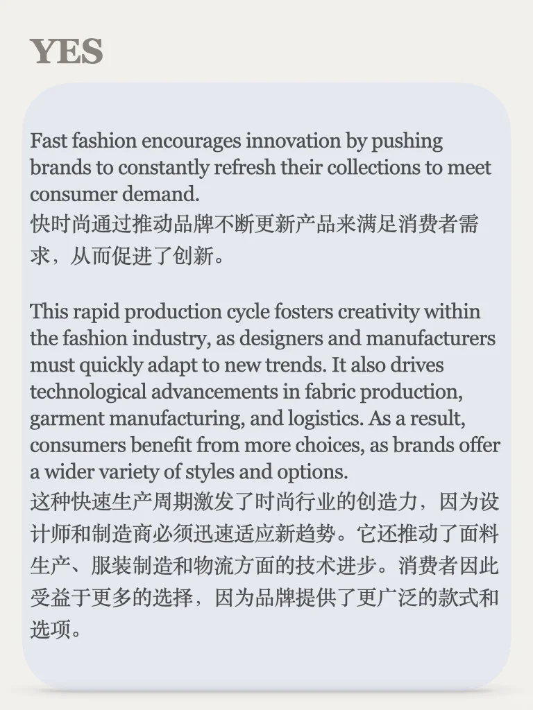
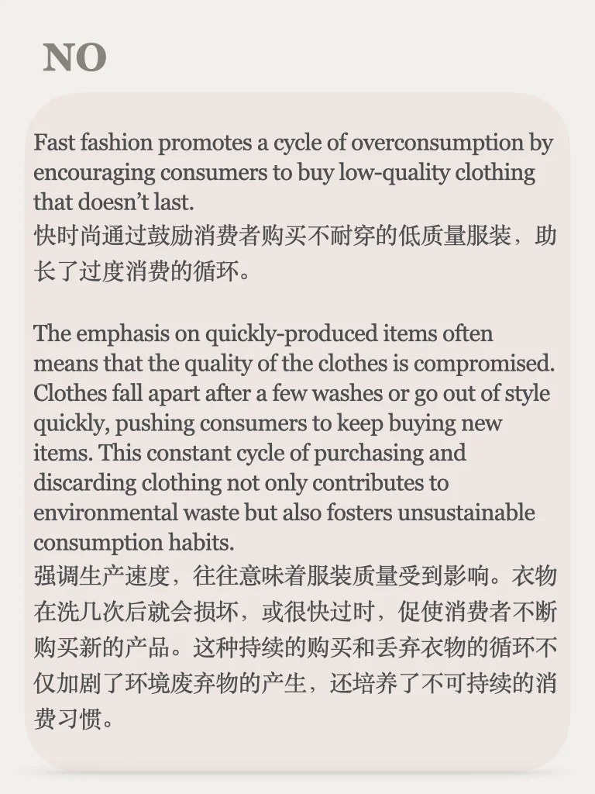
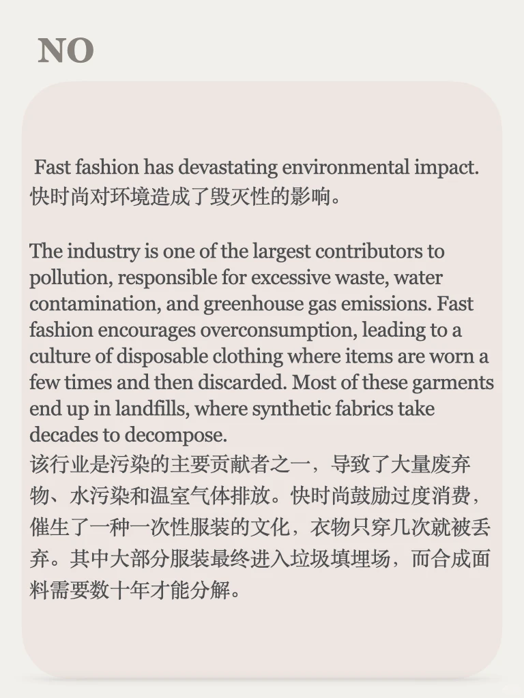

# 思辨能力培养46期｜说出你的立场

今天是辩论栏目的第46期，主题：快时尚趋势是好是坏？
灵感来自于“ lifekit播客- how to buy less stuff ”
辩论栏目每周一个新话题，欢迎关注
所有辩论语料合集可以点击笔记同款商品获得，9.9永久订阅
#雅思备考 #英语地道表达 #雅思攻略 #快时尚 #写作素材 #雅思写作观点 #英语辩论 #辩证思考 #口语素材

## 图片
| 图1 | 图2 | 图3 | 图4 |
| --- | --- | --- | --- |
|  |  |  |  |
|  |  |  |   |

生成时间：2025-11-14 21:24:37