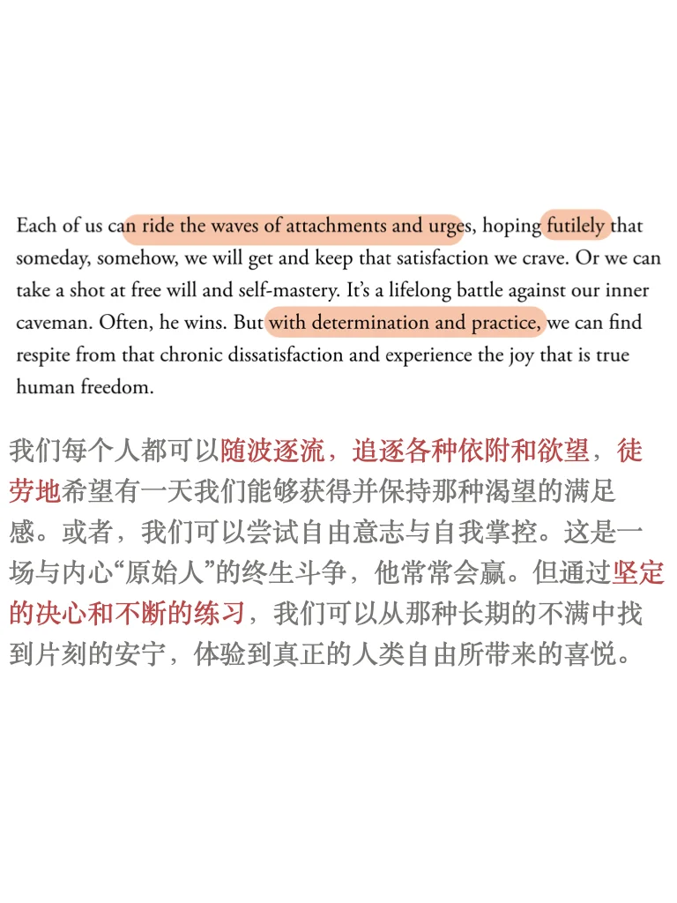
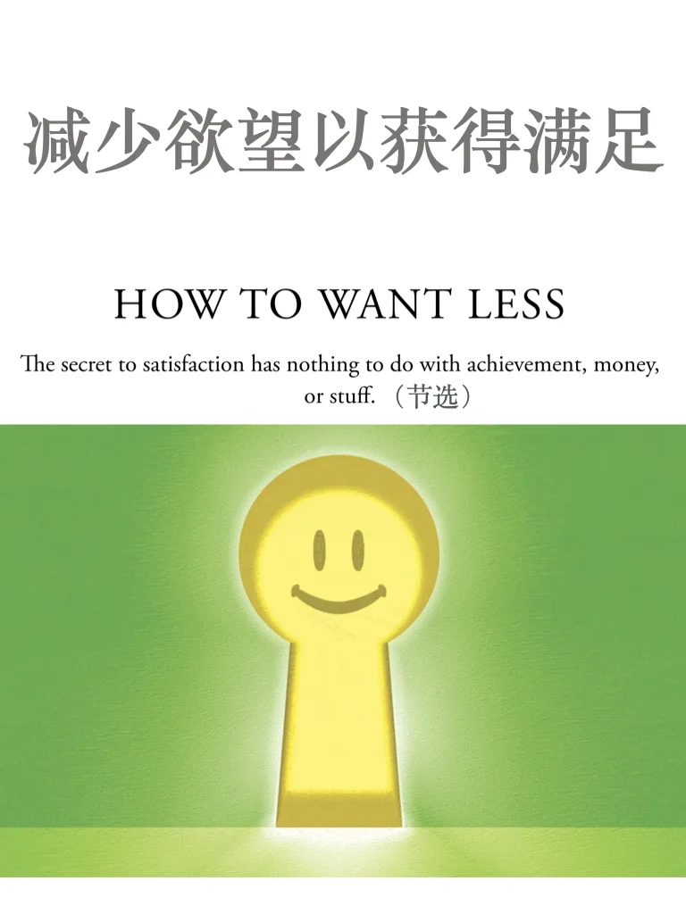
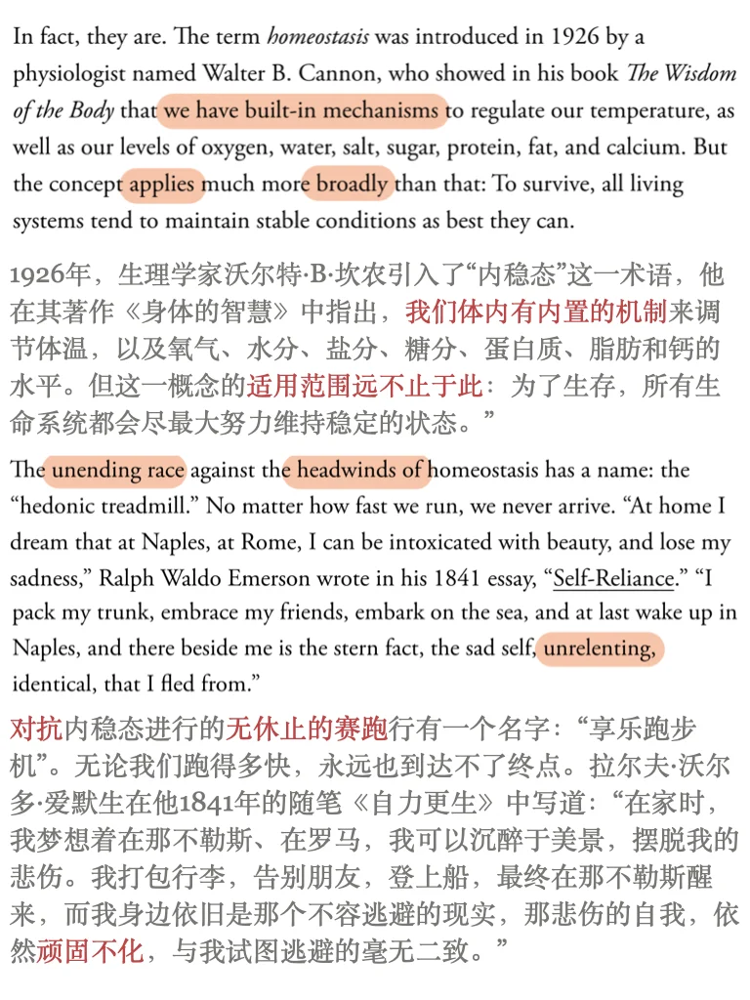
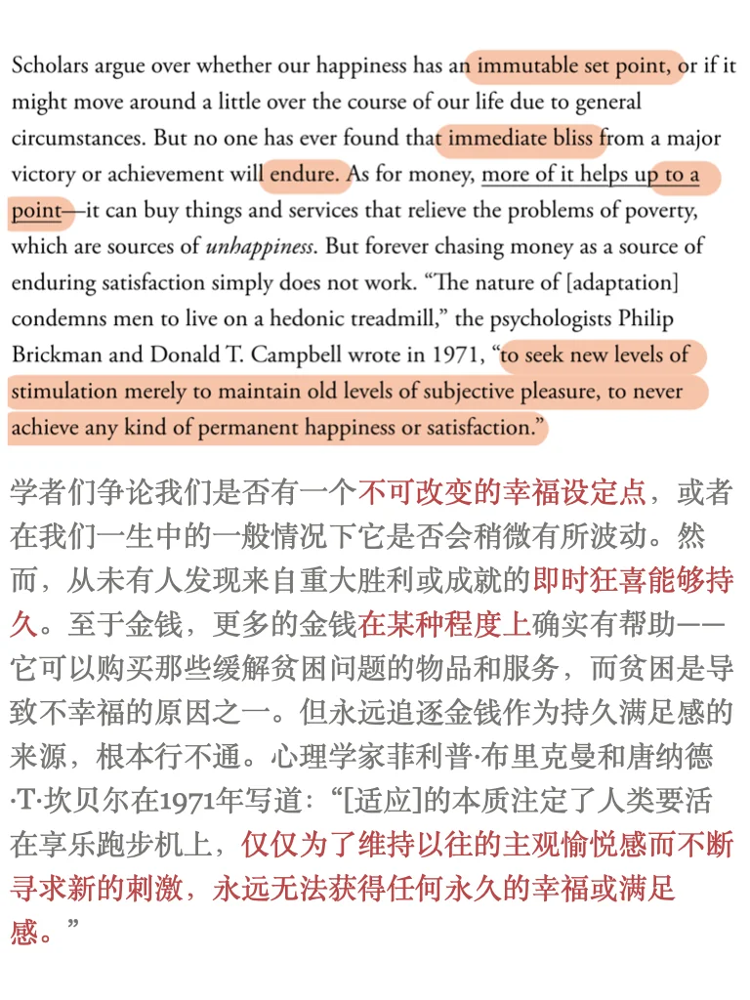
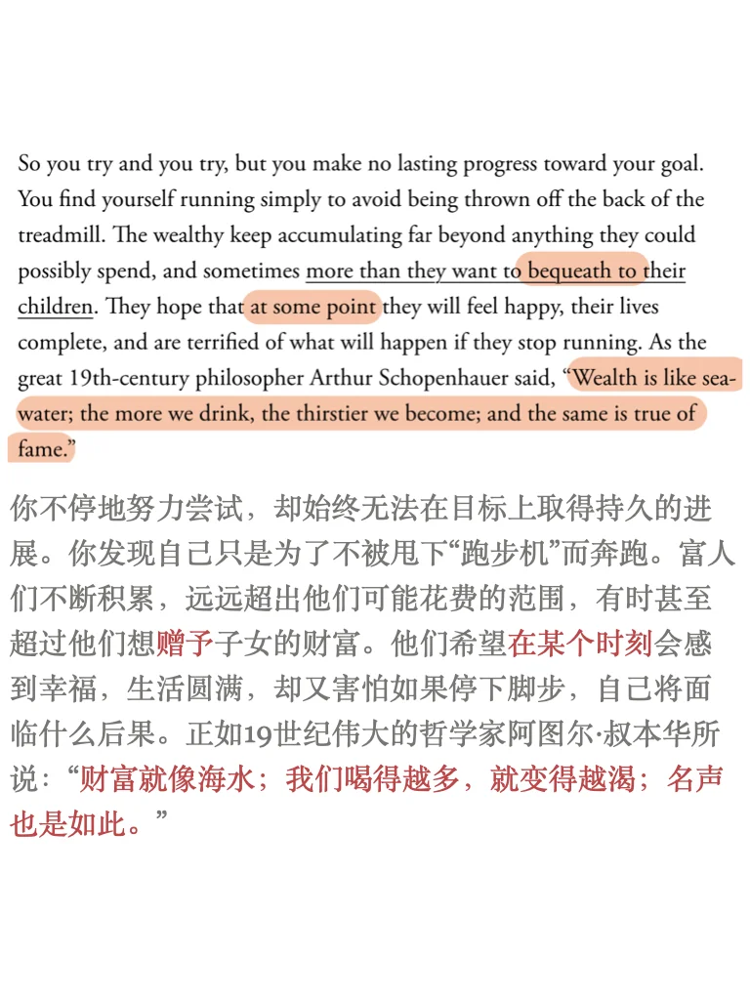
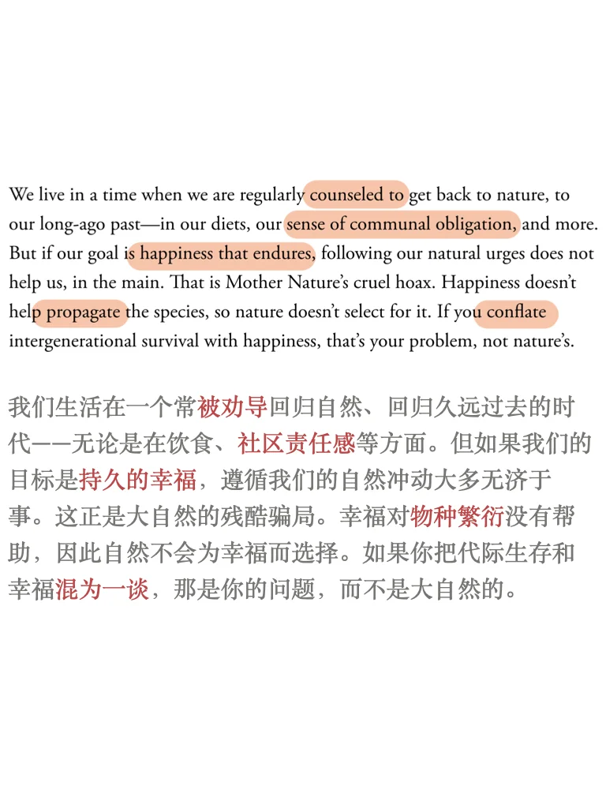
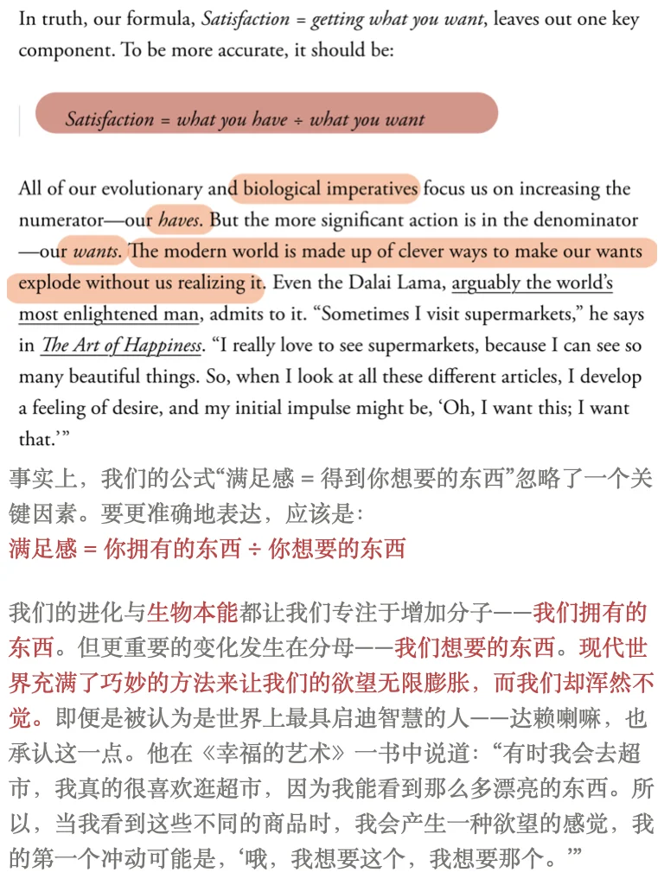
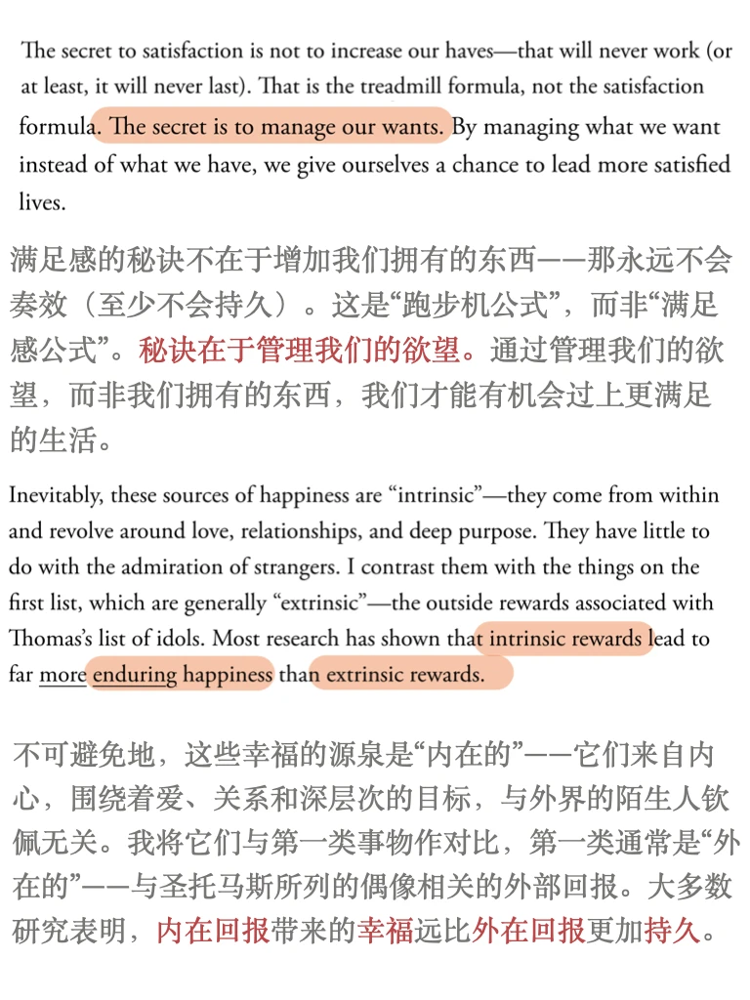

# 外刊泛读｜不开心的根本是欲望太多？

文章来自The Atlantic , 2022年3月期（最近搜其他话题无意间翻阅到）
文章主旨：
我们都在“享乐跑步机”（hedonic treadmill）上无休止的努力奔跑，不断追逐幸福与满足感，却从未获得持久的快乐。
尽管人们可能追求财富、成功和物质奖励，但这些外部来源（“外在回报”）只能带来暂时的愉悦。真正持久的幸福来自内心，通过诸如爱、人际关系和目标感等 “内在”源泉。
管理欲望比不断积累更多东西更为重要，自我掌控与内心的平静是摆脱长期不满、获得真正自由与幸福的关键。
	
平时分享的内容受篇幅限制，很多是段落节选或者词汇讲解
我把平时阅读的文章从期刊、网页中筛选出来，以PDF格式保存
想更阅读更完整的外刊原文，欢迎加入群聊🎉
	
#外刊 #外刊精读 #英语外刊 #英语泛读 #四六级 #考研英语 #英专生 #满足感 #幸福感

## 图片
| 图1 | 图2 | 图3 | 图4 |
| --- | --- | --- | --- |
|  |  |  |  |
|  |  |  |  |
|  |   |   |   |

生成时间：2025-11-14 21:23:30