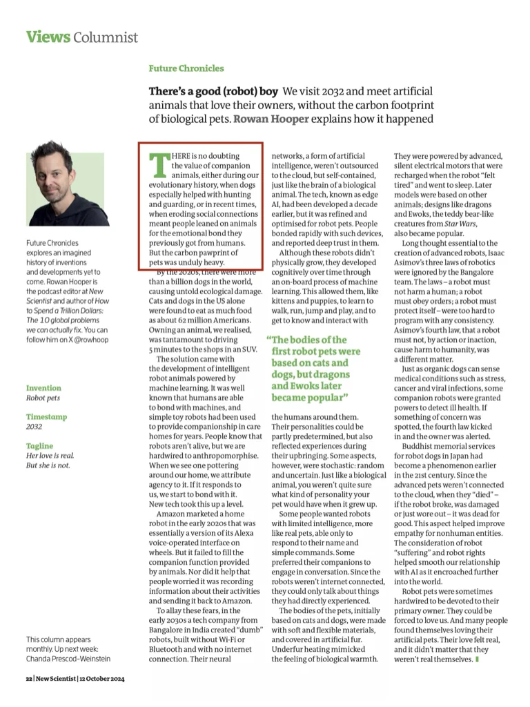
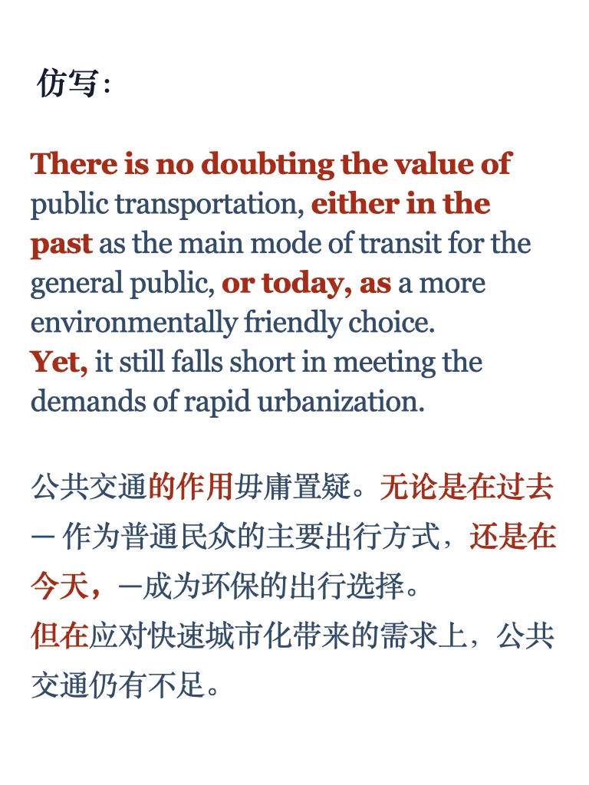

# 外刊仿写29｜写作句子还是得跟母语者学

一个句子写出了让步、举例、对比👍
快挑战自己模仿起来吧，想要深入学习句子结构和练习更多句子的同学可以点击左下角同款，我们一起坚持练习💪
	
#外刊精读 #英语长难句 #英语地道表达 #雅思备考 #雅思攻略 #仿写句子 #四六级 #考研英语 #母语者英语 #外刊写作

## 图片
| 图1 | 图2 | 图3 | 图4 |
| --- | --- | --- | --- |
|  |  |  |  |
|  |   |   |   |

生成时间：2025-11-14 15:54:25