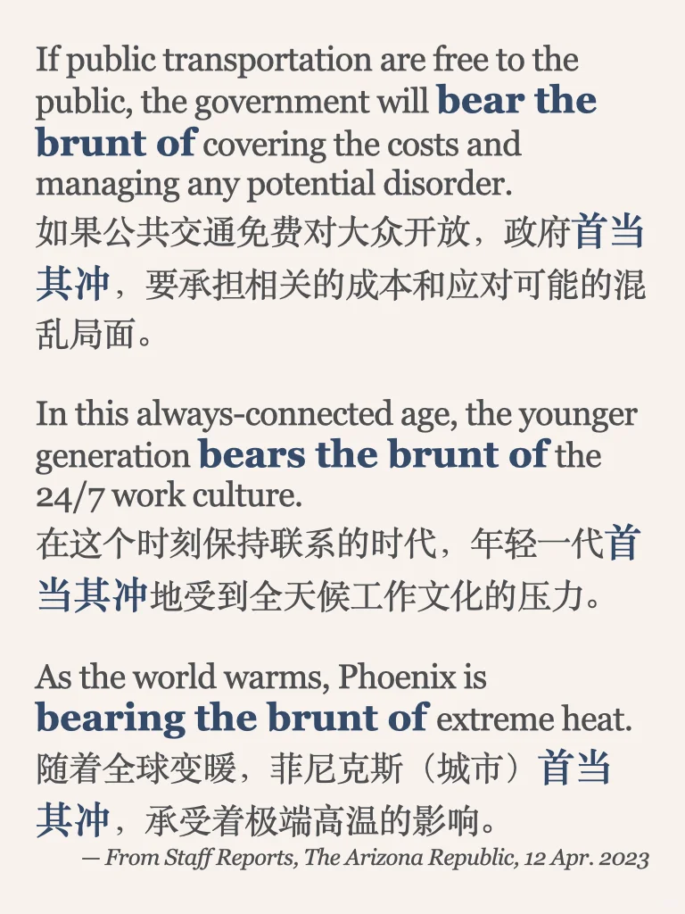
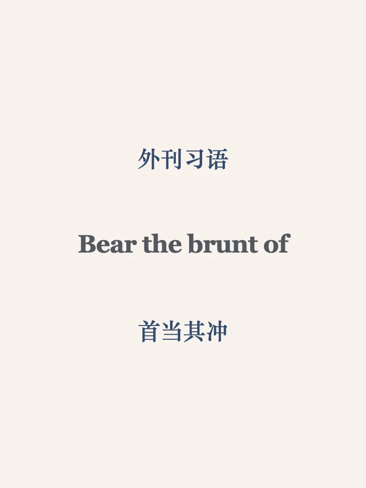
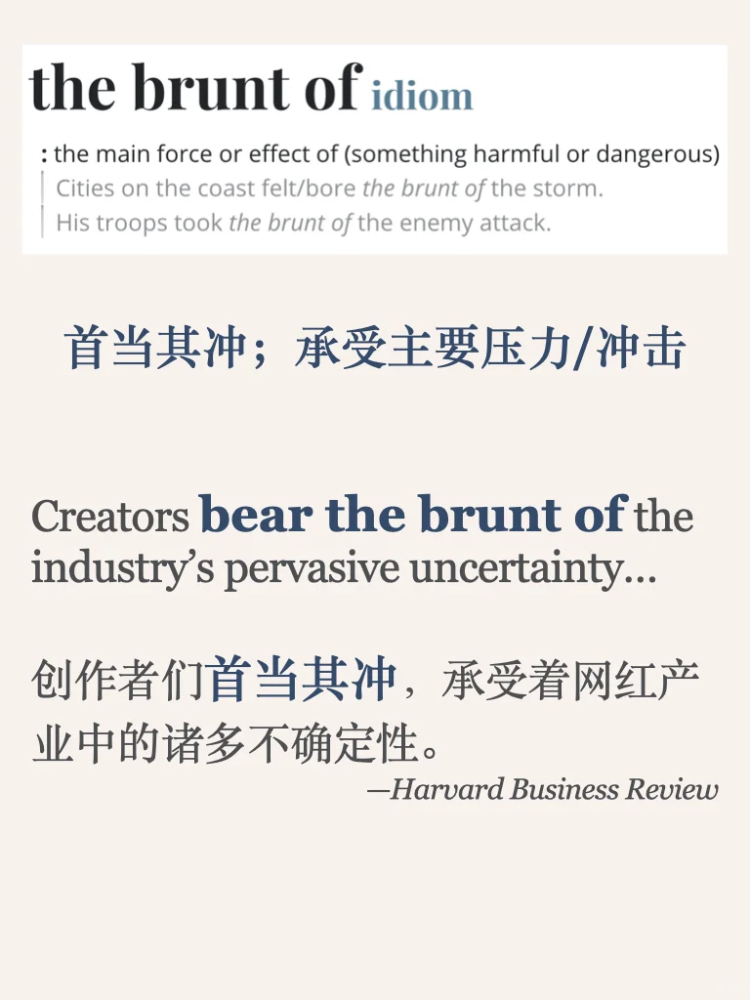

# 外刊习语｜the brunt of sth

最糟糕的后果由…来承担
平时分享的内容受篇幅限制，很多是段落节选或者词汇讲解
我把平时阅读的文章从期刊、网页中筛选出来，以PDF格式保存
想更阅读更完整的外刊原文，欢迎加入群聊🎉
#英语学习打卡 #外刊精读 #雅思备考 #英语地道表达 #雅思攻略 #地道习语 #写作素材 #写作干货 #习语

## 图片
| 图1 | 图2 | 图3 | 图4 |
| --- | --- | --- | --- |
|  |  |  |   |

生成时间：2025-11-14 21:21:16